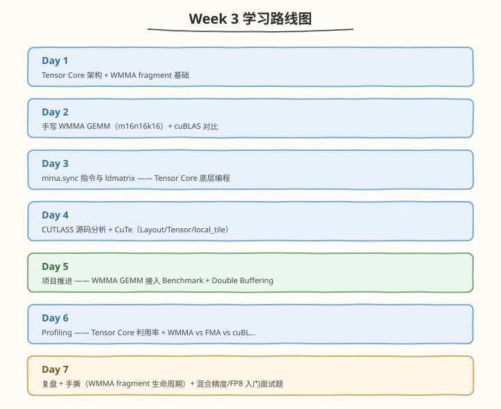

# Week 3：Tensor Core 与 CUTLASS

> 核心目标：掌握 Tensor Core/WMMA/mma.sync 指令编程、CUTLASS 三级 Tiling 源码、CuTe 布局抽象与混合精度策略

| 项目　　　 | 说明　　　　　　　　　　　　　　　　　　　　　　　　　　　　　|
| ------------| ------------------------------------------------------------|
| 前置要求　 | 已完成 Week 2，掌握 GEMM 七层优化路径、Warp Shuffle、Register Blocking　　　　　　　　　　　　　　　　　　　　　　　|
| 建议时长　 | 工作日每天 2.5h，周末每天 6h，周计 24.5h　　　　　　　　　　|
| 本周产出　 | wmma_gemm.cu、CUTLASS 源码分析笔记、CuTe 概念笔记、WMMA vs FMA vs cuBLAS 性能对比表　　　　　　　　　　　　　　　　　　　　　　　　　|
| 周日里程碑 | 理解 WMMA fragment 生命周期与 mma.sync 指令，CUTLASS 三级 Tiling 结构清晰，WMMA GEMM 正确性 PASS　　　　　　　　　　　　　　　　　　　　　　　|

---

## 🧭 本周学习地图

---

## 📚 每日学习材料

| Day | 主题 | 目录 |
|-----|------|------|
| Day 1 | Tensor Core 与 WMMA —— 从 FMA 到 Tensor Core | [day1/](/week3/day1) |
| Day 2 | 手写 WMMA GEMM 与 cuBLAS 性能对比 | [day2/](/week3/day2) |
| Day 3 | mma.sync 指令与 ldmatrix —— Tensor Core 底层编程 | [day3/](/week3/day3) |
| Day 4 | CUTLASS 源码分析 + CuTe 概念铺垫 | [day4/](/week3/day4) |
| Day 5 | 项目推进 —— WMMA GEMM 接入 Benchmark 与 Double Buffering | [day5/](/week3/day5) |
| Day 6 | Profiling —— Tensor Core 利用率与 WMMA vs FMA 对比 | [day6/](/week3/day6) |
| Day 7 | 复盘与手撕 —— Tensor Core/CUTLASS 面试要点 | [day7/](/week3/day7) |
