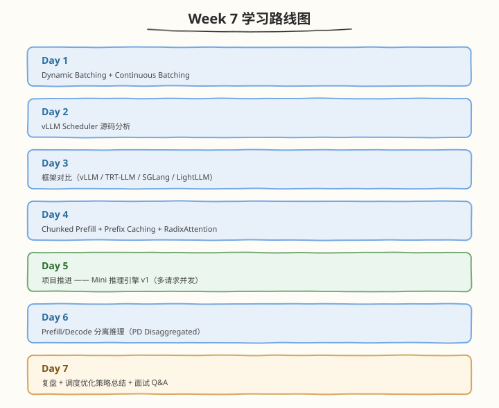

# Week 7：Batching 与调度

> 核心目标：掌握 Dynamic/Continuous Batching、vLLM Scheduler、Chunked Prefill、Prefix Caching、PD 分离与 Mini 引擎 v1

| 项目　　　 | 说明　　　　　　　　　　　　　　　　　　　　　　　　　　　　　|
| ------------| ------------------------------------------------------------|
| 前置要求　 | 已完成 Week 6，掌握 PagedAttention、FlashDecoding、Mini 引擎 v0、vLLM 架构　　　　　　　　　　　　　　　　　　　　　　　|
| 建议时长　 | 工作日每天 2.5h，周末每天 6h，周计 24.5h　　　　　　　　　　|
| 本周产出　 | Continuous Batching 模拟器、Scheduler 复刻、Chunked Prefill simulator、PD 分离模拟器、Mini 引擎 v1　　　　　　　　　　　　　　　　　　　　　　　　　|
| 周日里程碑 | Mini 引擎 v1 多请求并发可跑，PD 分离模拟器验证 TTFT/TPOT 改善　　　　　　　　　　　　　　　　　　　　　　　|

---

## 🧭 本周学习地图

---

## 📚 每日学习材料

| Day | 主题 | 目录 |
|-----|------|------|
| Day 1 | Continuous Batching（含 Dynamic Batching） | [day1/](/week7/day1) |
| Day 2 | vLLM Scheduler 源码分析 | [day2/](/week7/day2) |
| Day 3 | TensorRT-LLM / LightLLM / SGLang 调度对比 | [day3/](/week7/day3) |
| Day 4 | Chunked Prefill 与 Prefix Caching 实操 | [day4/](/week7/day4) |
| Day 5 | Mini 推理引擎 v1（多请求并发） | [day5/](/week7/day5) |
| Day 6 | Prefill/Decode 分离推理（PD Disaggregated） | [day6/](/week7/day6) |
| Day 7 | 调度优化策略总结 | [day7/](/week7/day7) |

