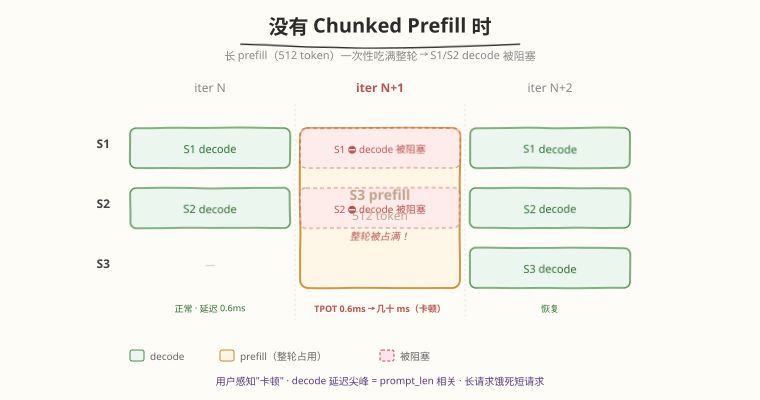
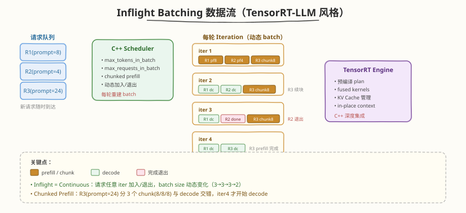
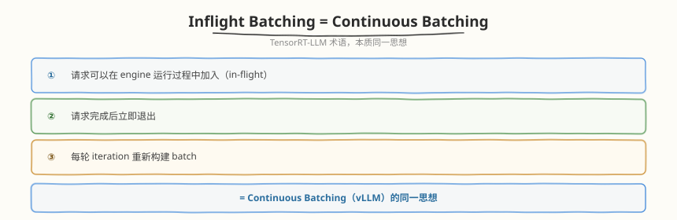
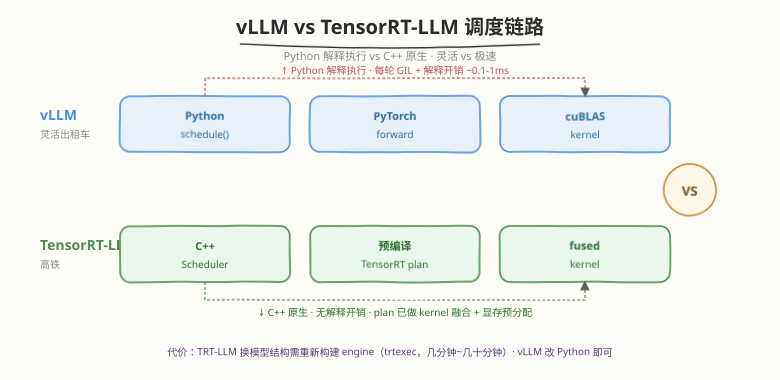
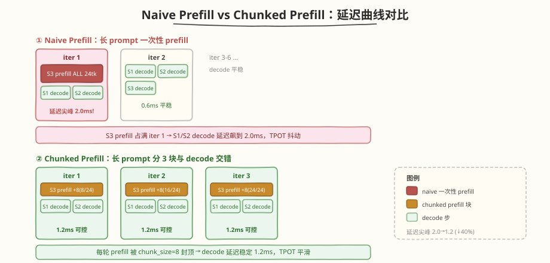
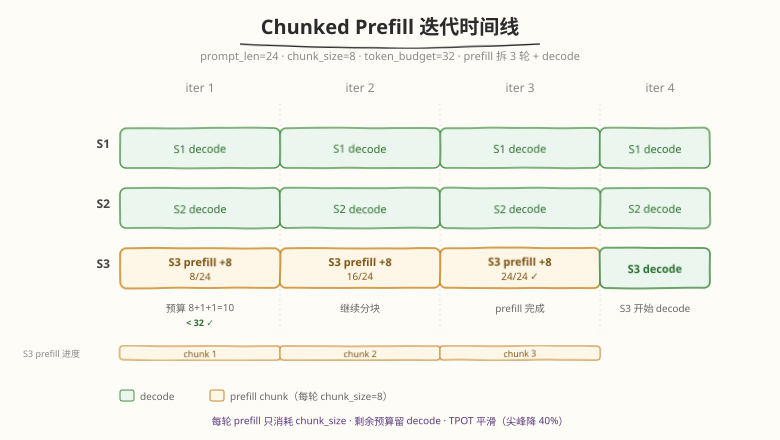
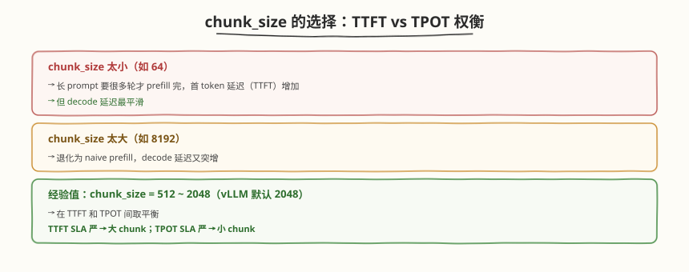
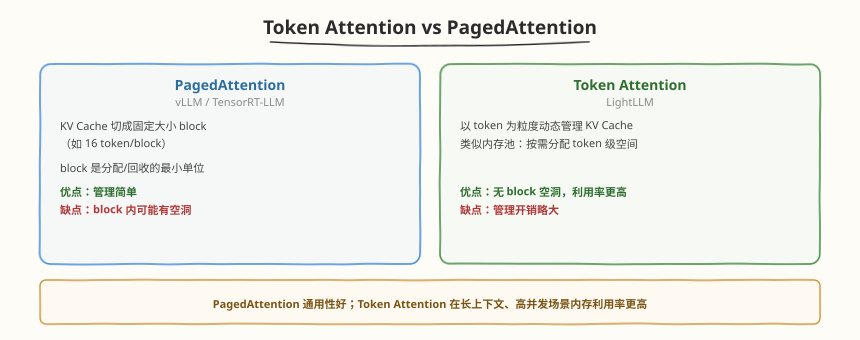
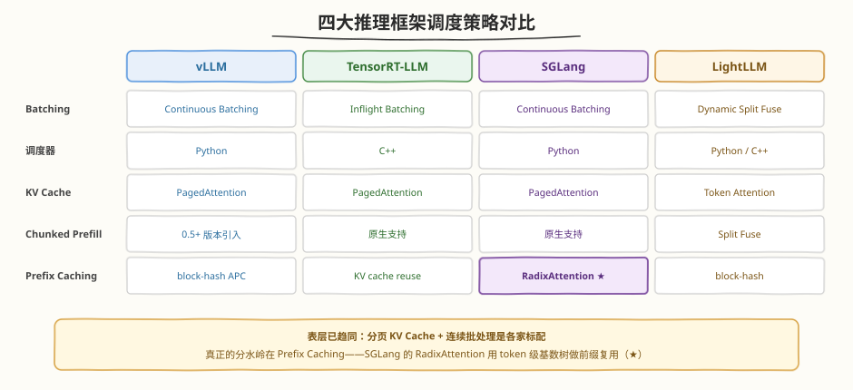

## Day 3：TensorRT-LLM / LightLLM / SGLang 调度对比

### 🎯 目标

通过今天的学习，你将：

1. 理解 **Inflight Batching 就是 Continuous Batching**——TensorRT-LLM 用了不同术语，本质都是 iteration-level 调度、请求动态加入退出<br>
2. 掌握 **TensorRT-LLM 调度器特点**——C++ 层实现、与 TensorRT engine 深度集成、原生支持 chunked prefill，对比 vLLM Python 调度器的灵活性与开销权衡<br>
3. 理解 **Chunked Prefill 的原理与收益**——长 prompt 拆成小 chunk 与 decode 交错，避免 prefill 占满整轮算力导致 decode 延迟突增<br>
4. 了解 **LightLLM 的 Dynamic Split Fuse 与 Token Attention**——动态组合 prefill/decode、内存池式 KV Cache 管理的差异化思路<br>
5. 掌握 **SGLang RadixAttention 的 radix tree 结构**——match/insert/evict 三操作、引用计数防淘汰、写入策略与 cache-aware 调度的设计思想<br>
6. 用 Python 手写一个 **Chunked Prefill 模拟器**，实测 naive vs chunked 两种策略下 decode 延迟曲线，验证 TPOT（time-per-output-token）平滑效果

> 💡 **为什么重要**：Day 2 我们拆解了 vLLM Scheduler 的 `schedule()` 5 步流程，但它有个隐患——`_schedule_waiting` 一次性 prefill 整个 prompt，长 prompt 会占满整轮 token budget，导致同 batch 的 decode 请求延迟突增。今天我们看 TensorRT-LLM 和 LightLLM 怎么解决这个"长 prefill 阻塞 decode"问题，核心答案就是 **Chunked Prefill**。这也是面试高频加分题："不同推理框架的 batching 策略对比"。

---

### 学前导读：Day 2 Scheduler 的"长 prefill 阻塞"问题

Day 2 的 `_schedule_waiting` 有这么一行：

```python
num_new = seq.prompt_len # prefill 一次性消耗 prompt_len 个 token budget
if budget.can_schedule(num_new, 1): # ← 长 prompt 可能直接吃满整轮
 ...
```

假设 `token_budget=32`，一个 `prompt_len=24` 的请求 prefill 时消耗 24 budget，只剩 8 给 decode。如果 `prompt_len=512`（长文档问答），它要么被拒绝（budget 不够），要么如果调大 budget 就会占满整轮——**decode 请求被"卡住"一轮，TPOT 突增**：



| 问题 | 原因 | 影响 |
|------|------|------|
| 长 prefill 占满整轮 | 一次性 prefill prompt_len token | decode 请求被阻塞一轮 |
| TPOT 突增 | decode 等待 prefill 完成 | 用户感知"卡顿"、流式输出抖动 |
| 长请求饿死短请求 | token budget 被长 prefill 吃光 | 短请求 decode 延迟不可控 |

> 💡 **一句话总结**：Chunked Prefill 把长 prompt 的 prefill 拆成多个小 chunk（如每块 512 token），每轮只 prefill 一个 chunk，剩余预算给 decode——prefill 不再霸占整轮，decode 延迟平滑。TensorRT-LLM 原生支持，vLLM 0.5+ 也已跟进。

---

### 理论学习

#### 4.1 Inflight Batching = Continuous Batching



TensorRT-LLM 用 **"Inflight Batching"** 这个术语，但本质和 Day 2 的 Continuous Batching 完全一致：



##### 术语对照

| 概念 | vLLM 术语 | TensorRT-LLM 术语 | 本质 |
|------|----------|-------------------|------|
| iteration-level 调度 | Continuous Batching | **Inflight Batching** | 每轮重建 batch |
| 请求动态加入 | schedule() waiting→running | in-flight 加入 | 同一机制 |
| 请求完成退出 | FINISHED 移除 | context 释放 | 同一机制 |
| 调度预算 | SchedulingBudget | max_tokens_in_batch | token/seq 上限 |

> 💡 不要被不同术语迷惑——**Inflight 和 Continuous 是同一个东西**。面试时直接说"Inflight Batching 本质就是 Continuous Batching，TensorRT-LLM 换了个名字"即可。

#### 4.2 TensorRT-LLM 调度器特点

TensorRT-LLM 的调度器与 vLLM 有关键差异：

| 维度 | vLLM | TensorRT-LLM |
|------|------|-------------|
| 调度器语言 | **Python** | **C++** |
| 与 engine 关系 | 松耦合（调 PyTorch） | **深度集成**（调预编译 plan） |
| 灵活性 | 高（易扩展、易调试） | 中（需重新编译 engine） |
| 调度开销 | 较高（Python GIL、解释执行） | **低**（C++ 原生） |
| Chunked Prefill | 0.5+ 支持 | **原生支持** |
| 部署 | pip install | 需构建 engine（trtexec） |

##### 为什么 TensorRT-LLM 性能更高？



**代价**：灵活性低——换模型结构要重新构建 engine（trtexec 编译，耗时几分钟到几十分钟）；vLLM 改模型只需改 Python 代码。

##### 形象类比

- **vLLM** = 灵活的出租车（Python 调度，随时改路线，但每单有调度开销）
- **TensorRT-LLM** = 高铁（C++ 预编译 plan，固定线路极速，但改线路要重新铺轨）

#### 4.3 Chunked Prefill：核心创新



Chunked Prefill 是今天最核心的概念，解决"长 prefill 阻塞 decode"问题：

```python
# Naive Prefill（Day 2 的做法）：
# 一次性 prefill 整个 prompt
def prefill_naive(seq, budget):
 budget.consume(seq.prompt_len) # 一次吃光

# Chunked Prefill：
# 长 prompt 拆成多个 chunk，每轮只 prefill 一块
def prefill_chunked(seq, budget, chunk_size):
 remaining = seq.prompt_len - seq.prefilled_tokens
 n = min(chunk_size, remaining) # 每轮最多 chunk_size
 seq.prefilled_tokens += n
 budget.consume(n) # 只消耗 chunk_size
 # 剩余预算留给 decode
```

##### Chunked Prefill 的工作流程



##### 收益量化

| 指标 | Naive Prefill | Chunked Prefill |
|------|--------------|----------------|
| iter 1 decode 延迟 | **2.0ms**（被 prefill 24 挤压） | **1.2ms**（只被 chunk 8 挤压） |
| 延迟尖峰 | 高（=prompt_len 相关） | 低（=chunk_size 封顶） |
| TPOT 稳定性 | 抖动 | **平滑** |
| 总 iterations | 7 | 8（多 1 轮，但延迟更稳） |

> ⚠️ **注意**：Chunked Prefill 会让总 iterations 略增（prefill 拆成多轮），但换来 decode 延迟的稳定性——这是**吞吐 vs 延迟**的权衡。对在线服务（用户感知 TPOT），稳定性通常更重要。

##### chunk_size 的选择



#### 4.4 LightLLM：Dynamic Split Fuse 与 Token Attention

LightLLM 走了另一条差异化路线：

| 机制 | LightLLM 做法 | 与 vLLM/TRT-LLM 区别 |
|------|--------------|---------------------|
| **Dynamic Split Fuse** | prefill 和 decode 动态组合，按算力自动 split | 类似 chunked prefill，但更激进地混合 |
| **Token Attention** | 不预分配固定 KV Cache，用内存池动态管理 | vs PagedAttention 的 block 分配 |
| **Router 分层** | 多级 router 调度，支持分布式 | 适合多卡高并发 |

##### Token Attention vs PagedAttention



#### 4.5 四框架横向对比



| 维度 | vLLM | TensorRT-LLM | SGLang | LightLLM | 说明 |
|------|------|-------------|--------|----------|------|
| Batching | Continuous | Inflight | Continuous | Dynamic Split Fuse | 动态批处理 |
| KV Cache | PagedAttention | PagedAttention | PagedAttention | Token Attention | 分页 KV Cache |
| Chunked Prefill | 0.5+ | 原生 | 原生 | Split Fuse | 分块 prefill |
| Prefix Caching | block-hash | KV cache reuse | RadixAttention | block-hash | 前缀复用 |
| 灵活性 | 高 | 中 | 高 | 中 | 灵活程度 |
| 语言 | Python | C++ | Python | Python | — |

##### SGLang 与 RadixAttention

**SGLang**（SG-Lang）是 2024+ 兴起的推理框架，核心创新是 **RadixAttention**——用基数树（radix tree）管理 prefix caching，比 vLLM 的 block-hash 方案更高效。

**RadixAttention vs block-hash prefix caching**：

| 维度 | block-hash（vLLM） | RadixAttention（SGLang） |
|------|-------------------|------------------------|
| 数据结构 | block 级哈希表 | 前缀树（radix tree） |
| 匹配粒度 | block（如 16 token） | 任意前缀长度 |
| 共享前缀复用 | 需手动 block 对齐 | 自动识别任意公共前缀 |
| 多轮对话 | 每轮重新哈希 | 前缀树自动增量 |
| 适用场景 | 短/无共享前缀 | 共享前缀多且长（如多轮对话、few-shot） |

**Radix tree 数据结构**：基数树 = 压缩前缀树（compressed trie）——每条**边存一段 token 序列**（不是单个 token，所以树高很低），每个**节点挂这段 token 对应的 KV cache 索引**。根到任意节点的路径拼接起来，就是一个"被缓存过"的完整前缀：

```python
class RadixNode:
    keys: List[int]                # 这条边对应的 token 序列段（如 1024 个 system prompt token）
    value: List[int]               # 这些 token 的 KV cache slot 索引（token 粒度）
    children: Dict[int, RadixNode] # 用下一个 token id 索引子节点
    lock_ref: int                  # 引用计数：>0 = 有运行中请求在用，不可淘汰
    last_access_time: float        # LRU 淘汰依据
```

**三个核心操作**：

**① match（请求到达时：前缀匹配）**——从根沿 token 序列走树，找最长匹配前缀，命中部分直接复用 KV，只对剩余部分 prefill：

```python
def match_prefix(root, tokens):
    node, matched = root, 0
    while matched < len(tokens):
        child = node.children.get(tokens[matched])
        if child is None:
            break   # 没有子边可走：匹配结束
        n = len(common_prefix(child.keys, tokens[matched:]))
        matched += n
        node = child
        if n < len(child.keys):
            break   # 边内部分匹配：前缀到此为止（block-hash 无此能力，粒度损失就在这）
    return node, matched   # 前 matched 个 token 复用 KV，其余进 prefill
```

**② insert（请求完成后：序列插入）**——把新序列沿树插入；若与已有边只部分重合，则**分裂**（split）该边——共享前缀由此自动"沉淀"出来：

```text
[S]=共享 system prompt，A/B=两个 session，q=用户输入，a=模型回复

Round 1 后:  root ──[S + q1 + a1]
Round 2 后:  root ──[S + q1 + a1 + q2 + a2]           ← A session 增量扩展，只 prefill 新增段
B 到达时:    root ──[S]──┬──[q1 + a1 + q2 + a2]       ← [S] 边分裂，两 session 共享 system prompt
                        └──[few-shot examples + B 的 query]
```

**③ evict（显存不够时：淘汰）**——**自叶向根**按 LRU 淘汰，只淘汰 `lock_ref == 0` 的节点（运行中请求 pin 住的不许动）；节点子树被清空后向上**合并**（merge），保持树紧凑、避免退化成链表。

**关键设计细节**：

| 设计 | 做法 | 原因 |
|------|------|------|
| 引用计数（lock） | match 成功后对路径上所有节点 `lock_ref += 1`，请求结束 `-1` | 运行中请求的 KV 正被 attention 读取，淘汰会导致读到脏数据 |
| 写入策略 | 默认**不缓存最后一个 token** | 末 token 往往马上被扩展（多轮追加新输入）或分叉（采样多候选），先缓存它反而引发频繁的节点分裂 |
| Cache-aware 调度 | waiting 队列重排，**优先调度前缀命中更长**的请求 | 趁命中前缀还在树上赶紧复用；先跑不相关请求可能把热点前缀 LRU 挤出去 |
| 前端协同 | SGLang 前端提供 `fork`/`join` 原语 | Agent/树搜索式程序（一次采多个候选分支）天然产生共享前缀，RadixAttention 自动管理所有分支的 KV |

> 💡 **RadixAttention 的本质**：把"prefix 复用什么、怎么共享、怎么淘汰、谁在用"统一到一棵树上——**匹配 = 查树，共享 = 边分裂，淘汰 = 剪枝，防踩 = 引用计数**。对比 vLLM block-hash 需要 hash 表 + LRU 链 + ref_count 多套机制配合，radix tree 一个数据结构全包了。代价是实现复杂度更高（树操作要加锁/做并发控制），这也是 vLLM 选择简单哈希表的工程权衡。

> 📖 品读论文：SGLang: Efficient Execution of Structured Language Model Programs（NeurIPS 2024，RadixAttention 原论文）。对齐损失的量化对比见 Day 4。

##### 选型建议

| 场景 | 推荐框架 | 原因 |
|------|---------|------|
| 快速迭代、多模型 | **vLLM** | Python 灵活、生态成熟 |
| 极致性能、模型固定 | **TensorRT-LLM** | C++ 调度、kernel 融合 |
| 高并发、长上下文 | **LightLLM** | Token Attention 内存利用率高 |

### Coding 任务：手写 Chunked Prefill 模拟器

#### 任务 1：创建 chunked_prefill_simulator.py

创建文件 [kernels/chunked_prefill_simulator.py](https://github.com/hzchenxiaobin/ai-infra-notes/blob/main/aiinfra/daily/week7/day3/kernels/chunked_prefill_simulator.py)，对比 naive 与 chunked 两种 prefill 策略的 decode 延迟曲线：

```python
# chunked_prefill_simulator.py —— Chunked Prefill vs Naive Prefill 延迟对比模拟
# 运行命令: python chunked_prefill_simulator.py
# 依赖: 仅标准库
#
# 本文件模拟两种 prefill 调度策略对 decode 延迟的影响：
#   1. Naive Prefill：长 prompt 一次性 prefill，整轮算力被 prefill 占满 → decode 请求被阻塞、latency 突增
#   2. Chunked Prefill：长 prompt 拆成多个小 chunk，每轮只 prefill 一个 chunk，剩余预算给 decode → latency 平滑
#
# 对应 TensorRT-LLM / vLLM(0.5+) 的 Chunked Prefill 机制：
#   - vLLM 默认把长 prompt 一次性 prefill（naive）
#   - vLLM 0.5+ 与 TensorRT-LLM 原生支持 chunked prefill（长 prompt 分块与 decode 交错）
#
# 与 Day1 ContinuousBatcher / Day2 Scheduler 的关系：
#   - Day1/Day2 的 _schedule_waiting 一次性 prefill 整个 prompt（消耗 prompt_len token budget）
#   - 本文件把 prefill 改成"每轮只消耗 chunk_size token"，多轮完成一个长 prefill

from collections import deque
from dataclasses import dataclass, field
from typing import Deque, Dict, List


class SeqStatus:
    WAITING = "waiting"
    RUNNING = "running"
    FINISHED = "finished"


@dataclass
class Sequence:
    """一个推理序列。prefill 进度用 prefilled_tokens 追踪（chunked 模式下分块累加）。"""
    seq_id: int
    prompt_len: int
    max_new_tokens: int = 6
    status: str = SeqStatus.WAITING
    prefilled_tokens: int = 0       # 已 prefill 的 prompt token 数（=prompt_len 时 prefill 完成）
    generated_count: int = 0
    start_iter: int = -1
    finish_iter: int = -1

    @property
    def is_prefill_done(self) -> bool:
        return self.prefilled_tokens >= self.prompt_len

    def prefill_chunk(self, chunk_size: int) -> int:
        """prefill 一块，返回实际处理的 token 数。"""
        remaining = self.prompt_len - self.prefilled_tokens
        n = min(chunk_size, remaining)
        self.prefilled_tokens += n
        return n

    def decode_step(self):
        """生成 1 个 token。"""
        self.generated_count += 1
        if self.generated_count >= self.max_new_tokens:
            self.status = SeqStatus.FINISHED


@dataclass
class IterRecord:
    """一轮 iteration 的记录，用于画延迟曲线。"""
    iter: int
    prefill_tokens: int          # 本轮 prefill 的 token 数（大 → decode 被挤压）
    decode_seqs: int             # 本轮 decode 的序列数
    decode_latencies: List[float] = field(default_factory=list)  # 本轮各 decode 序列的感知延迟
    events: List[str] = field(default_factory=list)              # 本轮发生的事件


class PrefillScheduler:
    """支持 naive / chunked 两种 prefill 策略的调度器。

    token_budget：每轮 iteration 最多处理的 token 数（prefill + decode 共享）。
    - naive 模式：新请求一次性 prefill 整个 prompt（消耗 prompt_len）
    - chunked 模式：新请求每轮只 prefill chunk_size 个 token，剩余预算给 decode
    """

    def __init__(self, max_token_budget: int = 32, max_num_seqs: int = 8,
                 chunk_size: int = 8, use_chunked: bool = False):
        self.max_token_budget = max_token_budget
        self.max_num_seqs = max_num_seqs
        self.chunk_size = chunk_size
        self.use_chunked = use_chunked
        self.waiting: Deque[Sequence] = deque()
        self.running: Dict[int, Sequence] = {}
        self.iteration = 0
        self.history: List[IterRecord] = []

    def submit(self, seq: Sequence):
        self.waiting.append(seq)

    def _decode_cost(self, num_decode: int) -> float:
        """模拟 decode 延迟：decode 越多每 token 越省（batch 摊销），但有下限。"""
        if num_decode == 0:
            return 0.0
        return 0.5 + 0.3 / num_decode   # 纯 decode 时 ~0.8ms/token；decode 越多越接近 0.5

    def _prefill_cost_per_token(self, prefill_tokens: int, num_decode: int) -> float:
        """模拟 prefill 对 decode 延迟的挤压：prefill tokens 越多，本轮 decode 越慢。

        naive 模式下 prefill_tokens 可能很大（=prompt_len）→ decode 延迟飙升
        chunked 模式下 prefill_tokens 被 chunk_size 封顶 → decode 延迟可控
        """
        base = 0.8
        # prefill 是 compute-bound，会抢占 SM 资源，decode 被拖慢
        pressure = 0.05 * prefill_tokens
        return base + pressure

    def schedule_iteration(self) -> IterRecord:
        budget = self.max_token_budget
        rec = IterRecord(iter=self.iteration + 1, prefill_tokens=0, decode_seqs=0)

        # 1. 移除已完成
        finished = [sid for sid, s in self.running.items() if s.status == SeqStatus.FINISHED]
        for sid in finished:
            self.running.pop(sid)

        # 2. 保留 running 的 decode（若 prefill 已完成）或继续 prefill chunk
        decode_batch: List[Sequence] = []
        for seq in self.running.values():
            if not seq.is_prefill_done:
                # chunked 模式下，未完成 prefill 的序列本轮继续 prefill 一个 chunk
                if self.use_chunked and budget >= self.chunk_size:
                    n = seq.prefill_chunk(self.chunk_size)
                    budget -= n
                    rec.prefill_tokens += n
                    rec.events.append(f"S{seq.seq_id} prefill +{n}({seq.prefilled_tokens}/{seq.prompt_len})")
                elif not self.use_chunked:
                    # naive 模式：prefill 应该早已一次性完成，不应到这里
                    pass
                # naive 模式且未完成：什么都不做（等一次性 prefill，见 step 3）
            else:
                # prefill 完成，本轮 decode 1 步
                if budget >= 1 and len(decode_batch) < self.max_num_seqs:
                    decode_batch.append(seq)
                    budget -= 1

        # 3. 从 waiting 加入新请求
        still_waiting: Deque[Sequence] = deque()
        for seq in self.waiting:
            if len(self.running) >= self.max_num_seqs:
                still_waiting.append(seq)
                continue
            if self.use_chunked:
                # chunked：本轮只 prefill 一个 chunk
                if budget >= self.chunk_size:
                    seq.status = SeqStatus.RUNNING
                    if seq.start_iter < 0:
                        seq.start_iter = self.iteration + 1
                    n = seq.prefill_chunk(self.chunk_size)
                    budget -= n
                    rec.prefill_tokens += n
                    self.running[seq.seq_id] = seq
                    rec.events.append(f"S{seq.seq_id} prefill +{n}({seq.prefilled_tokens}/{seq.prompt_len}) [new]")
                else:
                    still_waiting.append(seq)
            else:
                # naive：一次性 prefill 整个 prompt
                if budget >= seq.prompt_len:
                    seq.status = SeqStatus.RUNNING
                    seq.start_iter = self.iteration + 1
                    n = seq.prefill_chunk(seq.prompt_len)   # 一次到位
                    budget -= n
                    rec.prefill_tokens += n
                    self.running[seq.seq_id] = seq
                    rec.events.append(f"S{seq.seq_id} prefill ALL {n} [new]")
                else:
                    still_waiting.append(seq)
        self.waiting = still_waiting

        # 4. 执行 decode
        rec.decode_seqs = len(decode_batch)
        # 本轮每个 decode 序列的感知延迟 = prefill 挤压后的 per-token 成本
        per_token = self._prefill_cost_per_token(rec.prefill_tokens, len(decode_batch))
        decode_per_token = self._decode_cost(len(decode_batch))
        # 实际延迟：prefill 挤压 + decode 本身
        actual = per_token if rec.prefill_tokens > 0 else decode_per_token
        for seq in decode_batch:
            seq.decode_step()
            if seq.status == SeqStatus.FINISHED:
                seq.finish_iter = self.iteration + 1
            rec.decode_latencies.append(actual)

        self.iteration += 1
        self.history.append(rec)
        return rec

    def has_work(self) -> bool:
        return bool(self.waiting or self.running)


def run_scenario(use_chunked: bool, label: str) -> List[IterRecord]:
    """跑一个场景：2 个短 decode 请求 + 1 个长 prompt 请求同时到达。

    短请求 S1/S2 正在 decode，此时 S3（prompt=24）到达。
    - naive：S3 一次性 prefill 24 token，整轮算力被占 → S1/S2 decode 延迟飙升
    - chunked：S3 分 3 轮 prefill（chunk=8），每轮 S1/S2 仍能 decode → 延迟平滑
    """
    print("=" * 78)
    print(f"场景：{label}")
    print("=" * 78)

    sched = PrefillScheduler(
        max_token_budget=32, max_num_seqs=8,
        chunk_size=8, use_chunked=use_chunked,
    )

    # S1/S2：短请求，已 prefill 完成，正在 decode
    s1 = Sequence(seq_id=1, prompt_len=4, max_new_tokens=6)
    s1.prefilled_tokens = 4   # 已 prefill
    s1.status = SeqStatus.RUNNING
    s1.start_iter = 0
    sched.running[1] = s1

    s2 = Sequence(seq_id=2, prompt_len=4, max_new_tokens=6)
    s2.prefilled_tokens = 4
    s2.status = SeqStatus.RUNNING
    s2.start_iter = 0
    sched.running[2] = s2

    # S3：长 prompt 请求，到达后开始 prefill
    s3 = Sequence(seq_id=3, prompt_len=24, max_new_tokens=4)
    sched.submit(s3)

    print("\n初始：S1/S2 正在 decode(gen=0/6)，S3 等待 prefill(prompt=24)\n")

    while sched.has_work() and sched.iteration < 25:
        rec = sched.schedule_iteration()
        lat_str = ", ".join(f"{l:.1f}" for l in rec.decode_latencies) or "-"
        ev_str = "; ".join(rec.events)
        print(f"  iter{rec.iter:>2} | prefill_tk={rec.prefill_tokens:>2} | "
              f"decode={rec.decode_seqs} | lat=[{lat_str}] | {ev_str}")

    print(f"\n  总 iterations: {sched.iteration}")
    print(f"  S1 finish_iter={s1.finish_iter}, S2 finish_iter={s2.finish_iter}, "
          f"S3 finish_iter={s3.finish_iter}")
    return sched.history


def print_latency_comparison(naive_hist: List[IterRecord], chunked_hist: List[IterRecord]):
    """对比两种策略下 decode 序列的延迟曲线。"""
    print("\n" + "=" * 78)
    print("Decode 延迟对比（S1/S2 的每轮感知延迟 ms/token）")
    print("=" * 78)

    print(f"\n{'iter':>4} | {'naive 延迟':>22} | {'chunked 延迟':>22} | {'差异':>8}")
    print("-" * 78)
    max_iter = max(len(naive_hist), len(chunked_hist))
    naive_max_spike = 0.0
    chunked_max_spike = 0.0
    for i in range(max_iter):
        n_lats = naive_hist[i].decode_latencies if i < len(naive_hist) else []
        c_lats = chunked_hist[i].decode_latencies if i < len(chunked_hist) else []
        n_str = ", ".join(f"{l:.1f}" for l in n_lats) or "(无decode)"
        c_str = ", ".join(f"{l:.1f}" for l in c_lats) or "(无decode)"
        n_max = max(n_lats) if n_lats else 0
        c_max = max(c_lats) if c_lats else 0
        naive_max_spike = max(naive_max_spike, n_max)
        chunked_max_spike = max(chunked_max_spike, c_max)
        diff = n_max - c_max if (n_lats and c_lats) else 0
        print(f"{i+1:>4} | {n_str:>22} | {c_str:>22} | {diff:>+7.1f}")

    print(f"\n  Naive   最大延迟尖峰: {naive_max_spike:.1f} ms/token")
    print(f"  Chunked 最大延迟尖峰: {chunked_max_spike:.1f} ms/token")
    print(f"  延迟尖峰降低: {naive_max_spike - chunked_max_spike:.1f} ms/token "
          f"({(1 - chunked_max_spike/naive_max_spike)*100:.0f}%)" if naive_max_spike > 0 else "")

    print(f"\n  Naive   总 iterations: {len(naive_hist)}")
    print(f"  Chunked 总 iterations: {len(chunked_hist)}")
    print("\n  结论：chunked prefill 把长 prompt 的 prefill 拆成小块与 decode 交错，")
    print("        decode 延迟尖峰大幅降低，TPOT（time-per-output-token）更稳定。")


def main():
    print("Chunked Prefill vs Naive Prefill —— 延迟对比模拟")
    print("对应：TensorRT-LLM Inflight Batching + Chunked Prefill / vLLM 0.5+ chunked prefill\n")

    naive_hist = run_scenario(use_chunked=False, label="Naive Prefill（一次性 prefill 整个 prompt）")
    chunked_hist = run_scenario(use_chunked=True, label="Chunked Prefill（prompt 分块与 decode 交错）")

    print_latency_comparison(naive_hist, chunked_hist)

    print("\n" + "=" * 78)
    print("✅ 核心机制验证完毕：")
    print("  1. Inflight/Continuous Batching：请求动态加入/退出，每轮重建 batch")
    print("  2. Chunked Prefill：长 prompt 拆 chunk 与 decode 交错，平滑 TPOT")
    print("  3. TensorRT-LLM C++ scheduler 原生支持；vLLM 0.5+ 也已支持")
    print("=" * 78)


if __name__ == "__main__":
    main()

```

完整代码（含延迟模型、对比输出）见 [kernels/chunked_prefill_simulator.py](https://github.com/hzchenxiaobin/ai-infra-notes/blob/main/aiinfra/daily/week7/day3/kernels/chunked_prefill_simulator.py)。

代码要点：
- `Sequence.prefill_chunk(chunk_size)`：核心方法——每轮只 prefill `min(chunk_size, remaining)` 个 token，`prefilled_tokens` 累加追踪进度
- `is_prefill_done`：`prefilled_tokens >= prompt_len` 时 prefill 完成，序列转入 decode
- **naive vs chunked 的分支**：`_schedule_waiting` 中，naive 一次 `prefill_chunk(prompt_len)`，chunked 每轮 `prefill_chunk(chunk_size)`
- **延迟模型**：`_prefill_cost_per_token` 模拟 prefill tokens 对 decode 延迟的挤压——prefill tokens 越多，本轮 decode 越慢
- **与 Day 2 Scheduler 的区别**：Day 2 一次性 prefill（naive），本文件多了 chunked 分支和延迟追踪

#### 任务 2：运行并观察延迟曲线

```bash
python kernels/chunked_prefill_simulator.py
```

**预期输出**（延迟对比，节选）：

```text
Decode 延迟对比（S1/S2 的每轮感知延迟 ms/token）

iter | naive 延迟 | chunked 延迟 | 差异
------------------------------------------------------------------------------
 1 | 2.0, 2.0 | 1.2, 1.2 | +0.8
 2 | 0.6, 0.6, 0.6 | 1.2, 1.2 | -0.6
 3 | 0.6, 0.6, 0.6 | 1.2, 1.2 | -0.6
 4 | 0.6, 0.6, 0.6 | 0.6, 0.6, 0.6 | +0.0
 ...

 Naive 最大延迟尖峰: 2.0 ms/token
 Chunked 最大延迟尖峰: 1.2 ms/token
 延迟尖峰降低: 0.8 ms/token (40%)
```

##### 观察重点

1. **iter 1 naive 延迟 2.0ms**：S3 一次性 prefill 24 token，挤压 S1/S2 decode → 尖峰
2. **iter 1 chunked 延迟 1.2ms**：S3 只 prefill 8 token（chunk_size），挤压小 → 平滑
3. **chunked 的 S3 分 3 轮 prefill**：8→16→24，每轮都和 decode 交错
4. **延迟尖峰降低 40%**：2.0 → 1.2，TPOT 更稳定
5. **总 iterations chunked 多 1 轮**（8 vs 7）：吞吐略降，换延迟稳定性

> 💡 这正是 TensorRT-LLM 原生支持 chunked prefill 的原因——在线服务对 TPOT 稳定性敏感，chunked 避免长 prompt 导致的"卡顿"。

#### 任务 3：调整 chunk_size 观察权衡

修改 `chunk_size` 从 4 到 24（极端情况=naive），观察延迟尖峰和总 iterations 的变化：

```python
# 在 main() 中试不同 chunk_size
for cs in [4, 8, 16, 24]:
 sched = PrefillScheduler(max_token_budget=32, chunk_size=cs, use_chunked=True)
 # ... 跑场景，记录最大延迟和总 iterations
```

> 思考：chunk_size 越小，延迟越平滑但总 iterations 越多（TTFT 增加）。如何根据 SLA 选择？（提示：TTFT SLA 严 → 大 chunk；TPOT SLA 严 → 小 chunk。）

#### 任务 4：LeetGPU 在线题目 —— Segmented Prefix Sum

**题目链接**：<https://leetgpu.com/challenges/segmented-prefix-sum>

**与今日知识的关联**：

这道题的**分段扫描 + 段间边界 carry** 与 Chunked Prefill 把长 prompt 拆成多个 chunk 的处理同构——Chunked Prefill 把一个长 prompt（一个"大段"）拆成多个 chunk（多个"小段"），每个 chunk 独立做 attention（段内 prefix sum），chunk 之间通过 KV Cache 累积（段间边界 carry）。segmented prefix sum 的"段内独立 + 段间修正"两阶段，正是 chunked prefill 的"per-chunk attention + cross-chunk KV 传递"。这道题的 GPU 实现用 warp scan 做段内前缀和 + 段边界处理，对应推理系统里 chunk 内计算 + chunk 间状态累积。

> 💡 提交后在 [LeetGPU Segmented Prefix Sum](https://leetgpu.com/challenges/segmented-prefix-sum) 上记录通过耗时。完整题解（含分段 scan kernel、段边界 carry、与 Chunked Prefill 分块累积的类比）见 <a target="_blank" rel="noopener" href="/problems/gpu/medium/70-segmented-prefix-sum">Segmented Prefix Sum 题解</a>。

#### 任务 5：LeetCode 面试题（10 周计划 · 第 7 周 Day 3）

> 📅 今日题目来自 <a target="_blank" rel="noopener" href="/problems/lists/10-week-plan">10 周算法面试刷题计划</a> 第 7 周「二叉树（下）+ 回溯 + 网格搜索」Day 3（序列化与宽度），共 3 题。简单题快速过、中等题精做、困难题吃透；卡壳 20 分钟就看题解，看懂后自己默写一遍。

| 题目 | 难度 | 核心套路 | 题解 |
|------|------|---------|------|
| [297. 二叉树的序列化与反序列化](https://leetcode.cn/problems/serialize-and-deserialize-binary-tree/) | 困难 | 前序 + 队列 | <a target="_blank" rel="noopener" href="/problems/algo/0297">题解</a> |
| [662. 二叉树最大宽度](https://leetcode.cn/problems/maximum-width-of-binary-tree/) | 中等 | BFS/DFS + 节点编号 | <a target="_blank" rel="noopener" href="/problems/algo/0662">题解</a> |
| [958. 二叉树的完全性检验](https://leetcode.cn/problems/check-completeness-of-a-binary-tree/) | 中等 | 层序遍历判空节点 | <a target="_blank" rel="noopener" href="/problems/algo/0958">题解</a> |

---

### 扩展实验

#### 实验 1：实现混合 prefill + decode 的 token budget 分配

修改 `schedule_iteration()`，在同一轮中同时处理新请求的 prefill chunk 和 running 的 decode，用 token budget 分配：prefill 消耗 `chunk_size`，decode 消耗 1。测试：长 prompt 的 prefill chunk 不阻塞短 decode。

> 思考：混合调度时如何保证 decode 的延迟下限？（提示：给 decode 预留固定预算，如 `decode_budget = max(1, total_budget - chunk_size)`。）

#### 实验 2：对比不同 chunk_size 的 TTFT vs TPOT

让被抢占的请求 prompt 长度从 64 到 2048，chunk_size 从 64 到 1024，绘制"chunk_size vs 最大延迟尖峰"和"chunk_size vs TTFT"双曲线。验证：存在最优 chunk_size 使 TPOT 和 TTFT 都达标。

> 思考：为什么 chunk_size 不能太小？（提示：TTFT = prefill 总轮数 × 每轮时间，chunk_size 小 → 轮数多 → 首 token 延迟增加。）

#### 实验 3：实现 LightLLM 风格的 Dynamic Split Fuse

修改调度器，不固定 chunk_size，而是根据当前 decode 请求数动态调整：decode 多时 chunk_size 缩小（保 decode），decode 少时 chunk_size 放大（加速 prefill）。测试：自适应 chunk 比固定 chunk 的延迟方差更小。

> 思考：Dynamic Split Fuse 与固定 chunked prefill 的本质区别？（提示：一个是"按 decode 负载自适应分块"，一个是"固定分块大小"。前者更激进地利用空闲算力。）

#### 实验 4：手写 Mini RadixAttention 模拟器

实现 `RadixNode` + `match_prefix` + `insert` + `evict`（叶优先 LRU + lock_ref），模拟"共享 system prompt + 2 个多轮 session + few-shot batch"的请求流，统计每轮 prefill token 数与命中率：

```python
# 核心骨架
root = RadixNode()
for req in request_stream:                  # 交替到达的多轮/few-shot 请求
    node, n_hit = match_prefix(root, req.tokens)   # ① 查树：命中前缀复用 KV
    lock_path(node)                         # ② 引用计数 +1，pin 住路径
    req.prefill_len = len(req.tokens) - n_hit      # 只 prefill 未命中部分
    run_and_generate(req)
    insert(root, req.tokens, req.kv_indices)       # ③ 插入树，部分重合则边分裂
    if memory_full():
        evict(root)                         # ④ 叶优先 LRU，跳过 lock_ref > 0 的节点
```

> 思考：与 Day 4 的 block-hash 版 `PrefixCache` 跑同一请求流对比命中率——把共享前缀长度设成非 block_size 整数倍（如 17、33），观察 radix 版无对齐损失、block-hash 版尾部浪费。再问自己：如果 `lock_path` 漏加，会出现什么 bug？（提示：运行中请求的 KV 被淘汰 → attention 读到脏数据，输出错乱但可能不报错，是最难排查的一类 bug。）

---

### 今日总结

Day 3 我们对比了四大推理框架的调度策略，并手写了 Chunked Prefill 模拟器：

1. **Inflight = Continuous**：TensorRT-LLM 的 Inflight Batching 本质就是 iteration-level 调度，请求动态加入退出，与 vLLM Continuous Batching 同一思想
2. **TensorRT-LLM 特点**：C++ 调度器 + 预编译 plan + kernel 融合，性能更高但灵活性低（换模型要重编译）
3. **Chunked Prefill**：长 prompt 拆成小 chunk 与 decode 交错，每轮 prefill 被 chunk_size 封顶，decode 延迟平滑（实测尖峰降 40%）
4. **TTFT vs TPOT 权衡**：chunk_size 小 → TPOT 平滑但 TTFT 增加；chunk_size 大 → TTFT 短但 TPOT 抖动；经验值 512-2048
5. **LightLLM 差异化**：Dynamic Split Fuse（自适应分块）+ Token Attention（token 粒度内存池），高并发长上下文场景优势
6. **RadixAttention（SGLang）**：radix tree 统一管理 prefix 复用——match 查树 / insert 边分裂沉淀共享前缀 / evict 叶优先 LRU + lock_ref 引用计数，token 级匹配无 block 对齐损失，多轮对话与 few-shot 场景命中率更高
7. **手写模拟器**：实测 naive 延迟尖峰 2.0ms、chunked 1.2ms，验证 chunked prefill 的 TPOT 平滑效果

掌握这些后，你就有了推理框架的全局视野——明天 Day 4 先讲 Chunked Prefill + Prefix Caching，Day 5 再把 Continuous Batching + Scheduler + Chunked Prefill 整合进 Mini 推理引擎 v1，构建支持多请求并发的完整引擎。

---

### 面试要点

1. **TensorRT-LLM 的 Inflight Batching 和 vLLM 的 Continuous Batching 有什么区别？**（⭐⭐⭐⭐ 高频）

<details>
<summary>点击查看答案</summary>

 - **本质相同**：都是 iteration-level scheduling，支持请求动态加入和退出，每轮重建 batch
 - **实现差异**：
 - vLLM 调度器在 **Python** 层，灵活、易扩展调试，但有解释开销
 - TensorRT-LLM 调度器在 **C++** 层，与 TensorRT engine 深度集成，性能更高但灵活性低
 - **其他**：TensorRT-LLM 原生支持 chunked prefill；vLLM 0.5+ 也已支持
 - **选型**：极致性能且模型固定 → TensorRT-LLM；灵活性和生态 → vLLM

</details>


2. **什么是 Chunked Prefill？它解决了什么问题？**（⭐⭐⭐⭐ 高频）

<details>
<summary>点击查看答案</summary>

 - **Chunked Prefill**：将长 prompt 的 prefill 拆分成多个小 chunk（如每块 512-2048 token），每轮只 prefill 一个 chunk，剩余 token budget 给 decode
 - **解决的问题**：
 - 长 prompt 的 prefill 一次性占满整轮 token budget → decode 请求被阻塞一轮
 - 导致 TPOT（time-per-output-token）突增，用户感知"卡顿"
 - **效果**：
 - prefill 被 chunk_size 封顶，decode 延迟平滑（实测尖峰降 40%）
 - 更好地 mix prefill 和 decode，提高系统稳定性
 - **代价**：总 iterations 略增（prefill 拆多轮），TTFT（首 token 延迟）可能增加

</details>


3. **Chunked Prefill 的 chunk_size 怎么选？TTFT 和 TPOT 如何权衡？**

<details>
<summary>点击查看答案</summary>

 - chunk_size 太小（如 64）：TTFT 增加（prefill 要很多轮），但 TPOT 最平滑
 - chunk_size 太大（如 8192）：退化为 naive prefill，TPOT 又抖动
 - **经验值**：512 ~ 2048（vLLM 默认 2048），在 TTFT 和 TPOT 间取平衡
 - **依据 SLA**：TTFT SLA 严 → 大 chunk；TPOT SLA 严 → 小 chunk
 - LightLLM 的 Dynamic Split Fuse 更激进：按 decode 负载自适应调整 chunk_size

</details>


4. **LightLLM 的 Token Attention 和 vLLM 的 PagedAttention 有什么区别？**

<details>
<summary>点击查看答案</summary>

 - **PagedAttention**（vLLM/TRT-LLM）：KV Cache 切成固定大小 block（如 16 token/block），block 是分配/回收最小单位。管理简单，但 block 内可能有空洞
 - **Token Attention**（LightLLM）：以 token 为粒度动态管理 KV Cache，类似内存池按需分配。无 block 空洞、利用率更高，但管理开销略大
 - **适用**：PagedAttention 通用性好；Token Attention 在长上下文、高并发场景内存利用率更高

</details>


5. **为什么 TensorRT-LLM 比 vLLM 性能更高？有什么代价？**

<details>
<summary>点击查看答案</summary>

  - **性能更高的原因**：
  - C++ 调度器无 Python 解释开销和 GIL
  - 与 TensorRT engine 深度集成，使用预编译 plan（kernel 融合、显存预分配）
  - 原生 C++ 实现 chunked prefill、KV Cache 管理
  - **代价**：
  - 灵活性低：换模型结构要重新构建 engine（trtexec 编译，几分钟到几十分钟）
  - vLLM 改模型只需改 Python 代码，迭代快
  - **选择**：生产部署固定模型选 TensorRT-LLM；研发迭代选 vLLM

</details>


6. **SGLang 的 RadixAttention 是什么？相比 vLLM 的 block-hash prefix caching 有什么优势？**（⭐⭐⭐ 高频）

<details>
<summary>点击查看答案</summary>

  - **RadixAttention**：用基数树（radix tree）管理 KV Cache 的自动复用。每条边存一段 token 序列，每个节点挂这些 token 的 KV 索引；根到节点的路径 = 一个已缓存前缀
  - **三个核心操作**：
  - **match**：新请求沿树找最长匹配前缀（可停在边的中间，token 级粒度），命中部分复用 KV，只 prefill 剩余
  - **insert**：请求完成后序列插入树，与已有边部分重合则边分裂（split）——共享前缀自动沉淀
  - **evict**：显存不够时自叶向根 LRU 淘汰，`lock_ref > 0`（运行中请求 pin 住）的节点不可淘汰
  - **vs block-hash（vLLM）**：
  - 匹配粒度 token 级 vs block 级 → 无 block 对齐损失
  - 一棵树统一"匹配/共享/淘汰/引用计数"，vs 哈希表 + LRU 链 + ref_count 多套机制
  - 天然支持 fork 分支：agent/树搜索程序的多候选共享前缀自动管理
  - **配套设计**：写入策略默认不缓存最后一个 token（避免频繁分裂）；cache-aware 调度优先跑前缀命中更长的请求
  - **适用**：共享前缀多且长（多轮对话、few-shot、共享 system prompt）时命中率和 TTFT 显著更优；无共享前缀时两者等同

</details>

