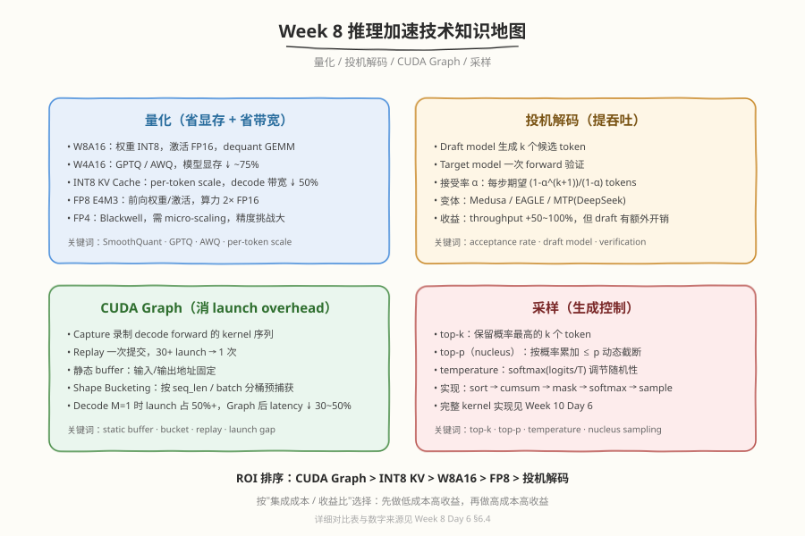

## Day 7：复盘与面试 Q&A —— 量化/投机解码/CUDA Graph/采样

### 🎯 目标

通过今天的学习，你将：

1. 能画出 **推理加速技术知识地图**——量化/投机解码/CUDA Graph/采样四条优化路线 
2. 能回答"推理引擎怎么加速"的完整决策链——从瓶颈分析到技术选型 
3. 掌握本周核心面试题——量化算法对比、FP8 格式、CUDA Graph 动态 shape、投机解码接受率 

> 💡 **为什么重要**：推理加速是面试"推理系统优化"的高频主题。今天把 Week 8 的知识收敛成"一张地图 + 10 道 Q&A"。

---

### 本周知识地图

> 📊 图中 ROI 排序与量化/CUDA Graph 数字来源见 [Week 8 Day 6 §6.4](/week8/day6)。
> 采样 kernel 的完整实现见 [Week 10 Day 6](../../week10/day6/)。

### 加速技术 ROI 总表

| 技术 | 成本(行) | 显存 | latency | throughput | ROI |
|------|---------|------|---------|-----------|-----|
| CUDA Graph | 50 | 0 | -50% decode | +30% | ⭐⭐⭐ |
| INT8 KV | 200 | -50% KV | -30% decode | +20% | ⭐⭐ |
| W8A16 | 300 | -50% 模型 | -10% prefill | +10% | ⭐⭐ |
| FP8 | 500 | -50% 模型 | -40% | +50% | ⭐⭐ |
| 投机解码 | 500 | 0 | 0 | +50-100% | ⭐ |
| top-p 采样 | 100 | 0 | 影响 | — | 基础 |

---

### 面试 Q&A 收敛

#### Q1：推理引擎有哪些加速手段？按 ROI 怎么排序？

答案

- 量化（W8A16/INT8 KV/FP8）：省显存 + 省带宽
- 投机解码：提吞吐（+50-100%）
- CUDA Graph：消 launch overhead（decode -50%）
- 采样 kernel：top-p/top-k
- ROI 排序：CUDA Graph > INT8 KV > W8A16 > FP8 > 投机解码
- 选择依据：先做低成本高收益（Graph），再做高成本高收益（FP8/投机）

#### Q2：GPTQ 和 AWQ 的区别？怎么选？

答案

- GPTQ：Hessian-based 逐列量化，精度最高，校准慢
- AWQ：activation-aware 保护大激活通道，校准快，部署友好
- 选择：vLLM 默认 AWQ（平衡），追求精度用 GPTQ
- 趋势：FP8 正在替代 W4A16（精度更好 + 算力 2x）

#### Q3：FP8 的 E4M3 和 E5M2 分别用于什么？

答案

- E4M3（4 指数 + 3 尾数）：精度好，用于前向（权重/激活）
- E5M2（5 指数 + 2 尾数）：范围大，用于反向（梯度）
- FP8 vs INT8：浮点自然容纳 outlier，不需要 SmoothQuant，算力 2x FP16

#### Q4：CUDA Graph 怎么处理动态 shape？

答案

- Shape bucketing：按 seq_len 分桶（128/256/512/...），每桶预捕获一个 Graph
- 调用时找最近 bucket，pad 到 bucket 大小
- 权衡：bucket 少 padding 浪费多，bucket 多捕获 + 显存开销大
- 生产：6-8 个 bucket，vLLM 默认用

#### Q5：投机解码的接受率怎么算？什么时候收益大？

答案

- 接受率 $\alpha$：draft token 被 target 接受的概率
- 每步期望产出：$(1-\alpha^{k+1})/(1-\alpha)$（k 个候选 + 1 个验证 token）
- $\alpha=0.8$, k=4 时：期望 3.36 tokens/步（vs 1 token/步，3.4x）
- 收益大条件：$\alpha$ 高（draft 质量好）+ k 大 + decode 是瓶颈
- 代价：draft model 额外显存 + 验证 forward 的算力

#### Q6：INT8 KV Cache 量化为什么用 per-token scale？

答案

- per-token scale：每个 token 的 K/V 各一个 scale
- 原因：不同 token 的 K/V 值域差异大（outlier token），per-tensor scale 会损失精度
- per-token 保留 token 内的 outlier，精度好
- attention kernel 内在线 dequant，带宽节省 50%

#### Q7：top-p 采样怎么实现？与 top-k 有什么区别？

答案

- top-k：保留概率最高的 k 个 token，其余置 -inf
- top-p（nucleus）：按概率降序累加，累积概率 ≤ p 的保留（动态 k）
- 区别：top-k 固定数量，top-p 固定概率覆盖（分布尖锐时 k 小，平坦时 k 大）
- 实现：sort → cumsum → mask(cumsum > p) → softmax → sample
- 采样 kernel 的完整实现见 [Week 10 Day 6](../../week10/day6/)

#### Q8：量化后 perplexity 变化多少算可接受？

答案

- W8A16: < 0.5%（几乎无损）
- W4A16 (GPTQ/AWQ): < 1%
- INT8 KV: < 0.1%
- FP8: < 0.3%
- 生产标准：perplexity 变化 < 1% 为可接受
- 验证方法：在 wiki/cnn_dailymail 等数据集上对比

#### Q9：FP4 量化有什么挑战？

答案

- 精度极低（1 位尾数），需要 per-block scaling + micro-scaling
- 校准复杂：scaling factor 设计更精细
- 适用：推理（容忍精度损失），训练需谨慎
- 算力：4x FP16，Blackwell 新精度

#### Q10：你的 Mini 引擎加了哪些加速？收益各多少？

答案

- CUDA Graph：decode latency -40%（launch overhead 从 50% 降到 5%）
- INT8 KV Cache：KV 显存 -50%，decode bandwidth -30%
- top-p 采样：支持 temperature/diversity 控制
- 总体：7B 模型 decode 5ms → 3ms, throughput 200 → 300 tok/s

---

#### 任务 1：本周 LeetCode 题目回顾（10 周计划 · 第 8 周）

本周 LeetCode 题目对应 <a href="/problems/lists/10-week-plan">10 周算法面试刷题计划</a> 第 8 周「二分查找与动态规划基础」（点击查看题解）：

| Day | 主题 | LeetCode 题目 |
|---|---|---|
| Day 1 | 二分模板 | <a href="/problems/algo/0704">704. 二分查找</a>、<a href="/problems/algo/0035">35. 搜索插入位置</a>、<a href="/problems/algo/0069">69. x 的平方根</a>、<a href="/problems/algo/0074">74. 搜索二维矩阵</a> |
| Day 2 | 旋转数组与峰值 | <a href="/problems/algo/0153">153. 寻找旋转排序数组中的最小值</a>、<a href="/problems/algo/0033">33. 搜索旋转排序数组</a>、<a href="/problems/algo/0034">34. 在排序数组中查找元素的第一个和最后一个位置</a>、<a href="/problems/algo/0162">162. 寻找峰值</a>、<a href="/problems/algo/0540">540. 有序数组中的单一元素</a> |
| Day 3 | 二分答案 | <a href="/problems/algo/0875">875. 爱吃香蕉的珂珂</a>、<a href="/problems/algo/1011">1011. 在 D 天内送达包裹的能力</a>、<a href="/problems/algo/0378">378. 有序矩阵中第 K 小的元素</a> |
| Day 4 | 二分进阶 | <a href="/problems/algo/0410">410. 分割数组的最大值</a>、<a href="/problems/algo/0719">719. 找出第 K 小的数对距离</a>、<a href="/problems/algo/0004">4. 寻找两个正序数组的中位数</a> |
| Day 5 | 一维 DP | <a href="/problems/algo/0070">70. 爬楼梯</a>、<a href="/problems/algo/0118">118. 杨辉三角</a>、<a href="/problems/algo/0198">198. 打家劫舍</a>、<a href="/problems/algo/0213">213. 打家劫舍 II</a>、<a href="/problems/algo/0337">337. 打家劫舍 III</a> |
| Day 6 | 背包 DP | <a href="/problems/algo/0279">279. 完全平方数</a>、<a href="/problems/algo/0322">322. 零钱兑换</a>、<a href="/problems/algo/0518">518. 零钱兑换 II</a>、<a href="/problems/algo/0416">416. 分割等和子集</a>、<a href="/problems/algo/0494">494. 目标和</a> |

> 💡 回顾重点：本周 LeetCode 题对应 10 周刷题计划第 8 周「二分查找与动态规划基础」。重做本周错题、总结模板笔记；没做完的题目今天补上。

---
### 本周复盘 Checklist

- [ ] 能解释 W8A16/W4A16/INT8 KV/FP8 各量化的原理和适用场景
- [ ] 能对比 GPTQ vs AWQ vs SmoothQuant
- [ ] 能说出 E4M3 vs E5M2 的区别和用途
- [ ] 能解释 CUDA Graph 的 capture/replay 机制
- [ ] 能描述 shape bucketing 策略
- [ ] 能算投机解码的接受率期望公式
- [ ] 能实现 top-p 采样
- [ ] 能列出加速技术 ROI 排序

---

### 下周预告

Week 9 是分布式并行与多硬件——掌握 TP/PP/DP 分布式并行、NCCL 通信、通信计算重叠、Ring Attention、MoE+EP 与 Ascend 多硬件对比，把单卡推理扩展到多卡多硬件场景。
