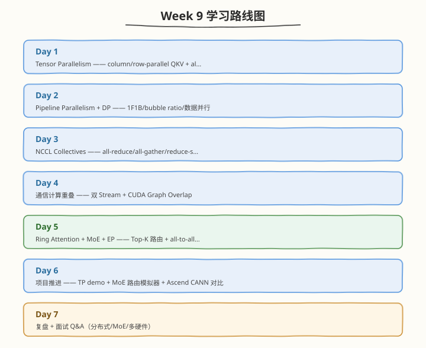

# Week 9：分布式并行与多硬件

> 核心目标：掌握 TP/PP/DP 分布式并行、NCCL 通信、通信计算重叠、Ring Attention、MoE+EP 与 Ascend 多硬件对比

| 项目　　　 | 说明　　　　　　　　　　　　　　　　　　　　　　　　　　　　　|
| ------------| ------------------------------------------------------------|
| 前置要求　 | 已完成 Week 8，掌握量化、投机解码、CUDA Graph、推理加速技术　　　　　　　　　　　　　　　　　　　　　　　|
| 建议时长　 | 工作日每天 2.5h，周末每天 6h，周计 24.5h　　　　　　　　　　|
| 本周产出　 | TP 推理 demo、NCCL 通信量推导笔记、分布式 all-reduce demo（torchrun 双进程）、MoE 路由模拟器、Ring Attention 模拟、Ascend 对比表　　　　　　　　　　　　　　　　　　　　　　　　　|
| 周日里程碑 | 理解 TP/PP/DP/EP 四维并行与通信模式，MoE 模拟器验证通信量，NCCL all-reduce 通信量推导完整　　　　　　　　　　　　　　　　　　　　　　　|

---

## 🧭 本周学习地图

---

## 📚 每日学习材料

| Day | 主题 | 目录 |
|-----|------|------|
| Day 1 | 分布式推理 —— 为什么需要分布式 + TP + DP 定位 | [day1/](/week9/day1) |
| Day 2 | Pipeline Parallelism 与 DP —— 1F1B/bubble ratio/数据并行 | [day2/](/week9/day2) |
| Day 3 | NCCL Collectives —— all-reduce/all-gather/reduce-scatter 通信量 | [day3/](/week9/day3) |
| Day 4 | 通信计算重叠 —— 双 Stream + CUDA Graph Overlap | [day4/](/week9/day4) |
| Day 5 | Ring Attention + MoE + EP 并行专题 | [day5/](/week9/day5) |
| Day 6 | 多硬件对比：NVIDIA CUDA vs Ascend CANN | [day6/](/week9/day6) |
| Day 7 | 复盘与面试 Q&A —— 分布式/MoE/多硬件 | [day7/](/week9/day7) |

