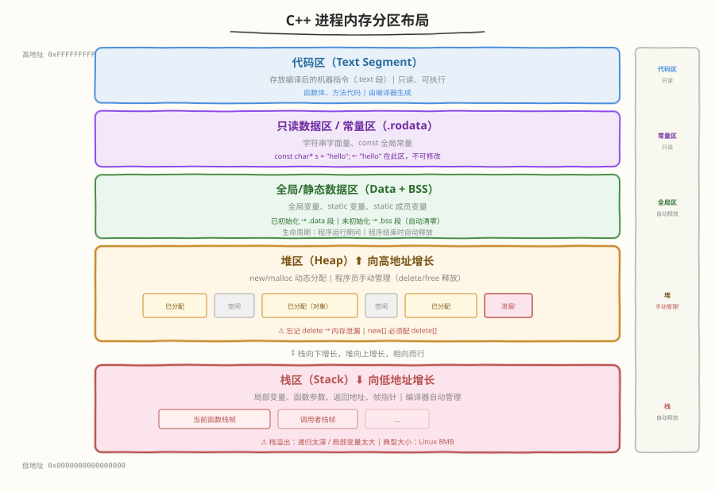
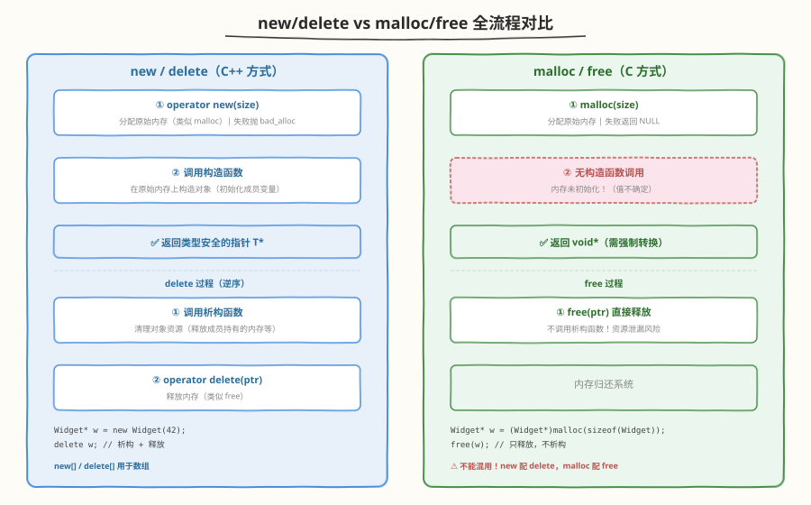
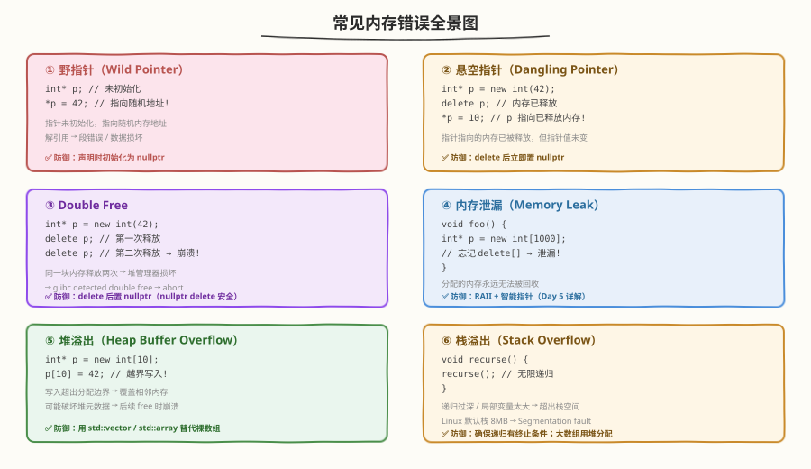
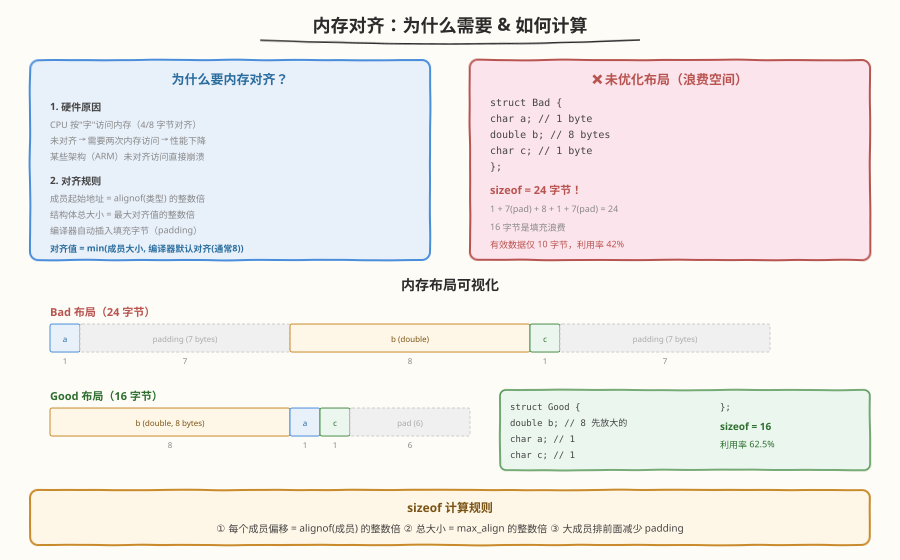

# Day 2（周二）：内存管理 ⭐（重中之重，必考）

> **今日目标**：掌握 C++ 内存分区模型、new/delete 底层原理、常见内存错误及排查手段、内存对齐计算
> **面试考察度**：⭐⭐⭐⭐⭐ 几乎每场必考，区分度高
> **建议节奏**：上午学理论（2~3h）→ 下午刷题自测（2h）→ 晚上手写代码 + 复述（1~2h）

---

## 学习任务 1：内存分区（45 分钟）

### C++ 进程内存布局



| 区域 | 存放内容 | 增长方向 | 生命周期 | 管理者 |
|------|---------|---------|---------|--------|
| **代码区**（.text） | 编译后的机器指令 | — | 程序运行期 | 编译器 |
| **只读数据区**（.rodata） | 字符串字面量、const 全局常量 | — | 程序运行期 | 编译器 |
| **全局/静态区**（.data/.bss） | 全局变量、static 变量 | — | 程序运行期 | 编译器 |
| **堆区**（Heap） | new/malloc 动态分配的对象 | ⬆ 向高地址 | 手动管理 | 程序员 |
| **栈区**（Stack） | 局部变量、函数参数、返回地址 | ⬇ 向低地址 | 函数作用域 | 编译器 |

### 代码示例：各区域变量分布

```cpp
#include <iostream>

int globalVar = 100;              // 全局/静态区（.data，已初始化）
int globalUninit;                 // 全局/静态区（.bss，未初始化，自动清零）
static int staticGlobal = 200;    // 全局/静态区（文件作用域）
const char* strLiteral = "hello"; // "hello" 在只读数据区，指针在静态区

void func() {
    int localVar = 10;            // 栈区
    static int staticLocal = 0;   // 全局/静态区（只初始化一次）
    int* heapVar = new int(42);   // int(42) 在堆区，指针在栈区

    std::cout << "代码区地址: " << (void*)func << std::endl;
    std::cout << "只读区地址: " << (void*)"hello" << std::endl;
    std::cout << "全局区地址: " << &globalVar << std::endl;
    std::cout << "栈区地址:   " << &localVar << std::endl;
    std::cout << "堆区地址:   " << heapVar << std::endl;

    delete heapVar;
}
```

### 栈 vs 堆 关键区别

| 维度 | 栈（Stack） | 堆（Heap） |
|------|------------|-----------|
| 分配方式 | 编译器自动分配/释放 | 程序员手动 new/delete |
| 速度 | 极快（移动栈指针） | 慢（需要搜索空闲内存） |
| 大小限制 | 较小（Linux 默认 8MB） | 较大（受限于虚拟内存） |
| 碎片问题 | 无 | 频繁分配/释放产生碎片 |
| 增长方向 | 向低地址 | 向高地址 |

---

## 学习任务 2：new/delete vs malloc/free（45 分钟）

### 全流程对比



### new 一个对象时发生了什么？（高频面试题）

```cpp
Widget* w = new Widget(42);
```

分两步执行：
1. **operator new(size_t size)**：分配原始内存（类似 malloc），失败抛 `std::bad_alloc`
2. **调用构造函数** `Widget::Widget(42)`：在分配的内存上构造对象

```cpp
// 等价的底层过程
void* mem = operator new(sizeof(Widget));   // 第一步：分配内存
Widget* w = static_cast<Widget*>(mem);
new (w) Widget(42);                         // 第二步：placement new 调用构造
```

### delete 一个对象时发生了什么？

```cpp
delete w;
```

分两步执行：
1. **调用析构函数** `w->~Widget()`：清理对象持有的资源
2. **operator delete(void* ptr)**：释放内存（类似 free）

### 对比表

| 维度 | new/delete | malloc/free |
|------|-----------|-------------|
| 语言 | C++ 运算符 | C 标准库函数 |
| 构造/析构 | ✅ 自动调用 | ❌ 不调用 |
| 返回类型 | 类型安全的 `T*` | `void*`（需强转） |
| 失败处理 | 抛 `std::bad_alloc` | 返回 `NULL` |
| 可重载 | ✅ 可重载 operator new/delete | ❌ |
| 大小计算 | 编译器自动计算 sizeof | 手动指定字节数 |
| 数组 | `new[]` / `delete[]` | 无区分 |

### 能否混用？

**不能！** new 配的内存必须用 delete 释放，malloc 配的必须用 free 释放。

```cpp
// ❌ 错误：混用
int* p1 = (int*)malloc(sizeof(int));
delete p1;           // 未定义行为！

int* p2 = new int;
free(p2);            // 未定义行为！

// ✅ 正确配对
int* p3 = (int*)malloc(sizeof(int));
free(p3);

int* p4 = new int;
delete p4;
```

### 数组 new[] 为什么必须配 delete[]？

```cpp
Widget* arr = new Widget[10];
```

- `new[]` 在分配的内存前部额外存储**元素个数**（通常是 8 字节 header）
- `delete[]` 读取这个个数，对每个元素调用析构函数
- 如果用 `delete`（而非 `delete[]`）：只调用第一个元素的析构函数 → 其余 9 个对象的资源泄漏

```cpp
Widget* arr = new Widget[10];
delete arr;      // ❌ 只析构 arr[0]，其余 9 个泄漏
delete[] arr;    // ✅ 析构全部 10 个元素
```

---

## 学习任务 3：常见内存错误（30 分钟）

### 六大常见错误



### 野指针 vs 悬空指针

| 类型 | 成因 | 示例 | 防御 |
|------|------|------|------|
| **野指针** | 指针未初始化 | `int* p; *p = 1;` | 声明时初始化为 nullptr |
| **悬空指针** | 指向的内存已释放 | `delete p; *p = 1;` | delete 后置 nullptr |

### 代码示例：各种错误

```cpp
// ① 野指针
int* wild;           // 未初始化，指向随机地址
*wild = 42;          // 段错误！

// ② 悬空指针
int* dangling = new int(42);
delete dangling;
*dangling = 10;      // 未定义行为：dangling 指向已释放内存

// ③ Double Free
int* df = new int(42);
delete df;
delete df;           // glibc detected double free → abort

// ④ 内存泄漏
void leak() {
    int* p = new int[1000];
    return;          // p 丢失，1000 个 int 永远无法释放
}

// ⑤ 堆溢出
int* buf = new int[10];
buf[10] = 42;        // 越界！写入 buf 之后的内存

// ⑥ 栈溢出
void infiniteRecursion() {
    infiniteRecursion();  // 无限递归 → 栈溢出 → Segfault
}
```

---

## 学习任务 4：内存泄漏检测（30 分钟）

### 常见泄漏场景

```cpp
// 场景 1：忘记释放
void foo() {
    int* p = new int(42);
    // 忘记 delete
}

// 场景 2：异常路径泄漏
void bar() {
    int* p = new int[100];
    doSomething();       // 如果抛异常，下面的 delete 永远不会执行
    delete[] p;
}

// 场景 3：覆盖指针
void baz() {
    int* p = new int(42);
    p = new int(100);    // 原来的 42 泄漏了！
    delete p;
}

// 场景 4：基类析构函数非虚
class Base { public: ~Base() {} };
class Derived : public Base {
    int* data_ = new int[1000];
public:
    ~Derived() { delete[] data_; }
};
Base* p = new Derived;
delete p;    // 只调用 ~Base()，~Derived() 不调用 → data_ 泄漏
```

### 检测工具

#### Valgrind（运行时检测）

```bash
# 编译（加 -g 保留调试信息）
g++ -g -o myprogram myprogram.cpp

# 运行 Valgrind
valgrind --leak-check=full --show-leak-kinds=all ./myprogram

# 输出示例：
# ==12345== HEAP SUMMARY:
# ==12345==     in use at exit: 4,096 bytes in 1 blocks
# ==12345==   total heap usage: 2 allocs, 1 frees, 4,100 bytes allocated
# ==12345==
# ==12345== 4,096 bytes in 1 blocks are definitely lost
# ==12345==    at 0x4C29203: operator new[](unsigned long)
# ==12345==    by 0x40093A: baz() (main.cpp:15)
```

#### AddressSanitizer（ASan，编译期插桩）

```bash
# 编译时加 -fsanitize=address
g++ -fsanitize=address -g -o myprogram myprogram.cpp

# 直接运行，泄漏时会输出详细报告
./myprogram

# 输出示例：
# =================================================================
# ==12345==ERROR: LeakSanitizer: detected memory leaks
# Direct leak of 4096 byte(s) in 1 object(s) allocated from:
#     #0 0x7f... in operator new[](unsigned long)
#     #1 0x40093a in baz() main.cpp:15
```

#### 对比

| 维度 | Valgrind | ASan |
|------|----------|------|
| 速度影响 | 慢 20~50x | 慢 2x |
| 内存开销 | 大 | 中等 |
| 检测范围 | 泄漏、越界、未初始化 | 泄漏、越界、double free、UAF |
| 使用方式 | 无需重新编译 | 需重新编译 |
| 推荐场景 | 测试阶段深度检查 | 开发阶段快速定位 |

---

## 学习任务 5：内存对齐（30 分钟）

### 内存对齐可视化



### 为什么要内存对齐？

1. **硬件原因**：CPU 按"字"（4 或 8 字节）访问内存。如果数据按对齐地址存放，一次访问即可读取；否则需要两次访问再拼接，性能下降
2. **平台要求**：某些硬件平台（如 ARM）要求数据必须对齐访问，不对齐直接触发硬件异常

### 对齐规则

1. 每个成员的**起始偏移**必须是 `alignof(成员类型)` 的整数倍
2. 结构体的**总大小**必须是**最大对齐值**的整数倍
3. 编译器自动在成员之间插入**填充字节**（padding）

### 计算 sizeof 结构体

```cpp
// 示例 1：未优化布局
struct Bad {
    char   a;    // offset 0,  size 1
               // padding 7 字节（让 double 对齐到 8）
    double b;    // offset 8,  size 8
    char   c;    // offset 16, size 1
               // padding 7 字节（总大小对齐到 8 的倍数 = 24）
};
// sizeof(Bad) = 24，有效数据 10 字节，利用率 42%

// 示例 2：优化布局（大成员优先）
struct Good {
    double b;    // offset 0,  size 8
    char   a;    // offset 8,  size 1
    char   c;    // offset 9,  size 1
               // padding 6 字节（总大小对齐到 8 的倍数 = 16）
};
// sizeof(Good) = 16，有效数据 10 字节，利用率 62.5%
```

### 手动验证

```cpp
#include <iostream>
#include <cstddef>

struct Test {
    char   a;
    double b;
    char   c;
};

int main() {
    std::cout << "sizeof(Test)  = " << sizeof(Test) << std::endl;       // 24
    std::cout << "alignof(Test) = " << alignof(Test) << std::endl;      // 8
    std::cout << "offsetof(Test, a) = " << offsetof(Test, a) << std::endl;  // 0
    std::cout << "offsetof(Test, b) = " << offsetof(Test, b) << std::endl;  // 8
    std::cout << "offsetof(Test, c) = " << offsetof(Test, c) << std::endl;  // 16
}
```

### 取消对齐（packed）

```cpp
struct __attribute__((packed)) Packed {
    char   a;    // offset 0, size 1
    double b;    // offset 1, size 8（无 padding）
    char   c;    // offset 9, size 1
};
// sizeof(Packed) = 10，无填充
// ⚠️ 访问 b 可能需要两次内存读取，性能下降
// ⚠️ 某些平台不支持，可能崩溃
```

---

## 高频面试题自测

### Q1：new 一个对象时发生了什么？

<details>
<summary>点击查看答案</summary>

两步：
1. **operator new(size)**：分配原始内存，失败抛 `std::bad_alloc`
2. **placement new**：在分配的内存上调用构造函数

```cpp
Widget* w = new Widget(42);
// 等价于：
void* mem = operator new(sizeof(Widget));
Widget* w = new (mem) Widget(42);
```

</details>

### Q2：delete this 合法吗？

<details>
<summary>点击查看答案</summary>

**合法但有严格条件**：
1. 对象必须是通过 `new`（而非 new[]、栈、全局）分配的
2. delete this 之后，不能再访问 this 的任何成员
3. 通常用于引用计数模式（引用计数归零时 delete this）

```cpp
class RefCounted {
    int refCount_ = 1;
public:
    void release() {
        if (--refCount_ == 0) {
            delete this;      // 合法：对象是 new 出来的
            // 此后不能访问任何成员
        }
    }
};
```

</details>

### Q3：数组 new[] 为什么必须配 delete[]？

<details>
<summary>点击查看答案</summary>

- `new[]` 在分配内存前部额外存储**元素个数**（实现相关，通常在 header 中）
- `delete[]` 读取这个个数，循环对每个元素调用析构函数
- 如果用 `delete`：只调用第一个元素的析构函数，其余元素析构函数不被调用 → 资源泄漏
- 对于 POD 类型（如 int），虽然不析构也没事，但仍然是未定义行为

</details>

### Q4：如何检测内存泄漏？

<details>
<summary>点击查看答案</summary>

| 工具 | 原理 | 特点 |
|------|------|------|
| **Valgrind** | 动态插桩，拦截所有内存操作 | 慢 20-50x，无需重编译，检测全面 |
| **ASan** | 编译期插桩（`-fsanitize=address`） | 慢 2x，需重编译，开发阶段首选 |
| **智能指针** | RAII，编译期保证不泄漏 | 预防而非检测（Day 5 详解） |
| **代码审查** | 确保每个 new 有对应 delete | 基础手段 |

</details>

---

## 动手练习

### 练习 1：写一个结构体计算 sizeof（含内存对齐）

```cpp
#include <iostream>
#include <cstddef>

struct A {
    char   a;     // 1 byte,  offset 0
    int    b;     // 4 bytes, offset 4 (需要 3 字节 padding)
    char   c;     // 1 byte,  offset 8
    double d;     // 8 bytes, offset 16 (需要 7 字节 padding)
    char   e;     // 1 byte,  offset 24
                  // 7 字节 padding → 总大小 32（8 的倍数）
};

int main() {
    std::cout << "sizeof(A) = " << sizeof(A) << std::endl;          // 32
    std::cout << "alignof(A) = " << alignof(A) << std::endl;        // 8
    std::cout << "offsetof(A, a) = " << offsetof(A, a) << std::endl; // 0
    std::cout << "offsetof(A, b) = " << offsetof(A, b) << std::endl; // 4
    std::cout << "offsetof(A, c) = " << offsetof(A, c) << std::endl; // 8
    std::cout << "offsetof(A, d) = " << offsetof(A, d) << std::endl; // 16
    std::cout << "offsetof(A, e) = " << offsetof(A, e) << std::endl; // 24
}
```

### 练习 2：故意制造一个内存泄漏，再用 ASan 抓出来

```cpp
// leak.cpp
#include <cstdlib>

int main() {
    int* p = new int[100];   // 分配 400 字节
    p[0] = 42;
    // 故意忘记 delete[]
    return 0;
}
```

```bash
# 编译 + 运行
g++ -fsanitize=address -g -o leak leak.cpp
./leak

# 预期输出：
# =================================================================
# ==XXXXX==ERROR: LeakSanitizer: detected memory leaks
#
# Direct leak of 400 byte(s) in 1 object(s) allocated from:
#     #0 0x7f... in operator new[](unsigned long)
#     #1 0x401234 in main leak.cpp:5
#
# SUMMARY: AddressSanitizer: 400 byte(s) leaked in 1 allocation(s).
```

---

## 今日小结

| 主题 | 核心要点 | 面试频率 |
|------|---------|---------|
| 内存分区 | 代码区/常量区/全局区/堆/栈，各区域存放什么 | ⭐⭐⭐⭐⭐ |
| new vs malloc | new = 分配内存 + 构造；malloc 只分配 | ⭐⭐⭐⭐⭐ |
| delete vs free | delete = 析构 + 释放；free 只释放 | ⭐⭐⭐⭐⭐ |
| new[]/delete[] | new[] 存元素个数，delete[] 循环析构 | ⭐⭐⭐⭐ |
| 内存错误 | 野指针/悬空指针/double free/泄漏/溢出 | ⭐⭐⭐⭐ |
| 泄漏检测 | Valgrind（慢但全面）、ASan（快，开发首选） | ⭐⭐⭐ |
| 内存对齐 | 成员偏移 = alignof 的倍数，总大小 = max_align 的倍数 | ⭐⭐⭐⭐ |

> **明日预告**：Day 3 面向对象 + 类机制——构造/析构顺序、虚函数机制、深拷贝 vs 浅拷贝、手写 String 类。
