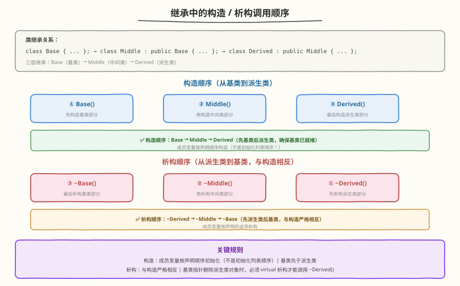
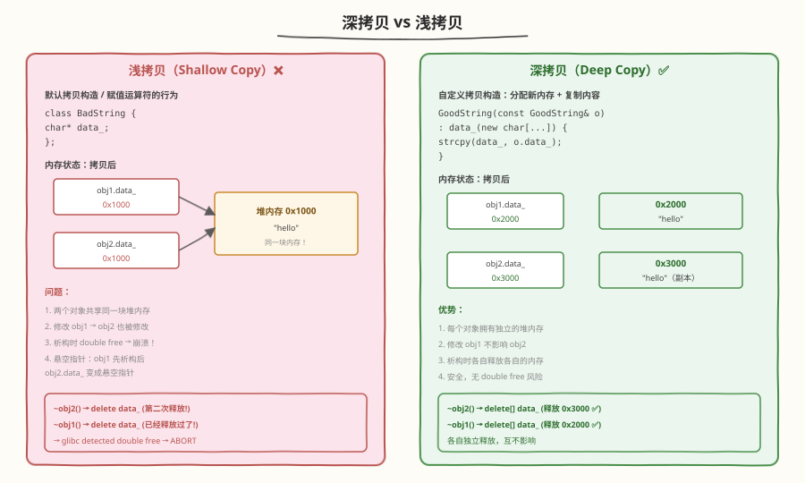
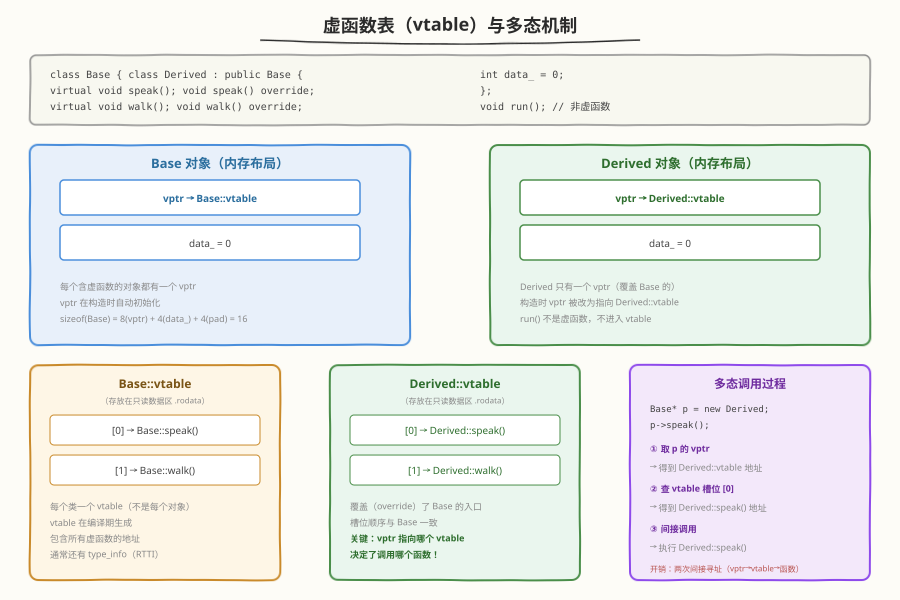
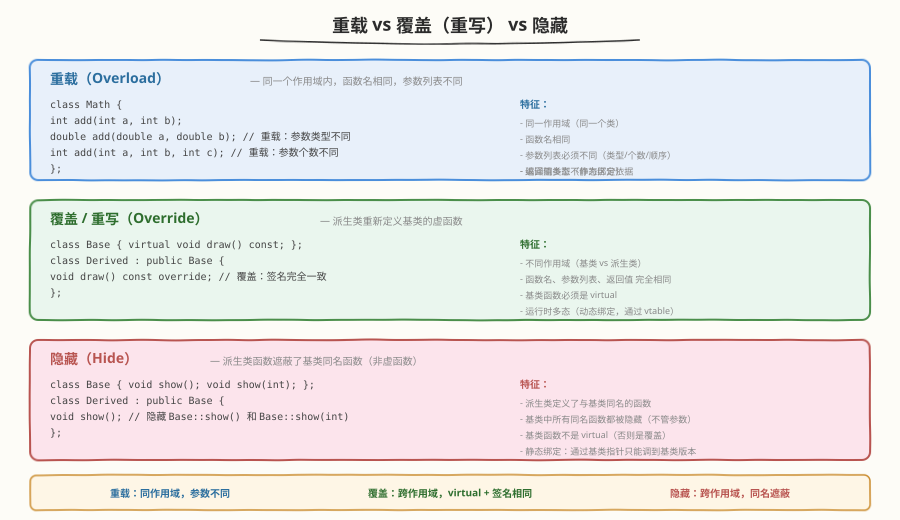
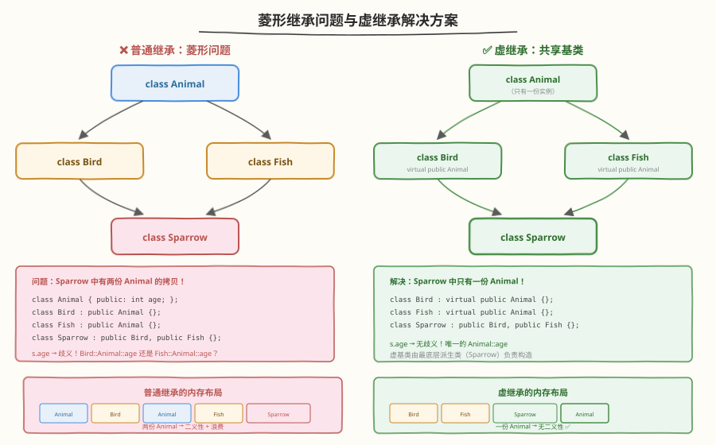

# Day 3（周三）：面向对象 + 类机制

> **今日目标**：掌握构造/析构顺序、深拷贝 vs 浅拷贝、虚函数与多态原理、手写 String 类
> **面试考察度**：⭐⭐⭐⭐⭐ 虚函数机制和深拷贝是每场必考，String 类是最高频手写题
> **建议节奏**：上午学理论（2~3h）→ 下午刷题自测（2h）→ 晚上手写 String 类到默写程度（1~2h）

---

## 学习任务 1：构造 / 析构 / 拷贝构造 / 赋值运算符（30 分钟）

### 四大特殊成员函数

```cpp
class Widget {
    int* data_;
    int size_;
public:
    Widget(int size);                          // 构造函数
    ~Widget();                                 // 析构函数
    Widget(const Widget& other);               // 拷贝构造函数
    Widget& operator=(const Widget& other);    // 拷贝赋值运算符
};
```

| 函数 | 触发时机 | 签名 |
|------|---------|------|
| 构造函数 | 创建对象时 | `Widget(args)` |
| 析构函数 | 对象销毁时 | `~Widget()` |
| 拷贝构造 | 用已有对象初始化新对象 | `Widget(const Widget&)` |
| 拷贝赋值 | 将已有对象赋给另一个已有对象 | `Widget& operator=(const Widget&)` |

### 区分拷贝构造 vs 拷贝赋值

```cpp
Widget a(10);           // 构造函数
Widget b(a);            // 拷贝构造（初始化新对象）
Widget c = a;           // 拷贝构造（不是赋值！）
Widget d(20);
d = a;                  // 拷贝赋值（已有对象被赋值）
```

### 如果不自定义，编译器自动生成默认版本

- 默认构造：调用成员的默认构造
- 默认析构：调用成员的析构（逆序）
- 默认拷贝构造/赋值：**逐成员浅拷贝**（这就是坑所在）

---

## 学习任务 2：继承中的构造 / 析构顺序（20 分钟）

### 调用顺序图



### 代码验证

```cpp
#include <iostream>

class Base {
public:
    Base()  { std::cout << "Base()" << std::endl; }
    ~Base() { std::cout << "~Base()" << std::endl; }
};

class Middle : public Base {
public:
    Middle()  { std::cout << "Middle()" << std::endl; }
    ~Middle() { std::cout << "~Middle()" << std::endl; }
};

class Derived : public Middle {
public:
    Derived()  { std::cout << "Derived()" << std::endl; }
    ~Derived() { std::cout << "~Derived()" << std::endl; }
};

int main() {
    Derived d;
    // 输出：
    // Base()
    // Middle()
    // Derived()
    // ~Derived()
    // ~Middle()
    // ~Base()
}
```

### 关键规则

- **构造顺序**：基类 → 成员变量（按声明顺序）→ 派生类构造函数体
- **析构顺序**：与构造严格相反——派生类析构体 → 成员变量（逆序）→ 基类
- **成员变量初始化顺序**：按类中**声明顺序**，不是初始化列表顺序！

---

## 学习任务 3：深拷贝 vs 浅拷贝 ⭐（30 分钟）

### 对比图



### 浅拷贝的问题

```cpp
class BadString {
    char* data_;
public:
    BadString(const char* s) {
        data_ = new char[strlen(s) + 1];
        strcpy(data_, s);
    }
    ~BadString() { delete[] data_; }
    // 没有自定义拷贝构造 → 编译器生成默认浅拷贝
};

void foo() {
    BadString a("hello");
    BadString b = a;       // 浅拷贝：b.data_ = a.data_（指向同一块内存）
}
// b 析构 → delete[] data_
// a 析构 → delete[] data_ → double free → 崩溃！
```

### 深拷贝的实现

```cpp
class GoodString {
    char* data_;
public:
    GoodString(const char* s) {
        data_ = new char[strlen(s) + 1];
        strcpy(data_, s);
    }

    // 深拷贝构造：分配新内存 + 复制内容
    GoodString(const GoodString& other) {
        data_ = new char[strlen(other.data_) + 1];
        strcpy(data_, other.data_);
    }

    // 深拷贝赋值（注意自赋值检查）
    GoodString& operator=(const GoodString& other) {
        if (this != &other) {           // 自赋值检查
            delete[] data_;             // 释放旧内存
            data_ = new char[strlen(other.data_) + 1];
            strcpy(data_, other.data_);
        }
        return *this;
    }

    ~GoodString() { delete[] data_; }
};
```

### 面试追问

> **Q：赋值运算符为什么要检查自赋值？**
> A：如果不检查 `if (this != &other)`，自赋值时先 `delete[] data_`，再 `strcpy(data_, other.data_)`——但 `other.data_` 就是 `this->data_`，已经被 delete 了，是悬空指针 → 未定义行为。

> **Q：copy-and-swap 惯用法是什么？**
> A：更安全的赋值实现方式，利用拷贝构造 + swap 自动处理自赋值和异常安全：
> ```cpp
> GoodString& operator=(GoodString other) {  // 传值，自动调用拷贝构造
>     swap(*this, other);                     // 交换
>     return *this;                           // other 析构时释放旧资源
> }
> ```

---

## 学习任务 4：虚函数机制 ⭐⭐⭐（45 分钟）

### 虚表（vtable）与虚表指针（vptr）



### 虚函数调用过程

```cpp
class Base {
public:
    virtual void speak() { cout << "Base speak" << endl; }
    virtual void walk()  { cout << "Base walk" << endl; }
};

class Derived : public Base {
public:
    void speak() override { cout << "Derived speak" << endl; }
    void walk() override  { cout << "Derived walk" << endl; }
};

Base* p = new Derived;
p->speak();    // 输出 "Derived speak"（动态绑定）
```

**底层执行过程**：
1. 取 `p` 指向对象的 **vptr**（虚表指针）
2. 通过 vptr 找到 **Derived::vtable**
3. 查 vtable 中 `speak` 的槽位（第 0 个）→ 得到 `Derived::speak` 的地址
4. 间接调用该地址的函数

### 虚函数 vs 非虚函数的区别

| 维度 | 虚函数（virtual） | 非虚函数 |
|------|-------------------|---------|
| 绑定时机 | 运行时（动态绑定） | 编译时（静态绑定） |
| 调用方式 | vptr → vtable → 间接调用 | 直接调用（编译器可内联） |
| 性能开销 | 两次间接寻址 + 不能内联 | 无额外开销 |
| 多态 | ✅ 支持 | ❌ 不支持 |
| 对象大小 | 增加 vptr 大小（8 字节/64位） | 不增加 |

### 为什么析构函数要声明成 virtual？

```cpp
class Base {
    int* data_ = new int[100];
public:
    ~Base() { delete[] data_; }   // ❌ 非虚析构
};

class Derived : public Base {
    int* extra_ = new int[200];
public:
    ~Derived() { delete[] extra_; }
};

Base* p = new Derived;
delete p;    // 只调用 ~Base()，~Derived() 不调用！
             // extra_ 泄漏！
```

**规则**：只要类有虚函数，就应该把析构函数声明为 virtual。

### 虚函数调用开销

```
非虚函数调用：call 指令直接跳转 → 1 次跳转
虚函数调用：  取 vptr → 查 vtable → 间接跳转 → 2~3 次内存访问
```

- 无法内联优化
- 无法在编译期确定目标
- 在性能敏感的循环中应避免虚函数调用

---

## 学习任务 5：纯虚函数、抽象类、接口（15 分钟）

```cpp
// 纯虚函数：只有声明，没有实现（= 0）
class Shape {
public:
    virtual double area() const = 0;     // 纯虚函数
    virtual double perimeter() const = 0; // 纯虚函数
    virtual ~Shape() = default;
};

// 抽象类：含有纯虚函数的类，不能实例化
// Shape s;  // ❌ 编译错误

// 具体类：必须实现所有纯虚函数
class Circle : public Shape {
    double radius_;
public:
    Circle(double r) : radius_(r) {}
    double area() const override { return 3.14159 * radius_ * radius_; }
    double perimeter() const override { return 2 * 3.14159 * radius_; }
};

// 接口：全部由纯虚函数组成的抽象类（类似 Java 的 interface）
class Drawable {
public:
    virtual void draw() const = 0;
    virtual void resize(double factor) = 0;
    virtual ~Drawable() = default;
};
```

### 构造函数里能调用虚函数吗？

**能调用，但不会发生多态！**

```cpp
class Base {
public:
    Base() {
        speak();   // 调用的是 Base::speak()，不是 Derived::speak()
    }
    virtual void speak() { cout << "Base" << endl; }
};

class Derived : public Base {
public:
    void speak() override { cout << "Derived" << endl; }
};

Derived d;   // 输出 "Base"（构造 Base 时，Derived 部分还没构造）
```

**原因**：构造 Base 时，对象的 vptr 指向 Base::vtable，Derived::vtable 还没设置。构造期间虚函数是静态绑定的。

---

## 学习任务 6：重载 vs 覆盖 vs 隐藏（20 分钟）



| 维度 | 重载（Overload） | 覆盖（Override） | 隐藏（Hide） |
|------|-----------------|------------------|-------------|
| 作用域 | 同一个类 | 基类 vs 派生类 | 基类 vs 派生类 |
| 函数名 | 相同 | 相同 | 相同 |
| 参数列表 | **必须不同** | **必须相同** | 不要求 |
| virtual | 不要求 | **必须是 virtual** | **不是 virtual** |
| 绑定时机 | 编译期（静态） | 运行期（动态） | 编译期（静态） |
| 本质 | 同名不同参 | 多态重写 | 名字遮蔽 |

### 隐藏的坑

```cpp
class Base {
public:
    void show() { cout << "Base::show()" << endl; }
    void show(int x) { cout << "Base::show(" << x << ")" << endl; }
};

class Derived : public Base {
public:
    void show() { cout << "Derived::show()" << endl; }
    // Base::show(int) 被隐藏了！
};

Derived d;
d.show();       // OK: Derived::show()
d.show(42);     // ❌ 编译错误！Base::show(int) 被隐藏
```

**解决**：用 `using Base::show;` 引入基类的所有同名函数。

---

## 学习任务 7：菱形继承与虚继承（20 分钟）



### 菱形继承的问题

```cpp
class Animal { public: int age; };
class Bird : public Animal {};
class Fish : public Animal {};
class Sparrow : public Bird, public Fish {};

Sparrow s;
s.age;       // ❌ 编译错误：age 有二义性（Bird::Animal::age vs Fish::Animal::age）
```

**问题**：Sparrow 中有两份 Animal 子对象，浪费空间 + 二义性。

### 虚继承解决

```cpp
class Animal { public: int age; };
class Bird : virtual public Animal {};
class Fish : virtual public Animal {};
class Sparrow : public Bird, public Fish {};

Sparrow s;
s.age;       // ✅ 无歧义，只有一份 Animal
```

### 虚继承的构造规则

- 虚基类由**最底层派生类**直接构造（跳过中间类）
- 中间类的构造函数中对虚基类的初始化会被忽略

```cpp
class Bird : virtual public Animal {
public:
    Bird() : Animal(1) {}    // 当 Bird 作为虚继承的一部分时，这个初始化被忽略
};

class Sparrow : public Bird, public Fish {
public:
    Sparrow() : Animal(5), Bird(), Fish() {}  // Sparrow 负责构造 Animal
};
```

---

## 学习任务 8：友元（10 分钟）

```cpp
class Widget {
    int secret_ = 42;
    friend void peek(const Widget& w);    // 友元函数
    friend class Inspector;               // 友元类
public:
    int getSecret() const { return secret_; }
};

void peek(const Widget& w) {
    cout << w.secret_;    // ✅ 友元函数可以访问 private 成员
}

class Inspector {
public:
    void inspect(const Widget& w) {
        cout << w.secret_;    // ✅ 友元类的所有成员函数都可以访问
    }
};
```

**注意**：友元破坏了封装性，应谨慎使用。常见用途：运算符重载（如 `operator<<`）。

---

## 高频面试题自测

### Q1：虚函数表存在哪？每个类几个？对象几个虚表指针？

<details>
<summary>点击查看答案</summary>

- **vtable 存在哪**：只读数据区（.rodata），编译期生成，每个类一份
- **每个类几个 vtable**：通常一个（含虚函数的类各一个）；多继承时每个含虚函数的基类各一个
- **对象几个 vptr**：单继承 1 个，N 重继承 N 个（每个含虚函数的基类子对象各一个）

</details>

### Q2：构造函数里能调用虚函数吗？会发生什么？

<details>
<summary>点击查看答案</summary>

能调用，但**不会发生多态**。构造基类时，对象的类型"就是"基类（vptr 指向基类的 vtable），派生类部分还没构造。所以构造函数中调用虚函数等价于静态绑定。

同理，析构函数中调用虚函数也不会多态——派生类部分已经析构。

</details>

### Q3：为什么 C++ 默认析构函数不是虚的？

<details>
<summary>点击查看答案</summary>

因为虚函数有开销（需要 vptr，增加对象大小，调用时多一次间接寻址）。C++ 哲学是"不为不用的特性付出代价"。只有基类需要被多态删除时才需要虚析构。如果类不打算被继承或多态删除，非虚析构是正确选择。

</details>

---

## 动手练习 ⭐：手写 String 类

这是 C++ 面试**最高频**的手写题，必须练到不看资料 10 分钟写完。

```cpp
#include <cstring>
#include <algorithm>
#include <iostream>

class String {
    char* data_;

public:
    // 构造函数
    String(const char* s = "") {
        data_ = new char[strlen(s) + 1];
        strcpy(data_, s);
    }

    // 析构函数
    ~String() {
        delete[] data_;
    }

    // 拷贝构造函数（深拷贝）
    String(const String& other) {
        data_ = new char[strlen(other.data_) + 1];
        strcpy(data_, other.data_);
    }

    // 拷贝赋值运算符（深拷贝 + 自赋值检查）
    String& operator=(const String& other) {
        if (this != &other) {
            delete[] data_;
            data_ = new char[strlen(other.data_) + 1];
            strcpy(data_, other.data_);
        }
        return *this;
    }

    // 获取 C 字符串
    const char* c_str() const { return data_; }

    // 获取长度
    size_t length() const { return strlen(data_); }

    // 友元：输出运算符
    friend std::ostream& operator<<(std::ostream& os, const String& s) {
        return os << s.data_;
    }

    // 比较运算符
    bool operator==(const String& other) const {
        return strcmp(data_, other.data_) == 0;
    }

    // 拼接运算符
    String operator+(const String& other) const {
        char* buf = new char[strlen(data_) + strlen(other.data_) + 1];
        strcpy(buf, data_);
        strcat(buf, other.data_);
        String result(buf);
        delete[] buf;
        return result;
    }
};
```

### 默写检查清单

- [ ] 构造函数：`new char[strlen+1]` + `strcpy`
- [ ] 析构函数：`delete[] data_`
- [ ] 拷贝构造：深拷贝（new + strcpy）
- [ ] 拷贝赋值：自赋值检查 + delete + 深拷贝 + return *this
- [ ] 能否加上移动构造和移动赋值？（Day 5 升级）

---

## 今日小结

| 主题 | 核心要点 | 面试频率 |
|------|---------|---------|
| 构造/析构顺序 | 构造：基类→成员→派生类；析构严格相反 | ⭐⭐⭐⭐ |
| 深拷贝 vs 浅拷贝 | 有裸指针必须自定义拷贝构造和赋值 | ⭐⭐⭐⭐⭐ |
| 虚函数机制 | vptr → vtable → 间接调用 | ⭐⭐⭐⭐⭐ |
| 虚析构 | 有虚函数的基类必须虚析构 | ⭐⭐⭐⭐⭐ |
| 纯虚/抽象类 | `= 0`，不能实例化，接口设计 | ⭐⭐⭐⭐ |
| 重载/覆盖/隐藏 | 同作用域+不同参 / virtual+同签名 / 同名遮蔽 | ⭐⭐⭐⭐ |
| 菱形继承/虚继承 | `virtual public`，最底层派生类构造虚基类 | ⭐⭐⭐ |
| String 类 | 构造/析构/拷贝构造/赋值 四件套 | ⭐⭐⭐⭐⭐ |

> **明日预告**：Day 4 STL 容器与算法——vector 扩容机制、迭代器失效、红黑树 vs 哈希表、LRU 缓存。
