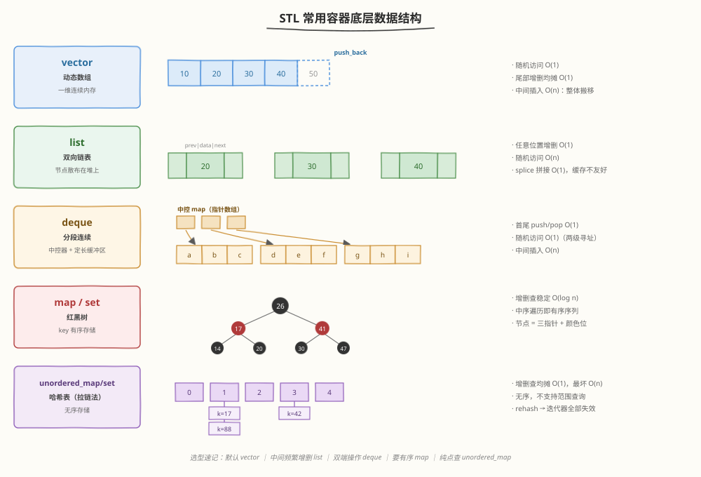
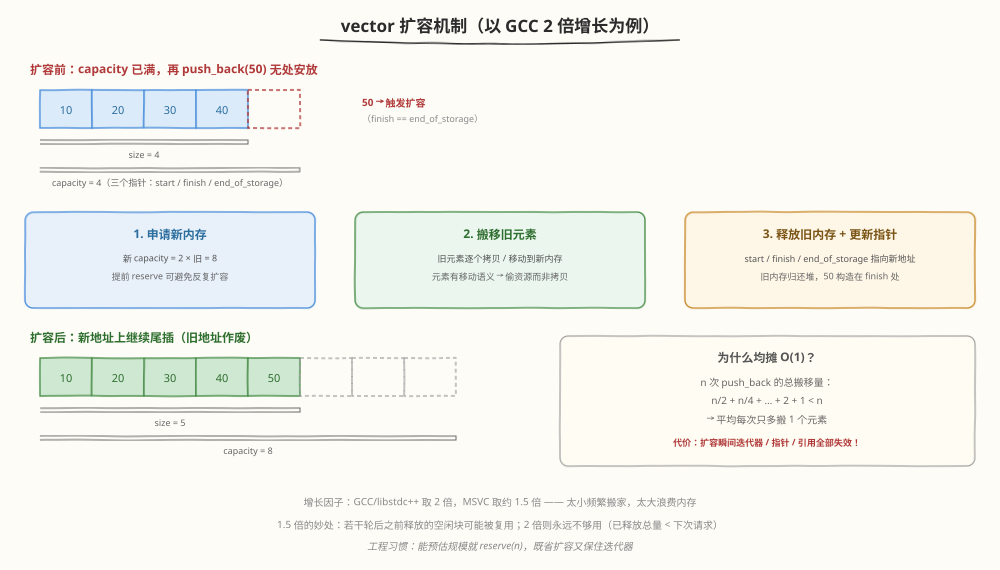
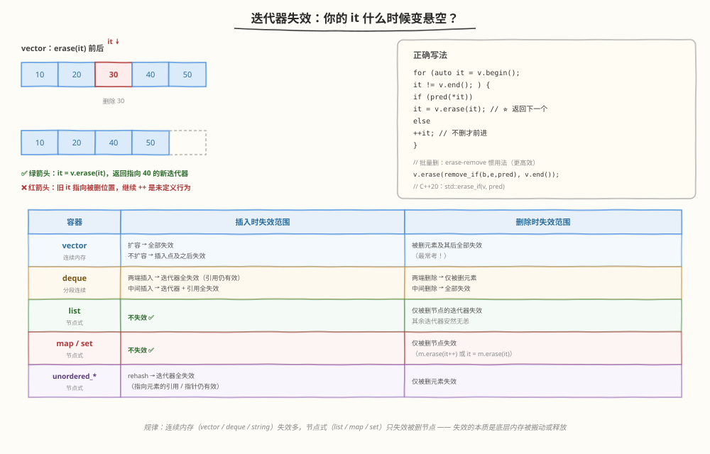
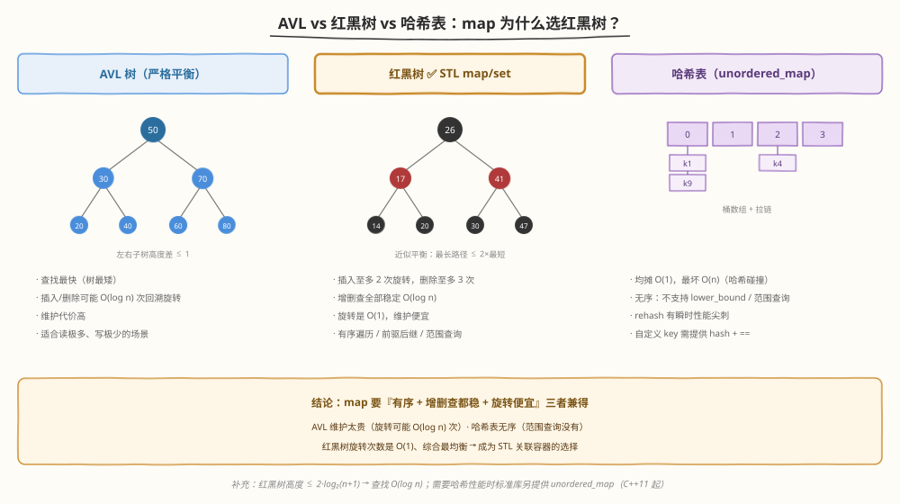
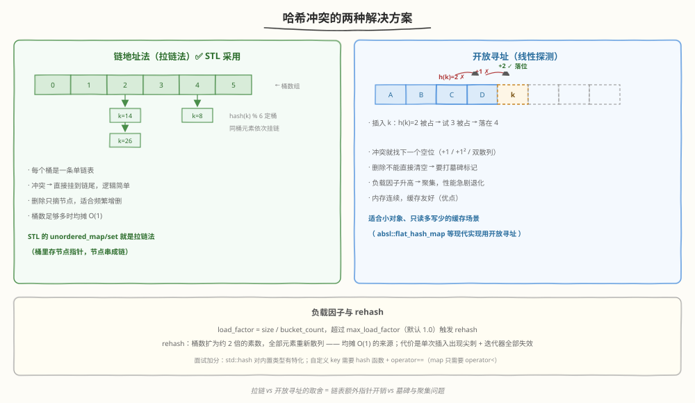
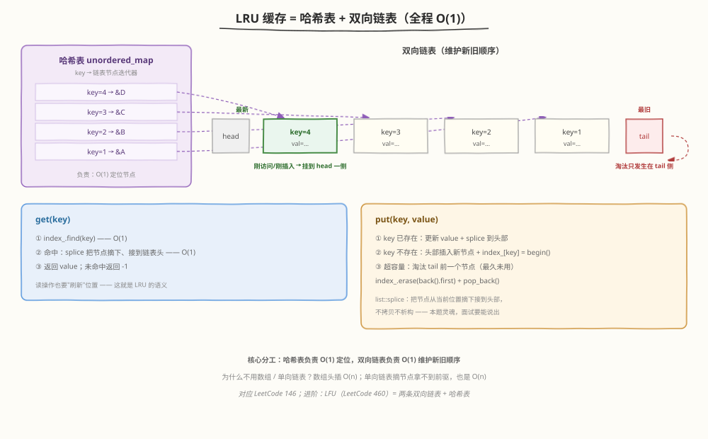

# Day 4（周四）：STL 容器与算法

> **今日目标**：掌握常用容器的底层数据结构、vector 扩容机制、迭代器失效规则、哈希冲突与红黑树选型，手写 LRU 缓存
> **面试考察度**：⭐⭐⭐⭐⭐ 容器底层与选型几乎必考，LRU 是 C++ 岗超高频手写题
> **建议节奏**：上午学理论（2~3h）→ 下午刷题自测（2h）→ 晚上手写 LRU 缓存到默写程度（1~2h）

---

## 学习任务 1：容器全景与底层数据结构（45 分钟）

### 底层数据结构总览



| 容器 | 底层结构 | 随机访问 | 插入/删除 | 内存特点 |
|------|---------|---------|----------|---------|
| vector | 动态数组（一维连续） | O(1) | 尾部均摊 O(1)，中间 O(n) | 连续，缓存友好 |
| list | 双向循环链表 | O(n) | 已有迭代器时任意位置 O(1) | 节点分散，每节点多 2 个指针 |
| deque | 中控器 + 定长缓冲区（分段连续） | O(1) | 首尾 O(1)，中间 O(n) | 分段连续 |
| map / set | 红黑树 | — | 增删查 O(log n)，按 key 有序 | 节点 = 三指针 + 颜色位 |
| unordered_map / set | 哈希表（拉链法） | — | 均摊 O(1)，最坏 O(n) | 桶数组 + 链表节点 |

### 各容器一句话画像

```cpp
#include <vector>
#include <list>
#include <deque>
#include <map>
#include <unordered_map>

std::vector<int> v = {1, 2, 3};          // 连续内存，默认首选
std::list<int> l = {1, 2, 3};            // 双向链表，中间增删快
std::deque<int> dq = {1, 2, 3};          // 分段连续，双端操作快
std::map<int, std::string> m;            // 红黑树，遍历按 key 升序
std::unordered_map<int, std::string> um; // 哈希表，纯查找最快

dq.push_front(0);                        // vector 没有 push_front！
m[3] = "three";                          // operator[]：不存在则插入 O(log n)
um[3] = "three";                         // 均摊 O(1)
```

### 选型口诀

- **默认 vector**：绝大多数场景，缓存友好是隐藏加分项
- **中间频繁插删** → list（但先想想真的需要吗？）
- **双端操作（滑动窗口、工作队列）** → deque
- **要有序遍历 / 范围查询 / 前驱后继** → map
- **纯点查、不在乎顺序** → unordered_map

### 面试追问

> **Q：vector 和 list 怎么选？list 中间插入 O(1) 不是更快吗？**
> A：list 的 O(1) 有前提——**已经有指向该位置的迭代器**；先要 `std::advance(it, k)` 找位置就是 O(n)。加上链表节点散布在堆上、缓存不命中率高，实践中 vector 即使搬移元素也常常更快。面试标准答案：除非有特殊需求（频繁 splice、迭代器不能失效），否则选 vector。

> **Q：deque 为什么随机访问也能 O(1)？**
> A：中控器（指针数组）记录每段缓冲区地址，`operator[]` 先算出落在第几段、再算段内偏移，两次寻址完成，所以是 O(1)（常数比 vector 大一点）。

---

## 学习任务 2：vector 扩容机制 ⭐（30 分钟）

### 扩容流程



vector 内部靠三个指针维护状态（libstdc++ 中为 `_M_start` / `_M_finish` / `_M_end_of_storage`）：

- `start`：数据起点
- `finish`：**size 边界**（最后一个元素的下一位置）
- `end_of_storage`：**capacity 边界**

当 `push_back` 时 `finish == end_of_storage`（容量已满），触发三步扩容：

1. **申请新内存**：新 capacity = 旧 capacity × 增长因子（GCC 2 倍，MSVC 约 1.5 倍）
2. **搬移旧元素**：逐个拷贝（或移动，元素支持移动语义时"偷"资源）到新内存
3. **释放旧内存**，三个指针指向新地址

### 均摊 O(1) 分析

```
n 次 push_back 的总搬移量 ≈ 1 + 2 + 4 + … + n/2 < n
→ 平均每次 push_back 只多搬 1 个元素 → 均摊 O(1)
```

### 为什么增长因子是 2 或 1.5？

- **太小**（如 1.1）：频繁搬移，均摊退化
- **太大**（如 4）：扩一次浪费大量空闲内存
- **1.5 倍的妙处**：若干轮扩容后，之前释放的空闲块**总和有可能覆盖**下一次请求，能被堆复用；**2 倍时永远不可能**（已释放总量恒小于下次请求）——这是经典面试加分点

### 三个实用接口

```cpp
std::vector<int> v;
v.reserve(1000);      // 预分配，之后 1000 次 push_back 都不会扩容
                        // → 迭代器、指针、引用全部稳定（非常重要的工程技巧）
v.shrink_to_fit();    // 请求收缩 capacity 到 size（非强制）
v.emplace_back(42);   // 原地构造，少一次移动/拷贝（Day 5 详解）
```

### 面试追问

> **Q：size 和 capacity 的区别？**
> A：size 是已有元素个数（`finish - start`），capacity 是已分配容量（`end_of_storage - start`）。区间 `[finish, end_of_storage)` 是"已分配未使用"的备用空间。

> **Q：怎么真正释放 vector 占的内存？**
> A：`clear()` 只析构元素、不改 capacity。用 `shrink_to_fit()`（非强制），或 swap 惯用法：`std::vector<int>().swap(v);`——用空 vector 换走内存，临时对象析构时释放。

---

## 学习任务 3：迭代器失效 ⭐⭐⭐（30 分钟）

### 失效全景



**失效的本质**：迭代器底层是指向容器内存的指针。一旦那块内存被**搬走**（扩容）或**释放**（erase 节点），迭代器就成了悬空指针。

### 经典错误：遍历中删除

```cpp
// ❌ 经典错误：erase 后继续 ++it
for (auto it = v.begin(); it != v.end(); ++it) {
    if (*it % 2 == 0) {
        v.erase(it);        // it 及其后全部失效，++it 是未定义行为
    }
}
```

### 正确写法

```cpp
// ✅ 写法 1：用 erase 的返回值（返回删除点之后的第一个有效迭代器）
for (auto it = v.begin(); it != v.end(); ) {
    if (*it % 2 == 0) {
        it = v.erase(it);   // ⭐ 删除后不 ++，用返回值继续
    } else {
        ++it;               // 只有未删除时才前进
    }
}

// ✅ 写法 2：erase-remove 惯用法（一次整体搬移，效率更高）
v.erase(std::remove_if(v.begin(), v.end(),
                       [](int x) { return x % 2 == 0; }),
        v.end());

// ✅ C++20 起一行搞定
std::erase_if(v, [](int x) { return x % 2 == 0; });
```

### map 的删除（对比记忆）

```cpp
// map 是节点式容器：只失效被删节点，其余迭代器安然无恙
for (auto it = m.begin(); it != m.end(); ) {
    if (it->second == "bad") {
        it = m.erase(it);       // C++11 起返回下一个迭代器
        // 旧代码常见写法：m.erase(it++);  // 后置 ++ 先保存旧值再删除
    } else {
        ++it;
    }
}
```

### 失效规则速查表

| 容器 | 插入时 | 删除时 |
|------|--------|--------|
| vector | 扩容 → **全部失效**；不扩容 → 插入点及之后失效 | 被删元素及其后**全部失效** |
| deque | 两端插入 → 迭代器全失效（引用仍有效）；中间插入 → 迭代器+引用全失效 | 两端删除 → 仅被删元素；中间删除 → 全部失效 |
| list | **不失效** | 仅被删节点失效 |
| map / set | **不失效** | 仅被删节点失效 |
| unordered_* | rehash → 迭代器全失效（引用/指针仍有效） | 仅被删元素失效 |

**记忆锚点**：底层是**连续内存**的（vector / deque / string）失效多；**节点式**的（list / map / set）只失效被删节点。

---

## 学习任务 4：map/set 底层——红黑树（25 分钟）

### 三种候选结构对比



### 红黑树五条性质（能说出 3 条即可）

1. 每个节点非红即黑
2. 根节点是黑色
3. 红节点的孩子必须是黑色（**不存在连续红节点**）
4. 任一节点到其所有后代叶子空节点的路径，**黑节点数目相同**（黑高相同）
5. 叶子（NIL 空节点）视为黑色

**推论**：最长路径（红黑相间）≤ 2 × 最短路径（全黑）→ 树高 ≤ 2·log₂(n+1) → 查找 O(log n)

### 为什么选红黑树而不是 AVL / 哈希表？

| 维度 | AVL | 红黑树 ✅ | 哈希表 |
|------|-----|----------|--------|
| 平衡程度 | 严格（高度差 ≤ 1） | 近似（最长 ≤ 2×最短） | 无树结构 |
| 查找 | 最快（最矮） | 略慢（常数大一点） | 均摊 O(1)，最坏 O(n) |
| 插入/删除旋转 | 可能 **O(log n)** 次 | **至多 2 / 3 次，O(1)** | 无旋转，但可能 rehash |
| 有序性 | ✅ | ✅ | ❌ |
| 范围查询 / 前驱后继 | ✅ | ✅ | ❌ |

**结论**：map 的需求是"**有序 + 增删查都稳定 log n + 频繁增删**"三者兼得——AVL 维护太贵，哈希表无序，红黑树旋转次数是 O(1)，综合最均衡。

---

## 学习任务 5：unordered_map 底层——哈希表（25 分钟）

### 哈希冲突的两种解法



- **链地址法（拉链法）**：每个桶挂一条单链表，`hash(key) % bucket_count` 定桶，同桶元素依次挂上。**STL 的 unordered_map 采用**（实现上桶里存的是节点指针）。
- **开放寻址法**：冲突时按探测序列（+1 / +1² / 双散列）找下一个空位。删除不能直接清空（会断链），要打**墓碑标记**；负载因子升高后出现聚集，性能急剧退化。

### 负载因子与 rehash

```
load_factor = size / bucket_count
超过 max_load_factor（默认 1.0）→ rehash：
桶数扩为约 2 倍的素数，全部元素重新散列
→ 这就是"均摊 O(1)"的来源；代价是单次插入出现瞬时尖刺 + 迭代器全部失效
```

### map vs unordered_map 选型（必考）

| 维度 | map | unordered_map |
|------|-----|---------------|
| 底层 | 红黑树 | 哈希表 |
| 有序性 | ✅ 按 key 有序 | ❌ 无序 |
| 单次操作 | 稳定 O(log n) | 均摊 O(1)，**最坏 O(n)** |
| 迭代器失效 | 只失效被删节点 | rehash 时全部失效 |
| 自定义 key 需要 | `operator<` | `hash 函数 + operator==` |
| 内存 | 每节点 3 指针 + 颜色 | 桶数组 + 节点 + hash 缓存 |

**选型口诀**：要有序遍历、范围查询（`lower_bound`）、最坏情况有保证 → map；纯点查、追求平均性能 → unordered_map。

```cpp
// 自定义类型做 key 的区别
struct Point { int x, y; };
bool operator<(const Point& a, const Point& b);   // map 够用

struct PointHash {                                 // unordered_map 还要：
    size_t operator()(const Point& p) const {      //   ① hash 仿函数
        return std::hash<int>()(p.x) ^ (std::hash<int>()(p.y) << 1);
    }
};
struct PointEq {                                   //   ② 相等判断
    bool operator()(const Point& a, const Point& b) const {
        return a.x == b.x && a.y == b.y;
    }
};
std::unordered_map<Point, int, PointHash, PointEq> m;
```

---

## 学习任务 6：空间配置器 allocator（10 分钟，概念级）

allocator 把"**内存分配**"和"**对象构造**"解耦：

```cpp
template <class T>
class allocator {
    T* allocate(size_t n);              // 分配 n 个 T 的原始内存（不构造）
    void deallocate(T* p, size_t n);    // 释放原始内存（不析构）
    void construct(T* p, Args&&...);    // placement new 在 p 上构造
    void destroy(T* p);                 // 调用析构函数
};
```

**为什么需要它**：容器（如 vector）扩容时先 `allocate` 新内存、搬移元素、析构旧元素、`deallocate` 旧内存——这套流程就建立在 allocator 接口上（对应学习任务 2 的扩容三步）。

**经典考点：SGI STL 的两级配置器**

- 第一级：> 128 字节的请求，直接走 malloc/free
- 第二级：≤ 128 字节，用 **16 条 free-list**（8、16、…、128 字节各一条）管理小块内存，避免频繁小额 malloc 造成碎片和开销

> 现代标准库实现多为 `operator new` 的薄封装，两级配置器作为经典设计思想了解即可。

---

## 学习任务 7：常用算法（20 分钟）

### std::sort：内省排序（introsort）

```
std::sort = 快速排序 + 堆排序 + 插入排序 的混合：
① 常规走快排（分区）
② 递归深度超过 2·log₂(n) → 说明分区选得很差 → 该子区间切换堆排序
③ 子区间长度 < 16（libstdc++ 阈值）→ 留给最后一趟插入排序收尾
→ 最坏也是 O(n log n)，不退化；不稳定（要稳定用 stable_sort，归并实现）
```

```cpp
std::vector<int> v = {5, 2, 9, 1, 7};
std::sort(v.begin(), v.end());                      // O(n log n)
std::sort(v.begin(), v.end(), std::greater<int>()); // 降序

std::list<int> l = {3, 1, 2};
// std::sort(l.begin(), l.end());   // ❌ 编译错误：需要随机访问迭代器
l.sort();                            // ✅ 成员函数：归并排序，稳定
```

### find 与 lower_bound

```cpp
std::vector<int> v = {1, 2, 4, 4, 6, 8};

// find：无序也可用，线性 O(n)
auto it = std::find(v.begin(), v.end(), 4);

// 二分族：要求有序，O(log n)
auto lb = std::lower_bound(v.begin(), v.end(), 4);  // 第一个 >= 4 的位置
auto ub = std::upper_bound(v.begin(), v.end(), 4);  // 第一个 >  4 的位置
auto cnt = ub - lb;                                 // 值为 4 的元素个数
```

| 算法 | 前提 | 复杂度 | 说明 |
|------|------|--------|------|
| `sort` | 随机访问迭代器 | O(n log n) | 内省排序，不稳定 |
| `stable_sort` | 随机访问迭代器 | O(n log n)（有额外内存） | 归并排序，稳定 |
| `find` | 无 | O(n) | 线性扫描 |
| `lower_bound` | **有序** | O(log n) | 第一个 >= x |
| `upper_bound` | **有序** | O(log n) | 第一个 > x |

---

## 高频面试题自测

### Q1：map 和 unordered_map 区别？什么时候用哪个？

<details>
<summary>点击查看答案</summary>

- **底层**：map 是红黑树（有序平衡二叉搜索树）；unordered_map 是哈希表（拉链法）
- **复杂度**：map 增删查稳定 O(log n)；unordered_map 均摊 O(1)，最坏 O(n)（哈希冲突 / rehash）
- **有序性**：map 遍历按 key 升序，支持 `lower_bound`、范围查询、前驱后继；unordered_map 完全无序
- **失效规则**：map 插入不失效迭代器，删除只失效被删节点；unordered_map rehash 使迭代器全部失效
- **选型**：要有序 / 范围查询 / 最坏情况保证 → map；纯点查、平均性能优先 → unordered_map；key 类型只有 `==` 没有 `<` → 只能 unordered_map

</details>

### Q2：vector 如何安全删除元素？

<details>
<summary>点击查看答案</summary>

三个层次：
1. **单点循环删除**：`it = v.erase(it);` 用返回值（指向被删元素之后的第一个有效迭代器），删除后不再 `++it`
2. **批量删除**：erase-remove 惯用法 `v.erase(std::remove_if(b, e, pred), v.end());`，一次搬移比逐个 erase 高效（逐个 erase 每次都搬移后面全部元素，O(n²)）
3. **C++20**：`std::erase_if(v, pred);`

陷阱：erase 会使被删位置之后的迭代器全部失效；扩容会使所有迭代器失效。若要在循环中插入/删除且保持迭代器有效，考虑 list 或预先 `reserve`。

</details>

### Q3：红黑树 vs AVL 树 vs 哈希表，STL 为什么选红黑树？

<details>
<summary>点击查看答案</summary>

- AVL 严格平衡（高度差 ≤ 1），查找最快，但插入/删除可能自底向上 **O(log n) 次旋转**，写多时代价高
- 红黑树近似平衡（最长路径 ≤ 2 倍最短），保证 O(log n)；插入**至多 2 次旋转**、删除**至多 3 次旋转**，维护是 O(1)
- 哈希表均摊 O(1) 但无序，不支持范围查询，最坏 O(n)
- map 的定位是"有序关联容器"：有序 + 增删查都要稳定对数复杂度 + 旋转便宜 → 红黑树综合最均衡。（要哈希性能时标准库另提供 unordered_map，C++11 起）

</details>

---

## 动手练习

### 练习 1：观察 vector 扩容过程

```cpp
#include <iostream>
#include <vector>

int main() {
    std::vector<int> v;
    std::cout << "初始 capacity = " << v.capacity() << std::endl;  // 0

    for (int i = 0; i < 70; ++i) {
        v.push_back(i);
        std::cout << "size=" << v.size()
                  << "  capacity=" << v.capacity() << std::endl;
    }
}
```

```text
GCC 输出节选：   capacity 依次为 1 2 4 8 16 32 64 128   （2 倍增长）
MSVC 输出节选：  capacity 依次为 1 2 3 4 6 9 13 19 …   （约 1.5 倍增长）

再加两行对比：
    std::vector<int> v2; v2.reserve(100);
    // 之后 100 次 push_back，capacity 恒为 100，一次扩容都没有
```

### 练习 2：两数之和（LeetCode 1，unordered_map 一趟扫描）

```cpp
class Solution {
public:
    std::vector<int> twoSum(std::vector<int>& nums, int target) {
        std::unordered_map<int, int> seen;          // 值 → 下标
        for (int i = 0; i < (int)nums.size(); ++i) {
            auto it = seen.find(target - nums[i]);  // O(1) 查补数
            if (it != seen.end()) return {it->second, i};
            seen[nums[i]] = i;
        }
        return {};
    }
};
```

### 练习 3 ⭐：手写 LRU 缓存（LeetCode 146，超高频）



**结构分工**：哈希表负责 O(1) 定位，双向链表负责 O(1) 维护"新旧顺序"（head 侧最新，tail 侧最久未用）。

```cpp
#include <cstddef>
#include <list>
#include <unordered_map>

class LRUCache {
    size_t capacity_;
    std::list<std::pair<int, int>> items_;                 // 头 = 最新，尾 = 最久未用
    std::unordered_map<int,
        std::list<std::pair<int, int>>::iterator> index_;  // key → 链表节点

public:
    explicit LRUCache(size_t capacity) : capacity_(capacity) {}

    int get(int key) {
        auto it = index_.find(key);                        // O(1) 定位
        if (it == index_.end()) return -1;
        items_.splice(items_.begin(), items_, it->second); // 摘下接到头部，O(1)
        return it->second->second;
    }

    void put(int key, int value) {
        auto it = index_.find(key);
        if (it != index_.end()) {                          // 已存在：更新 + 提前
            it->second->second = value;
            items_.splice(items_.begin(), items_, it->second);
            return;
        }
        if (items_.size() == capacity_) {                  // 淘汰 tail 侧最久未用
            index_.erase(items_.back().first);
            items_.pop_back();
        }
        items_.emplace_front(key, value);
        index_[key] = items_.begin();
    }
};
```

**手写要点（为什么全 O(1)）**：

- `list::splice` 把节点从当前位置**摘下并接到头部**，不拷贝不析构，O(1)——本题灵魂
- 哈希表存的是 `list::iterator`，既能 O(1) 找到节点，又能 O(1) 交给 splice
- 淘汰只发生在 tail 一侧：`back()` 取最旧 key → 哈希表 erase → `pop_back()`

### 默写检查清单

- [ ] 两个成员：`list<pair<K,V>>` + `unordered_map<K, list::iterator>`
- [ ] get：find → splice 到 begin → 返回 value；未命中返回 -1
- [ ] put：存在则更新 + splice；不存在则先判容量再淘汰 `back()` + `pop_back()`
- [ ] 新节点：`emplace_front` + `index_[key] = items_.begin()`
- [ ] 能说出 splice 的作用和复杂度

---

## 今日小结

| 主题 | 核心要点 | 面试频率 |
|------|---------|---------|
| 容器底层 | vector 数组 / list 链表 / deque 分段 / map 红黑树 / unordered 哈希 | ⭐⭐⭐⭐⭐ |
| vector 扩容 | 三步搬移、2 倍增长、均摊 O(1)、reserve 保迭代器 | ⭐⭐⭐⭐⭐ |
| 迭代器失效 | 连续内存失效多，节点式只失效被删节点；`it = erase(it)` | ⭐⭐⭐⭐⭐ |
| 红黑树选型 | 近似平衡 + 旋转 O(1)，综合优于 AVL；哈希表无序 | ⭐⭐⭐⭐ |
| 哈希冲突 | 拉链法（STL 采用）、负载因子、rehash | ⭐⭐⭐⭐ |
| map 选型 | 要有序 map，纯点查 unordered_map | ⭐⭐⭐⭐⭐ |
| sort | 内省排序：快排 + 堆排 + 插入排序，最坏 O(n log n) | ⭐⭐⭐⭐ |
| LRU 缓存 | 哈希表 + 双向链表 + splice，全 O(1) | ⭐⭐⭐⭐⭐ |

> **明日预告**：Day 5 现代 C++（C++11/14/17）——智能指针、移动语义、完美转发、lambda，区分度最高的一天。
