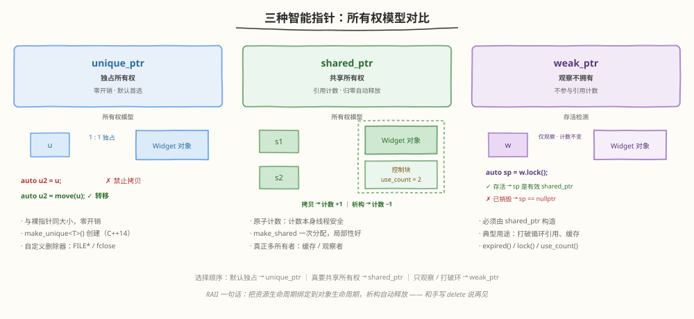
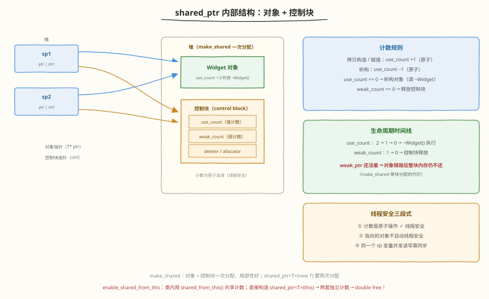
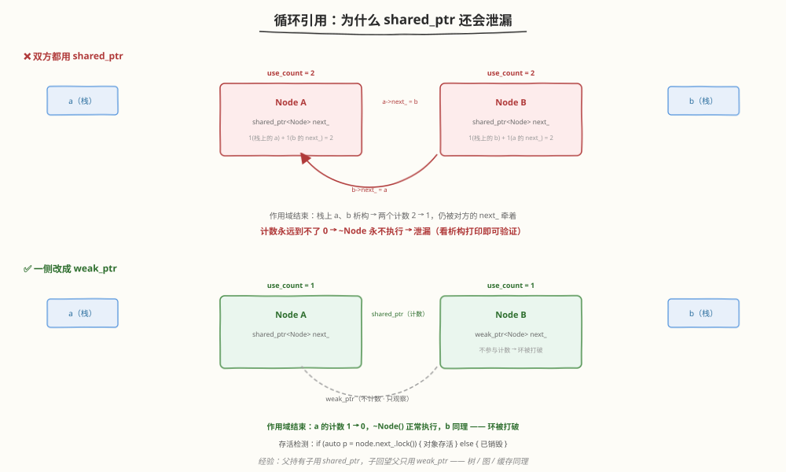
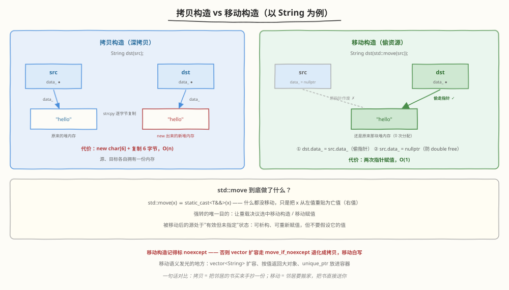
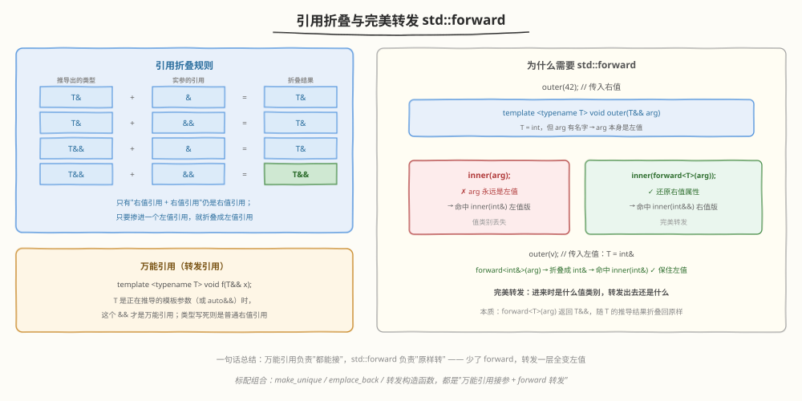
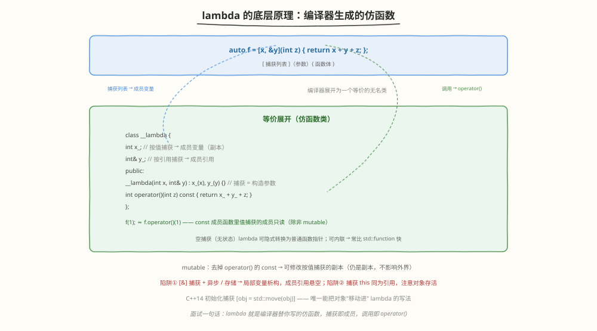

# Day 5（周五）：现代 C++（C++11/14/17）

> **今日目标**：拿下区分度最高的三大件——智能指针、移动语义、lambda，吃透万能引用与完美转发；晚上手写带移动语义的 String 和简易版 shared_ptr
> **面试考察度**：⭐⭐⭐⭐⭐ 会不会现代 C++，往往决定面试官把你归入"老式"还是"新式"工程师
> **建议节奏**：上午学理论（2~3h）→ 下午刷题自测（2h）→ 晚上手写代码 + 复述（1~2h）

---

## 学习任务 1：智能指针全景 ⭐⭐⭐（60 分钟）

智能指针全部围绕一个核心思想：**RAII**——把资源生命周期绑定到对象生命周期，析构时自动释放，不再依赖"记得调 delete"。



| 维度 | unique_ptr | shared_ptr | weak_ptr |
|------|-----------|-----------|---------|
| 所有权 | 独占（1 : 1） | 共享（N : 1） | 无，只观察 |
| 引用计数 | 无 | 强计数 | 弱计数（不影响对象生命周期） |
| 可否拷贝 | ❌ 只能移动 | ✅ 计数 +1 | ✅ |
| 可否解引用 | ✅ | ✅ | ❌ 必须 lock() |
| 额外开销 | 几乎为零 | 控制块 + 原子操作 | 与 shared_ptr 同源 |
| 典型用途 | 默认首选 | 多个所有者真需要共享 | 打破循环引用 / 缓存 / 观察 |

### 代码速览

```cpp
#include <memory>

// ---------- unique_ptr：独占，零开销 ----------
auto u1 = std::make_unique<Widget>();   // 首选创建方式（C++14）
// auto u2 = u1;                       // ❌ 编译错误：不可拷贝
auto u2 = std::move(u1);                // ✅ 所有权转移，此后 u1 == nullptr

// ---------- shared_ptr：共享，计数 ----------
auto s1 = std::make_shared<Widget>();   // 对象 + 控制块一次堆分配
auto s2 = s1;                           // use_count: 1 → 2
std::cout << s1.use_count();            // 2
// s2、s1 依次析构 → use_count 归零 → ~Widget() + 释放控制块

// ---------- weak_ptr：观察，不拥有 ----------
std::weak_ptr<Widget> w = s1;           // 必须由 shared_ptr 构造，计数不变
if (auto sp = w.lock()) {               // 检测存活的标准姿势
    sp->doWork();                       // 在 sp 作用域内对象保证存活
}
// w->doWork();                         // ❌ weak_ptr 没有 -> / *
```

### 面试追问

> **Q：为什么 unique_ptr 是零开销的？**
> A：没有计数、没有控制块，单个对象的 unique_ptr 与裸指针同样大小；析构就是一次 inline 的 delete；deleter 通过模板参数在编译期注入（空基优化），不占运行时开销。它可以完全替代"new + 手动 delete"。

> **Q：什么时候才真正需要 shared_ptr？**
> A：对象生命周期由多个所有者共同决定、无法静态确定——缓存、观察者模式、跨线程持有的节点。经验法则：默认 unique_ptr，只有"证明"确实需要共享才升级为 shared_ptr。

---

## 学习任务 2：shared_ptr 内部——控制块与引用计数（30 分钟）



### 结构

一个 shared_ptr 实际上是**两个指针**：

- `T* ptr`：指向被管理对象
- `control_block*`：指向堆上的控制块

控制块大致内容：

```
+----------------------+
| use_count  （强计数） |  原子整数，统计 shared_ptr 个数
| weak_count （弱计数） |  统计 weak_ptr 个数（强计数 > 0 时整体 +1）
| deleter / allocator  |  支持自定义删除器
+----------------------+
```

### 生命周期规则（必须能背）

1. 拷贝构造 / 拷贝赋值 → `use_count` **原子 +1**
2. 析构 → `use_count` **原子 −1**
3. `use_count == 0` → **析构对象**（调用 ~T()）
4. `weak_count == 0` → **释放控制块**

> 陷阱：`make_shared` 把对象和控制块放在同一块内存里，use_count 归零、~Widget() 跑完后，只要还有 weak_ptr 存在，**整块内存都不能归还**——要等 weak_count 也归零。

### 线程安全的三段式回答（高频追问）

1. **计数是线程安全的**：use_count 的加减是原子操作
2. **被指对象不自动线程安全**：多个线程读写同一个 Widget 依然要加锁
3. **同一个 shared_ptr 变量本身不线程安全**：多线程同时读写同一个 `sp` 变量需要外部同步，C++20 提供 `std::atomic<std::shared_ptr<T>>`

### make_shared vs shared_ptr(new T)

```cpp
auto sp1 = std::make_shared<Widget>();      // ✅ 一次堆分配，局部性好，异常安全
std::shared_ptr<Widget> sp2(new Widget);    // 两次分配（new + 控制块）
```

### enable_shared_from_this（常被追问）

```cpp
class Widget : public std::enable_shared_from_this<Widget> {
public:
    std::shared_ptr<Widget> getPtr() {
        return shared_from_this();               // ✅ 正确：与现有控制块共享计数
        // return std::shared_ptr<Widget>(this); // ❌ 错误：另起一套独立计数 → 双重释放
    }
};
```

---

## 学习任务 3：循环引用与 weak_ptr ⭐（30 分钟）



### 制造一次泄漏

```cpp
struct Node {
    std::shared_ptr<Node> next;    // ❌ 双方都用 shared_ptr → 环
    ~Node() { std::cout << "~Node\n"; }
};

int main() {
    auto a = std::make_shared<Node>();   // a 计数 = 1
    auto b = std::make_shared<Node>();   // b 计数 = 1
    a->next = b;                          // b 计数 = 2
    b->next = a;                          // a 计数 = 2
}   // 栈上 a 析构：a 计数 2→1（b->next 还牵着）
    // 栈上 b 析构：b 计数 2→1（a->next 还牵着）
    // 两个计数停在 1 → ~Node 永不执行 → 泄漏
```

**检验方法**：析构时没打印 `~Node` 就是泄漏（不到 10 行代码即可现场验证）。

### 修复：一侧改 weak_ptr

```cpp
struct Node {
    std::weak_ptr<Node> next;      // ✅ 不参与计数，环被打破

    void useNext() {
        if (auto p = next.lock()) {   // lock()：尝试升级为 shared_ptr
            // p 有效，对象存活（期间计数 +1）
        } else {
            // 对象已销毁，lock() 返回空
        }
    }
};
```

> **经验**："父子"结构（树、图、双向关系）中，父持有子用 shared_ptr，子回望父只用 weak_ptr。缓存同理：缓存本体持有 shared_ptr，使用者只拿 weak_ptr。

---

## 学习任务 4：左值 / 右值与移动语义 ⭐⭐⭐（45 分钟）



### 左值 vs 右值

- **左值**：有名字、有地址，能出现在 `=` 左边——变量、`*p`、`a[i]`、前置 `++i`
- **右值**：临时的、即将销毁的——字面量、`x + y`、函数按值返回的临时、`std::move(x)`
- 对应引用：`T&` 只能绑左值；`T&&`（右值引用）只能绑右值

```cpp
int a = 10;
int& r1 = a;      // ✅ 左值引用绑左值
int&& r2 = 10;    // ✅ 右值引用绑右值（字面量）
// int& r3 = 10;  // ❌
// int&& r4 = a;  // ❌ 右值引用不能绑左值
```

### 为什么要移动语义？

深拷贝大对象（如 1MB 的 String）要"1 次分配 + 1MB 复制"；而**源往往是即将销毁的临时对象**——不如直接"偷"走它的堆指针。移动语义让编译器/用户标记"这个对象可以被掏空"。

### 拷贝 vs 移动（String 为例）

```cpp
String s1("hello");

String s2 = s1;              // 拷贝构造：new + strcpy，O(n)
String s3 = std::move(s1);   // 移动构造：偷指针，O(1)
```

### std::move 到底做了什么？

```cpp
// 简化原型：
template <typename T>
constexpr remove_reference_t<T>&& move(T&& t) noexcept {
    return static_cast<remove_reference_t<T>&&>(t);
}
```

- **它什么都没移动**，只是把 x 从左值强转成亡值（xvalue，右值的一种）
- 强转的唯一目的：让**重载决议**选中移动构造 / 移动赋值
- 被移动后的源处于"有效但未指定"状态：可以析构、可以重新赋值，但不要假设它的值

### noexcept：移动的加分项

移动构造必须标 `noexcept`——否则 `vector<String>` 扩容时为了保证强异常安全会走 `move_if_noexcept`，**退化为拷贝**，你的移动白写了。

---

## 学习任务 5：万能引用、引用折叠与完美转发（30 分钟）



### 引用折叠规则

类型推导场景（模板、auto、别名）会出现"引用的引用"，折叠规则：

| 左边 | 右边 | 折叠为 |
|------|------|--------|
| `T&` | `&` | `T&` |
| `T&` | `&&` | `T&` |
| `T&&` | `&` | `T&` |
| `T&&` | `&&` | `T&&` |

**一句话**：只要出现左值引用就折叠成左值引用；只有"右值引用 + 右值引用"仍是右值引用。

### 万能引用（转发引用）

```cpp
template <typename T>
void f(T&& x);     // T 是正在推导的模板参数 → 这里的 && 是万能引用

f(10);             // 传右值：T = int，  x 的类型是 int&&
int v = 1;
f(v);              // 传左值：T = int&， x 的类型是 int&（折叠）
```

注意：只有 `T` 为**待推导**的模板参数时 `T&&` 才是万能引用；`void f(Widget&&)` 这种具体类型只是普通右值引用。

### 为什么需要 std::forward

```cpp
void inner(int& x)  { std::cout << "lvalue\n"; }
void inner(int&& x) { std::cout << "rvalue\n"; }

template <typename T>
void outer(T&& arg) {
    inner(arg);                     // ❌ arg 有名字，永远是左值 → 永远打 lvalue
    inner(std::forward<T>(arg));    // ✅ 按传入时的值类别原样转发
}

outer(42);   // 传右值 → forward → 打 rvalue
int v = 0;
outer(v);    // 传左值 → forward → 打 lvalue
```

**本质**：`std::forward<T>(arg)` 返回 `T&&`——`T = int` 时是 `int&&`（右值），`T = int&` 时折叠成 `int&`（左值）。万能引用 + forward 是"工厂函数"的标配组合：

```cpp
template <typename T, typename... Args>
std::unique_ptr<T> make_unique(Args&&... args) {
    return std::unique_ptr<T>(new T(std::forward<Args>(args)...));
}
```

---

## 学习任务 6：Rule of Three / Five / Zero（15 分钟）

| 规则 | 包含 | 触发条件 |
|------|------|---------|
| 三法则 | 析构函数、拷贝构造、拷贝赋值 | 类管理资源（裸指针 / 句柄） |
| 五法则 | 三 + 移动构造、移动赋值 | 同上，且想要 C++11 性能 |
| 零法则 | 一个都不写 | 成员全是值语义（string / vector / 智能指针），拷贝移动自动正确 |

```cpp
class Buffer {
    char* data_;
    size_t size_;
public:
    ~Buffer();                                   // ① 析构函数
    Buffer(const Buffer&);                       // ② 拷贝构造
    Buffer& operator=(const Buffer&);            // ③ 拷贝赋值
    Buffer(Buffer&&) noexcept;                   // ④ 移动构造
    Buffer& operator=(Buffer&&) noexcept;        // ⑤ 移动赋值
};
// Day 3 手写的 String 是"三"；今晚补上两个移动成员 → 升级为"五"
```

> **面试话术**："一旦手写了析构函数（资源管理的信号），编译器就不再默认生成移动成员——拷贝也变成按成员拷贝，若成员是裸指针就会浅拷贝。这正是五法则存在的原因。"

---

## 学习任务 7：Lambda 表达式（30 分钟）



### 语法与捕获方式

```cpp
[捕获列表](参数) mutable -> 返回类型 { 函数体 }
```

| 捕获 | 含义 | 注意 |
|------|------|------|
| `[]` | 不捕获 | —— |
| `[x]` | 按值捕获 x（拷贝一份） | 修改的是副本 |
| `[&x]` | 按引用捕获 x | 超出 x 生命周期会悬空 |
| `[=]` | 外部变量全按值 | 大对象会被悄悄拷贝 |
| `[&]` | 外部变量全按引用 | ⚠️ 悬空风险最高 |
| `[this]` | 捕获 this 指针 | 本质是引用捕获，注意对象存活 |
| `[obj = std::move(obj)]` | 初始化捕获（C++14） | 唯一能把对象移进 lambda 的方式 |

### 底层原理：展开为仿函数

```cpp
int x = 10, y = 20;
auto f = [x, &y](int z) { return x + y + z; };

// 编译器大约生成：
class __lambda {
    int  x_;      // 按值捕获 → 成员副本
    int& y_;      // 按引用捕获 → 成员引用
public:
    __lambda(int x, int& y) : x_(x), y_(y) {}
    int operator()(int z) const { return x_ + y_ + z; }  // 值捕获不可改（除非 mutable）
};
// f(1) ≈ f.operator()(1)
```

### 两个经典陷阱

```cpp
// ① 按引用捕获 + 异步/延迟执行
auto make = [&local] { return local + 1; };
// lambda 被存储/异步运行时 local 已析构 → 悬空引用

// ② [=] 也不是万能保险
auto task = [=] { use(bigObject); };
// [=] 拷贝的是 this 指针（本质仍引用对象）；大对象按值拷贝有性能代价
```

> **Q：lambda 是不是就是语法糖？**
> A：本质是编译器生成的匿名仿函数类：捕获列表 = 构造参数 + 成员变量，调用 = operator()。空捕获（无状态）lambda 可隐式转换为普通函数指针；因可内联，常比 std::function 更快。

---

## 学习任务 8：其余现代特性速览（15 分钟）

```cpp
// auto / decltype
auto i = 42;                    // 由初始化式推导
decltype(x + y) z = x + y;      // 由表达式推导，不求值

// 范围 for（语法糖：展开为 begin()/end() 迭代）
for (const auto& kv : myMap) std::cout << kv.first;

// nullptr：带类型的空指针，终结 0/NULL 的二义性重载问题
void f(int);     void f(char*);
f(NULL);         // C++98 下二义 / 调 f(int)
f(nullptr);      // 明确调用 f(char*)

// constexpr：编译期可计算
constexpr int factorial(int n) { return n <= 1 ? 1 : n * factorial(n - 1); }
int arr[factorial(5)];         // 长度 120，编译期确定

// enum class / override、final / 别名 / 可变参数模板
enum class Color { Red, Green };
using IntVec = std::vector<int>;
```

---

## 高频面试题自测

### Q1：shared_ptr 是怎么实现计数的？线程安全吗？

<details>
<summary>点击查看答案</summary>

每个 shared_ptr 持有两个指针：一个指向对象，一个指向堆上的**控制块**。控制块包含强计数 use_count（原子整数）、弱计数和删除器。拷贝 → 原子 +1；析构 → 原子 −1；use_count 归零析构对象，weak_count 归零释放控制块。

线程安全三段式：
1. 计数是原子操作，**计数本身线程安全**
2. **被指对象不自动线程安全**，并发读写要加锁
3. 多线程同时读写**同一个 shared_ptr 变量**需要外部同步（或 C++20 `atomic<shared_ptr>`）

</details>

### Q2：为什么要有移动语义？std::move 到底做了什么？

<details>
<summary>点击查看答案</summary>

为什么：深拷贝大对象代价是"分配 + 逐字节复制"，但源常常是即将销毁的临时对象。移动语义让新对象直接"偷"走源的堆资源（指针交接 + 源置空），把 O(n) 拷贝降为 O(1)。vector 扩容、按值返回大对象、unique_ptr 入容器都是受益场景。

std::move 只做一件事：`static_cast<T&&>(x)`，把 x 从左值重贴为亡值——**它自己不移动任何东西**，只是让重载决议选中移动构造/移动赋值。被移动后的源处于"有效但未指定"状态。

加分项：移动构造要标 noexcept，否则 vector 扩容走 move_if_noexcept 退化为拷贝。

</details>

### Q3：weak_ptr 解决什么问题？如何检测对象是否存活？

<details>
<summary>点击查看答案</summary>

解决：① shared_ptr 互相引用形成环，计数永不归零 → 泄漏；② 缓存、观察者等"想用但不拥有"的场景。

检测存活：`auto sp = w.lock();`——对象存活则返回一个 shared_ptr（计数 +1，保证使用期间不被销毁）；已销毁则返回 nullptr。也可用 `w.expired()` 只查询，但结果一返回就可能过期（竞态），应优先 lock()。

</details>

### Q4：[&] 和 [=] 捕获有什么区别？各举一个危险场景。

<details>
<summary>点击查看答案</summary>

`[&]` 按引用捕获：零拷贝，但 lambda 生命周期超过被捕获局部变量（存储后异步执行、作为返回值）→ 悬空引用。
`[=]` 按值捕获：值安全，但 ① 大对象按值拷贝有性能代价；② `this` 是指针，拷贝的只是指针——效果仍是引用对象，对象销毁后照样悬空（C++20 起隐式捕获 this 已废弃，需显式 `[this]` 或 `[*this]` 拷贝整个对象）。

C++14 初始化捕获 `[obj = std::move(obj)]` 是唯一能把对象移动进 lambda 的方式。

</details>

---

## 动手练习

### 练习 1 ⭐：给 Day 3 的 String 类补上移动语义

```cpp
// 在 Day 3 的三法则 String 上新增两个成员：

// 移动构造
String(String&& other) noexcept
    : data_(other.data_) {           // ① 偷指针
    other.data_ = nullptr;           // ② 源置空，防止 double free
}

// 移动赋值
String& operator=(String&& other) noexcept {
    if (this != &other) {            // 防自移动（p = std::move(p)）
        delete[] data_;              // 先释放自己的资源
        data_ = other.data_;         // 偷指针
        other.data_ = nullptr;       // 源置空
    }
    return *this;
}
```

验证：

```cpp
String s1("hello");
String s2 = s1;               // 拷贝构造：1 次堆分配 + 复制
String s3 = std::move(s1);    // 移动构造：0 次分配
s3 = std::move(s2);           // 移动赋值
```

### 练习 2 ⭐⭐⭐：手写简易版 shared_ptr（面试官超爱）

```cpp
#include <atomic>
#include <utility>

template <typename T>
class SharedPtr {
    T* ptr_ = nullptr;
    std::atomic<long>* count_ = nullptr;   // 简化控制块：只有强计数

public:
    SharedPtr() = default;

    explicit SharedPtr(T* p)
        : ptr_(p), count_(new std::atomic<long>(1)) {}

    ~SharedPtr() { release(); }

    // 拷贝：计数 +1
    SharedPtr(const SharedPtr& other)
        : ptr_(other.ptr_), count_(other.count_) {
        if (count_) count_->fetch_add(1, std::memory_order_relaxed);
    }

    // 移动：所有权转移，计数不变，源置空
    SharedPtr(SharedPtr&& other) noexcept
        : ptr_(other.ptr_), count_(other.count_) {
        other.ptr_ = nullptr;
        other.count_ = nullptr;
    }

    // 拷贝赋值 + 移动赋值二合一：copy-and-swap
    SharedPtr& operator=(SharedPtr other) noexcept {
        swap(other);    // 交换后 other 带走旧资源，析构时自动释放
        return *this;
    }

    void swap(SharedPtr& other) noexcept {
        std::swap(ptr_, other.ptr_);
        std::swap(count_, other.count_);
    }

    void release() {
        if (count_ && count_->fetch_sub(1, std::memory_order_acq_rel) == 1) {
            delete ptr_;      // 最后一个所有者：析构对象
            delete count_;    // 并释放控制块
        }
        ptr_ = nullptr;
        count_ = nullptr;
    }

    T* get() const { return ptr_; }
    T& operator*() const { return *ptr_; }
    T* operator->() const { return ptr_; }
    long use_count() const { return count_ ? count_->load() : 0; }
    explicit operator bool() const { return ptr_ != nullptr; }
};
```

### 默写检查清单

- [ ] 拷贝 +1 / 析构 −1 / 归零释放 —— 三步能脱口而出
- [ ] 移动成员：偷指针 → 源置空 → 标 noexcept
- [ ] copy-and-swap 统一处理拷贝/移动赋值与自赋值
- [ ] 能指出这版的简化点：没有 weak_count、对象与计数不在同一块（make_shared 的优化）

---

## 今日小结

| 主题 | 核心要点 | 面试频率 |
|------|---------|---------|
| unique_ptr | 独占、零开销、只能移动、默认首选 | ⭐⭐⭐⭐⭐ |
| shared_ptr | 控制块 + 原子计数；线程安全三段式 | ⭐⭐⭐⭐⭐ |
| weak_ptr | 打破循环引用；lock() 检测存活 | ⭐⭐⭐⭐⭐ |
| 移动语义 | std::move 只是类型转换；被移动源"有效但未指定" | ⭐⭐⭐⭐⭐ |
| 完美转发 | 万能引用 + 引用折叠 + forward 还原值类别 | ⭐⭐⭐⭐ |
| 五法则 | 写了析构 → 移动成员不再默认生成 | ⭐⭐⭐⭐ |
| lambda | 展开为仿函数；捕获即成员；[&] 悬空陷阱 | ⭐⭐⭐⭐ |
| constexpr / nullptr | 带类型空指针、编译期计算，速览即可 | ⭐⭐⭐ |

> **明日预告**：Day 6 多线程与并发——std::thread、mutex 与锁家族、条件变量、死锁四条件、atomic 内存序、DCLP 单例、生产者-消费者模型。面试前最后一块硬骨头！
