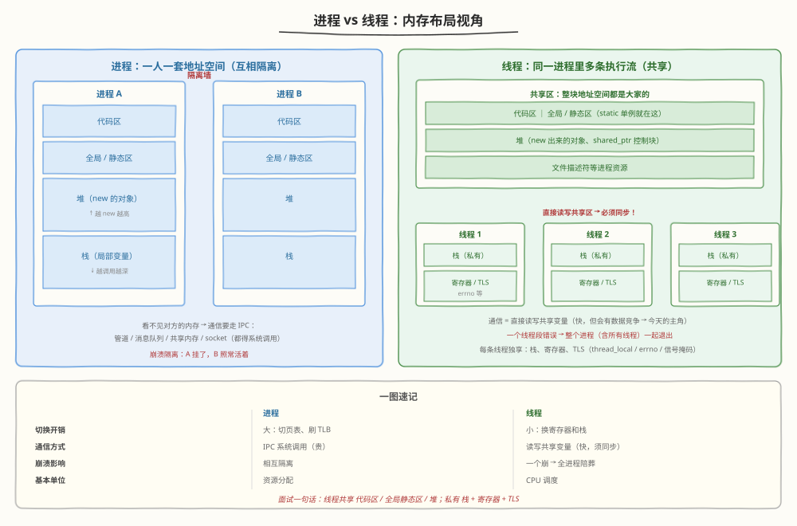
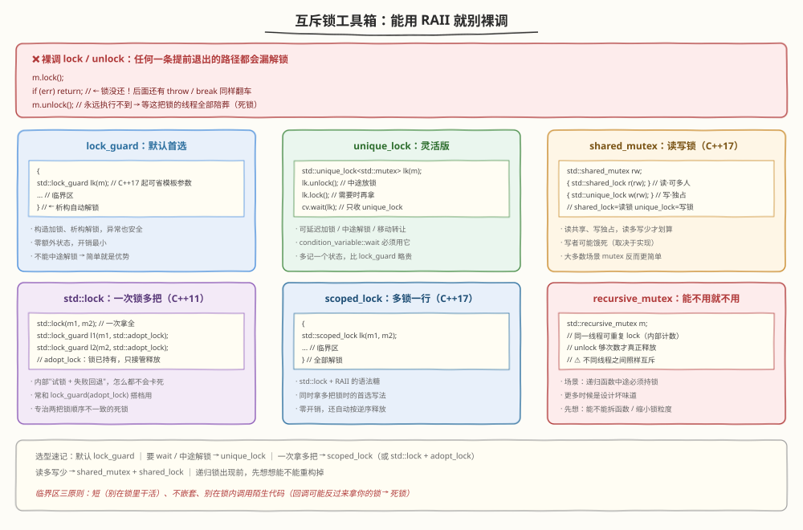
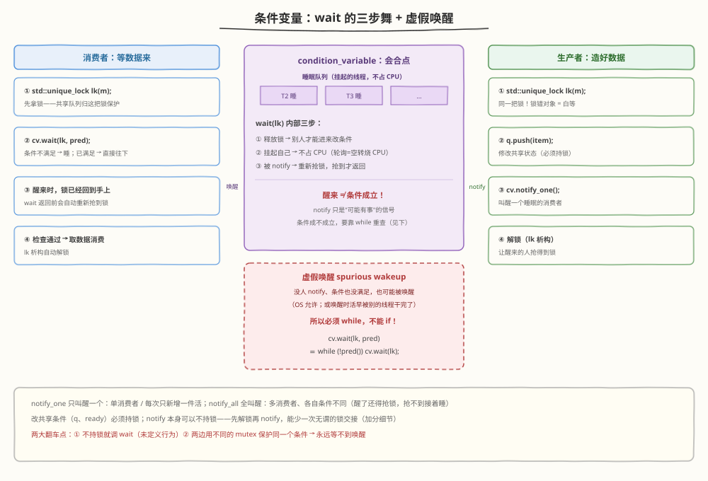
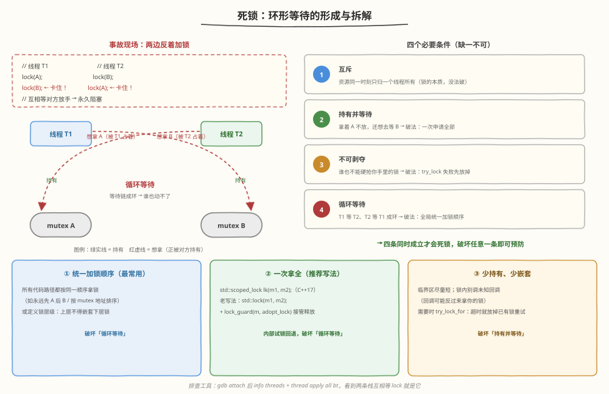
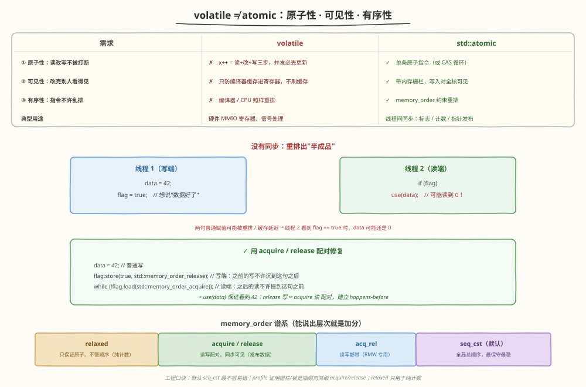
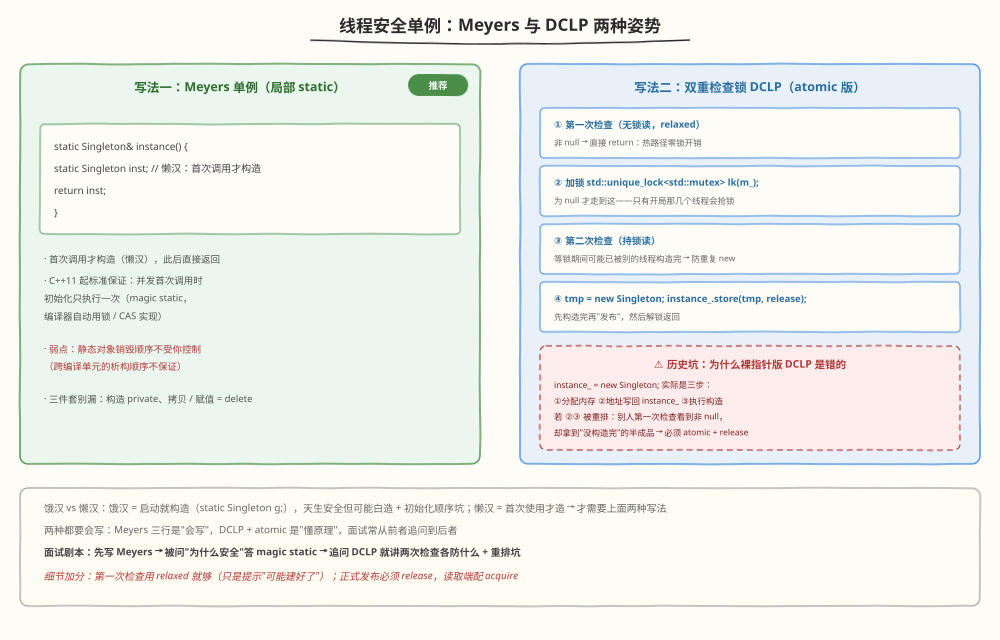

# Day 6（周六）：多线程与并发

> **今日目标**：掌握进程/线程区别、std::thread、锁家族、条件变量、死锁预防、atomic 与内存序概念；手写线程安全单例和生产者-消费者队列到默写程度
> **面试考察度**：⭐⭐⭐⭐ 中大厂 C++ 岗必考；单例与生产者-消费者是并发手写题双雄
> **建议节奏**：上午学理论（2~3h）→ 下午刷题自测（2h）→ 晚上手写两个模型 + 复述（1~2h）

---

## 学习任务 1：进程 vs 线程 + std::thread（40 分钟）

### 核心对比



| 维度 | 进程 | 线程 |
|------|------|------|
| 地址空间 | 独立，互相隔离 | 同进程内**共享** |
| 通信方式 | IPC：管道 / 消息队列 / 共享内存 / socket | 直接读写共享变量（**需要同步**） |
| 切换开销 | 大：切页表、刷 TLB | 小：换寄存器和栈 |
| 崩溃影响 | 一个挂了别人照常 | 一个段错误 → **整个进程挂** |
| 定位 | 资源分配的基本单位 | CPU 调度的基本单位 |

**面试一句话**：线程共享代码区、全局/静态区、堆；私有栈、寄存器、TLS（`thread_local`、errno、信号掩码）。

### std::thread 基本用法

```cpp
#include <thread>

void hello(int id) { std::cout << "hi from " << id << "\n"; }

int main() {
    std::thread t1(hello, 1);        // 构造即启动，参数默认按值拷贝
    std::thread t2([]{ hello(2); }); // lambda 也行
    t1.join();                       // 等 t1 跑完
    t2.join();                       // join / detach 二选一
}
```

### 三条铁律

1. **join / detach 二选一**：线程对象析构时若仍 joinable，直接 `std::terminate()` 崩给你看
2. **参数默认拷贝**：想传真引用必须 `std::ref(x)`
3. **异常不会跨线程传播**：线程函数内的异常必须就地 try-catch，否则 `std::terminate()`

```cpp
void inc(int& n) { ++n; }
int x = 0;
// std::thread t(inc, x);            // ❌ 改的是拷贝，x 不变
std::thread t(inc, std::ref(x));     // ✅ 真引用
t.join();
```

### 面试追问

> **Q：什么时候用多进程，什么时候用多线程？**
> A：要强隔离（一个模块崩不能拖垮全局，如 Chrome 每个 tab 一个进程）→ 多进程；要共享数据、低切换成本 → 多线程。

> **Q：线程越多越好吗？**
> A：不是。CPU 密集型任务线程数 ≈ 核数即可；线程过多反而上下文切换和锁争用吃掉吞吐——所以有线程池。

---

## 学习任务 2：互斥锁家族（40 分钟）

### 互斥锁工具箱



### 从裸调到 RAII

```cpp
std::mutex m;
m.lock();
if (error) return;   // ❌ 锁没还 → 等这把锁的线程全部永久阻塞
m.unlock();

{
    std::lock_guard<std::mutex> lk(m);  // ✅ 构造加锁
    // 临界区
}                                      // ✅ 析构解锁，return / 抛异常都能安全释放
```

### lock_guard vs unique_lock（必考对比）

| 维度 | lock_guard | unique_lock |
|------|-----------|-------------|
| 加锁时机 | 构造时立即 | 可延迟（`std::defer_lock`） |
| 中途解锁 | ❌ | ✅ `unlock()` / `lock()` 随意 |
| 所有权转移 | ❌ 不可移动 | ✅ 可移动（可放进容器、函数返回） |
| 配合条件变量 | ❌ | ✅ `wait()` 只收 unique_lock |
| 开销 | 零额外状态 | 多记一个状态，略大 |

**选型**：默认 `lock_guard`；要 `wait` / 中途解锁 / 转移所有权，才换 `unique_lock`。

### 读写锁与多把锁

```cpp
// 读写锁（C++17）：读共享、写独占，读多写少才划算
std::shared_mutex rw;
{
    std::shared_lock<std::shared_mutex> lk(rw);   // 多个读者可同时进入
    // 只读操作
}
{
    std::unique_lock<std::shared_mutex> lk(rw);   // 写者独占
    // 写操作
}

// 同时拿多把锁：C++17 一行（内部死锁避免算法）
std::scoped_lock lk(m1, m2);

// C++11 老写法：std::lock 一次性拿全，再交给 lock_guard 接管释放
std::lock(m1, m2);
std::lock_guard<std::mutex> l1(m1, std::adopt_lock);
std::lock_guard<std::mutex> l2(m2, std::adopt_lock);
```

### 面试追问

> **Q：lock() 抢不到锁会怎样？**
> A：阻塞挂起（让出 CPU）；`try_lock()` 抢不到立即返回 false；`timed_mutex` 提供带超时的 `try_lock_for()`。

> **Q：锁的粒度怎么把握？**
> A：临界区三原则——**短**（别在锁里做耗时操作）、**不嵌套**（嵌套是死锁温床）、**别在锁内调用未知代码**（回调可能反过来拿你的锁）。

---

## 学习任务 3：条件变量 condition_variable ⭐⭐⭐（35 分钟）

### 为什么需要它

```cpp
// ❌ 轮询：99% 的自旋都在白白烧 CPU
while (!ready) { /* 睡 10ms？延迟高；不睡？CPU 100% */ }

// ✅ 条件变量：条件不满足就睡，"可能有事"时被叫醒
```

### 标准骨架（生产者-消费者，必须默写）



```cpp
std::mutex m;
std::condition_variable cv;
std::queue<int> q;

// 消费者
void consumer() {
    std::unique_lock<std::mutex> lk(m);        // ① wait 前必须先持锁
    cv.wait(lk, []{ return !q.empty(); });     // ② 谓词版 = 自动套 while
    int x = q.front(); q.pop();                // ③ 醒来时锁已回到手上
}

// 生产者
void producer(int x) {
    {
        std::lock_guard<std::mutex> lk(m);
        q.push(x);                             // 改共享状态必须持锁
    }
    cv.notify_one();                           // 叫醒一个睡眠的消费者
}
```

### wait 内部三步（面试要能拆开讲）

1. **释放锁**——否则生产者进不来，永远没人 notify → 死锁
2. **挂起自己**——进入睡眠队列，不占 CPU
3. **被 notify 后重新抢锁**，抢到才从 wait 返回

### 虚假唤醒（必考）

`wait(lk, pred)` 等价于：

```cpp
while (!pred()) cv.wait(lk);   // 醒来必须重查条件
// 若用 if：虚假唤醒 / notify_all 后货被别人抢光 → 空队列上 pop = 未定义行为
```

### notify_one vs notify_all

- `notify_one`：叫醒一个，适合"单消费者 / 每次只新增一件活"
- `notify_all`：全叫醒，适合"多消费者 / 等待的条件各不相同"（醒了还得抢锁，抢不到的接着睡）

---

## 学习任务 4：死锁的四个必要条件与避免（25 分钟）



### 事故现场

```cpp
// T1                      // T2
lock(A);                   lock(B);
lock(B);  // 卡住！等 T2 放 B
                           lock(A);  // 卡住！等 T1 放 A
// 循环等待 → 永久阻塞
```

### 四个必要条件（背 + 会拆）

| 条件 | 含义 | 破坏方法 |
|------|------|---------|
| 互斥 | 资源一次只能一个线程持有 | 锁的本质，没法破 |
| 持有并等待 | 拿着 A 还想等 B | 一次性申请全部资源 |
| 不可剥夺 | 别人不能硬抢你手里的锁 | `try_lock` 失败先放掉已有的 |
| 循环等待 | 等待链成环 | **全局统一加锁顺序** |

**四条同时成立才会死锁 → 破坏任意一条即可预防。**

### 三招预防

```cpp
// ① 全局固定加锁顺序（最常用）：所有代码路径都先锁 A 再锁 B
// ② 一次拿全（推荐写法）
std::scoped_lock lk(A, B);            // C++17
// ③ 减少嵌套、缩小临界区；锁内别调未知回调 / 虚函数
```

### 面试追问

> **Q：线上怀疑死锁怎么排查？**
> A：gdb attach 后 `info threads` + `thread apply all bt`，两条栈互相等 lock 就是死锁；工程上还可用 `pthread_mutex_timedlock` / 超时重试兜底。

---

## 学习任务 5：atomic 与内存序（25 分钟，概念级）



### volatile vs atomic（回收 Day 1 伏笔）

| 维度 | volatile | std::atomic |
|------|----------|-------------|
| 原子性 | ❌ `x++` 仍是"读-改-写"三步，并发丢更新 | ✅ 单条原子指令 |
| 可见性 | ❌ 只防编译器缓存进寄存器，不刷缓存 | ✅ 带内存栅栏，写入对全核可见 |
| 有序性 | ❌ 不阻止重排 | ✅ memory_order 约束重排 |
| 用途 | 硬件 MMIO 寄存器、信号处理 | **线程间同步** |

```cpp
std::atomic<int> counter{0};
++counter;    // 原子自增，无需加锁（比 mutex 快得多）

// CAS：无锁数据结构的基石
int expected = 0;
bool ok = counter.compare_exchange_weak(expected, 1);
// counter == expected 则改为 1 返回 true；否则把当前值写回 expected 返回 false
```

### 为什么会有内存序——重排事故

```cpp
// 线程 1                    // 线程 2
data = 42;                   if (flag)
flag = true;                     use(data);   // 可能读到 0！
// 两句普通赋值可能被编译器 / CPU 重排，或缓存延迟可见
```

### 内存序谱系（概念级，说得出即可）

- `relaxed`：只保证原子性，不管顺序——纯计数统计
- `release`（写端）/ `acquire`（读端）：配对使用建立 happens-before——"发布数据"
- `seq_cst`：**默认**，所有线程看到的操作全局总顺序一致，最稳
- **工程建议**：默认 seq_cst；profile 证明有瓶颈再降级 acquire/release

---

## 学习任务 6：线程安全单例 ⭐（30 分钟）



### 饿汉 vs 懒汉

- **饿汉**：启动就构造（`static Singleton g;`），天生线程安全，但可能白造 + 静态初始化顺序坑
- **懒汉**：首次使用才构造 → 必须处理并发 → 两种标准写法

### 写法一：Meyers 单例（C++11 起推荐）

```cpp
class Singleton {
public:
    static Singleton& instance() {
        static Singleton inst;    // magic static：C++11 保证并发下只初始化一次
        return inst;
    }
    Singleton(const Singleton&) = delete;
    Singleton& operator=(const Singleton&) = delete;
private:
    Singleton() = default;
    ~Singleton() = default;
};
```

### 写法二：DCLP 双重检查锁（atomic 版）

```cpp
class Singleton {
public:
    static Singleton* instance() {
        Singleton* p = instance_.load(std::memory_order_acquire); // 第一次检查：无锁，热路径零开销
        if (p == nullptr) {
            std::lock_guard<std::mutex> lk(m_);
            p = instance_.load(std::memory_order_relaxed);        // 第二次检查：等锁期间可能已被别人构造
            if (p == nullptr) {
                p = new Singleton;
                instance_.store(p, std::memory_order_release);    // 发布：构造完成后才对别人可见
            }
        }
        return p;
    }
private:
    Singleton() = default;
    static std::atomic<Singleton*> instance_;
    static std::mutex m_;
};
std::atomic<Singleton*> Singleton::instance_{nullptr};
std::mutex Singleton::m_;
```

### 两次检查各自防什么（面试追问点）

- **第一次（无锁）**：99% 的调用走到这就返回了，避免每次抢锁
- **第二次（持锁）**：两个线程同时通过第一次检查，一个构造完，另一个拿到锁后发现已存在

### DCLP 的历史坑

`instance_ = new Singleton;` 可能被拆成 ①分配内存 ②地址写回指针 ③执行构造，②③ 一旦重排，别的线程第一次检查会拿到"没构造完的半成品"——所以必须 atomic + acquire/release（裸指针、Java 式 volatile 都救不了）。

---

## 高频面试题自测

### Q1：如何实现一个线程安全的单例？

<details>
<summary>点击查看答案</summary>

三层递进作答：

1. **Meyers 单例（首选）**：局部 static，C++11 起标准保证并发首次调用初始化只执行一次（magic static），编译器自动用锁/CAS 实现；代码只有三行
2. **DCLP + atomic**：第一次无锁检查（热路径零开销）→ 加锁 → 第二次检查（防等锁期间被重复构造）→ `new` 后 release 发布；坑在于裸指针版会被指令重排出"半成品"
3. **饿汉式**：启动即构造，天生安全，但可能白造、有静态初始化顺序问题

别忘了三件套：构造函数 private、拷贝/赋值 `=delete`、静态成员类外定义。

</details>

### Q2：生产者-消费者模型怎么写？

<details>
<summary>点击查看答案</summary>

一个队列 + 一把锁 + 一个条件变量：

- 消费者：`unique_lock` 持锁 → `cv.wait(lk, pred)` 带谓词（防虚假唤醒）→ 取数据
- 生产者：持锁 push → 解锁后 `notify_one`
- 退出协作：`done` 标志（同样受锁保护）+ `notify_all` 唤醒所有阻塞在 wait 的线程退出

关键点：wait 内部"释放锁-挂起-醒来抢锁"三步；谓词里查的条件和 push 修改的必须是同一个 mutex 保护的数据。

</details>

### Q3：volatile 和 atomic 的区别？

<details>
<summary>点击查看答案</summary>

- **volatile**：只禁止编译器把读写缓存到寄存器（每次都真的访存），用于硬件寄存器、信号处理；**不保证原子性**（`x++` 仍是三步）、**不保证可见性**（不刷 CPU 缓存）、**不禁止重排**——不是线程同步工具
- **std::atomic**：原子性（读-改-写不可分）+ 可见性（内存栅栏）+ 有序性（memory_order 约束重排），专用于线程间同步

一句话：volatile 给编译器看，atomic 给多线程看。

</details>

---

## 动手练习

### 练习 1 ⭐：手写生产者-消费者队列（可编译运行版）

```cpp
#include <condition_variable>
#include <iostream>
#include <mutex>
#include <queue>
#include <thread>

int main() {
    std::queue<int> q;
    std::mutex m;
    std::condition_variable cv;
    bool done = false;

    std::thread producer([&] {
        for (int i = 1; i <= 10; ++i) {
            {
                std::lock_guard<std::mutex> lk(m);
                q.push(i);
            }
            cv.notify_one();
        }
        {
            std::lock_guard<std::mutex> lk(m);
            done = true;
        }
        cv.notify_all();                  // 唤醒所有消费者：该退出了
    });

    std::thread consumer([&] {
        while (true) {
            std::unique_lock<std::mutex> lk(m);
            cv.wait(lk, [&]{ return !q.empty() || done; });   // 谓词：有货 或 该收工
            while (!q.empty()) {
                std::cout << q.front() << " ";
                q.pop();
            }
            if (done) break;
        }
    });

    producer.join();
    consumer.join();
    std::cout << "\n";
}
```

```text
编译运行：g++ -std=c++17 -pthread main.cpp && ./a.out
输出：1 2 3 4 5 6 7 8 9 10（顺序稳定；把 notify_one 改 notify_all 也能跑，理解为什么）

进阶改造：
① 加容量上限（有界队列）：push 侧也要 wait(not_full)，用同一个 cv + notify_all 或两个 cv
② 泛化成模板类 BlockingQueue<T>（见默写清单）
```

### 练习 2 ⭐：手写线程安全的懒汉单例

见学习任务 6 的两段代码——Meyers 版 5 分钟、DCLP 版 10 分钟，限时默写，编译验证：

```text
验证多线程安全（g++ -std=c++17 -pthread）：
开 8 个线程各调用 instance() 一万次，统计构造函数调用次数必须为 1。
```

### 默写检查清单

- [ ] wait 内部三步：释放锁 / 挂起 / 醒来重新抢锁
- [ ] `cv.wait(lk, pred)` ≡ `while (!pred()) cv.wait(lk);`——为什么必须 while
- [ ] push 用 lock_guard、pop 用 unique_lock，能说出为什么（wait 只收 unique_lock）
- [ ] 退出机制三件：done 标志 + 谓词里判断 done + notify_all
- [ ] Meyers 单例三行 + magic static 的保证是什么
- [ ] DCLP：两次检查各自的作用；为什么第一次检查可用 relaxed、store 必须 release
- [ ] 死锁四条件 + 对应的三招预防
- [ ] volatile 和 atomic 三维对比（原子性 / 可见性 / 有序性）

---

## 今日小结

| 主题 | 核心要点 | 面试频率 |
|------|---------|---------|
| 进程 vs 线程 | 线程共享代码区/全局区/堆，私有栈和寄存器 | ⭐⭐⭐⭐ |
| 锁家族 | RAII 优先；lock_guard 默认、unique_lock 灵活、scoped_lock 多锁 | ⭐⭐⭐⭐ |
| 条件变量 | wait 三步；谓词 / while 防虚假唤醒 | ⭐⭐⭐⭐⭐ |
| 死锁 | 四条件缺一不可；统一顺序 / scoped_lock / 减少嵌套 | ⭐⭐⭐⭐ |
| atomic | 原子 + 可见 + 有序；默认 seq_cst；volatile 不是同步工具 | ⭐⭐⭐⭐ |
| 单例 | Meyers 首选；DCLP 讲清两次检查和重排坑 | ⭐⭐⭐⭐⭐ |
| 生产者-消费者 | 一队列一锁一 cv + 谓词 wait + 退出协作 | ⭐⭐⭐⭐⭐ |

> **明日预告**：Day 7 综合冲刺 + 模拟面试——查漏补缺、五大手写题限时白板练习（String / shared_ptr / 单例 / LRU / 生产者-消费者）、完整模拟面试。
