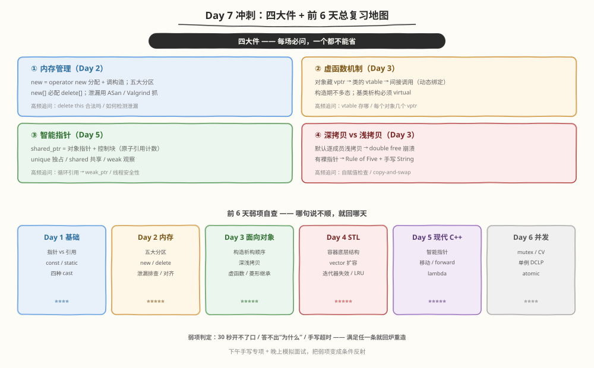
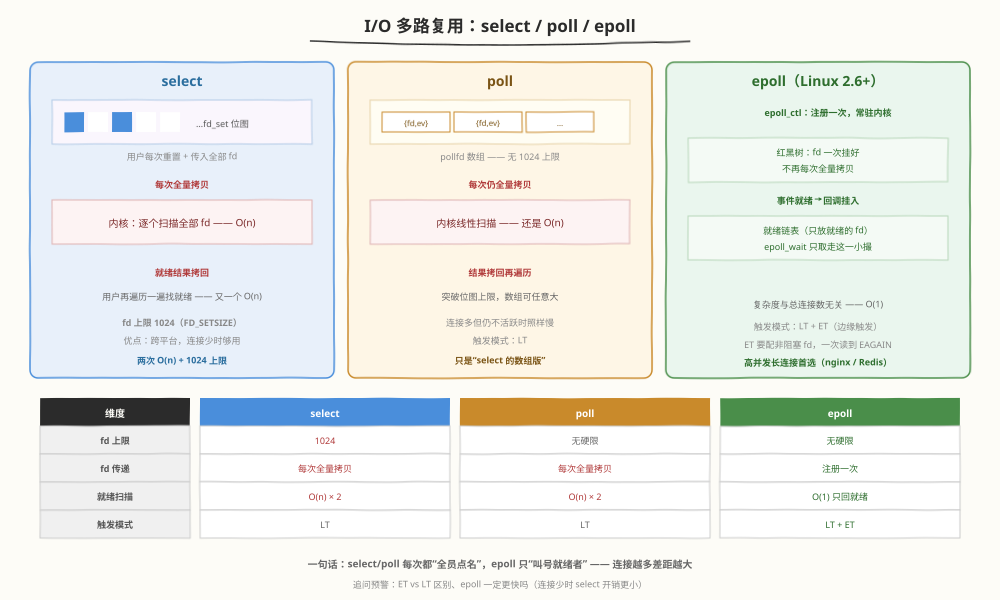
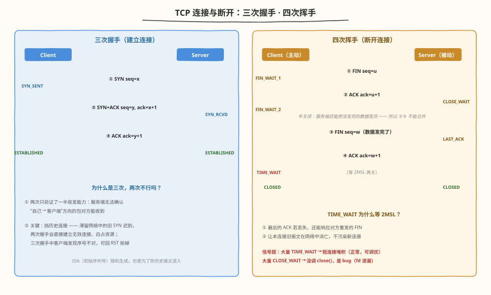
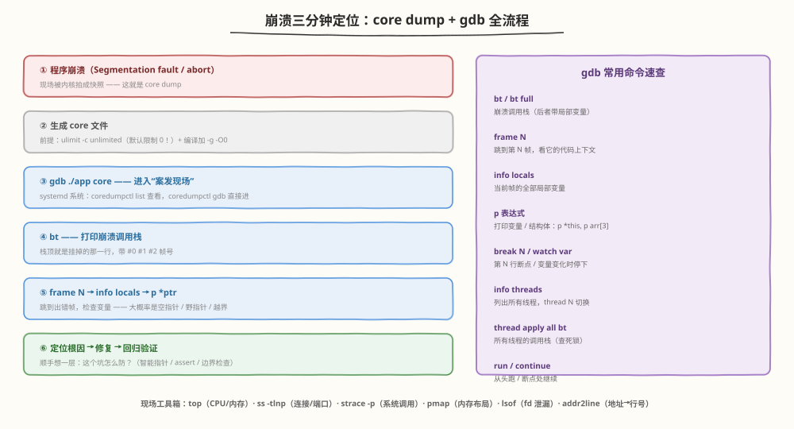
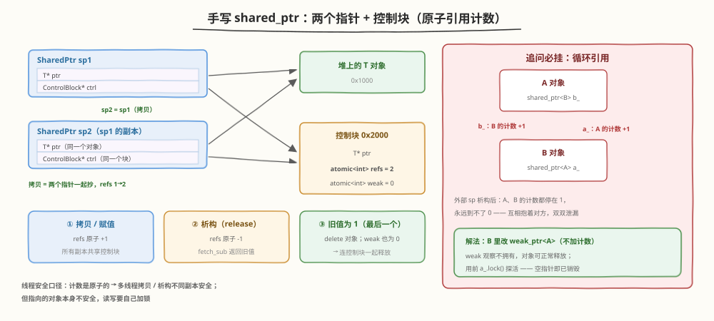
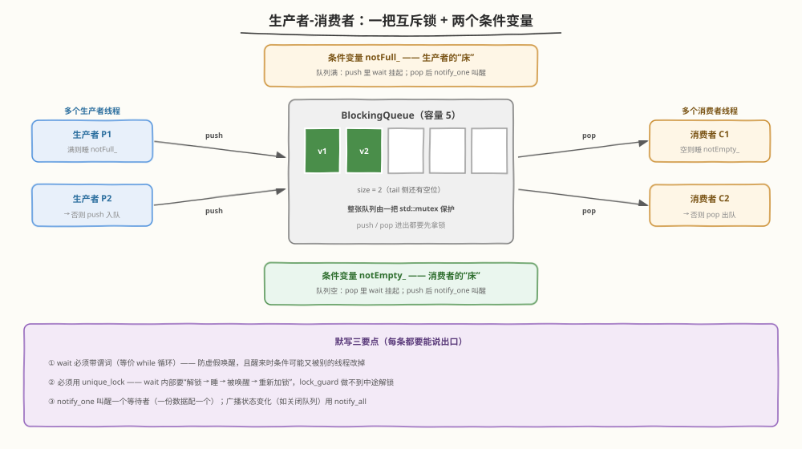
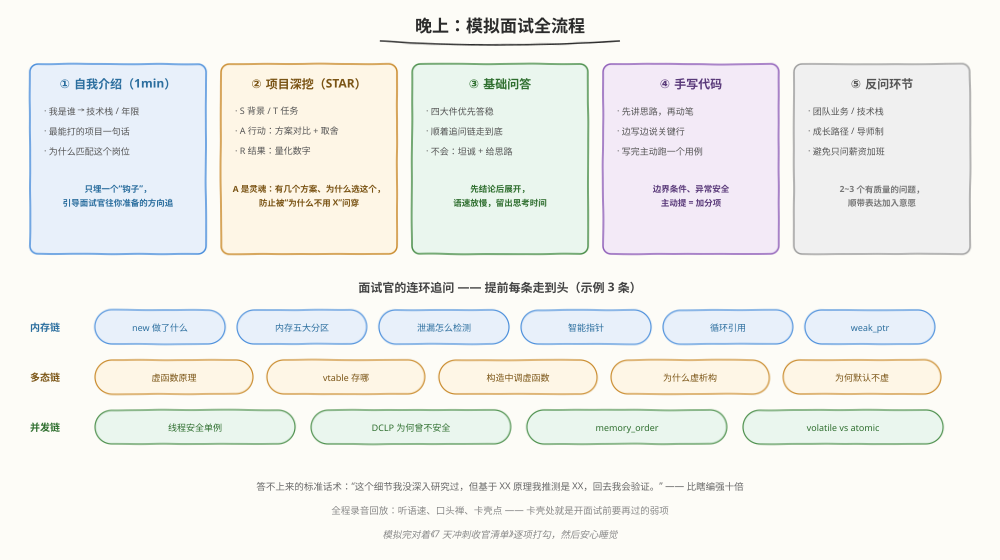

# Day 7（周日）：综合冲刺 + 模拟面试

> **今日目标**：前 6 天查漏补缺 + 网络编程 / Linux 调试扩展考点速览 + 5 道手写题白板限时练 + 完整模拟面试
> **面试考察度**：⭐⭐⭐⭐⭐ 手写题是分水岭，模拟面试决定临场发挥的上限
> **建议节奏**：上午查漏补缺（2~3h）→ 下午手写题专项限时（2h）→ 晚上模拟面试（1~2h）

---

## 上午：查漏补缺

### 学习任务 1：四大件 + 前 6 天总复习（45 分钟）



**四大件**（每场必问，一个都不能省）：

| 四大件 | 必须秒答的一句话 | 详见 |
|--------|----------------|------|
| 内存管理 | new = operator new 分配内存 + 调构造函数；五大分区；new[] 必配 delete[] | Day 2 |
| 虚函数机制 | 对象里藏 vptr → 类的 vtable → 间接调用；基类析构必须 virtual | Day 3 |
| 智能指针 | shared_ptr = 对象指针 + 控制块（原子计数）；循环引用用 weak_ptr 破 | Day 5 |
| 深拷贝 vs 浅拷贝 | 默认逐成员浅拷贝 → double free；有裸指针就要 Rule of Five | Day 3 |

**前 6 天一句话自查**（哪句说不顺，就回哪天）：

- Day 1：const 修饰它左边的东西；引用是别名、必须初始化、不能重绑定
- Day 2：栈快但小、堆大但要手动管；sizeof 结构体要算内存对齐
- Day 3：构造顺序"基类 → 成员 → 自己"，析构严格相反；构造函数里调虚函数不多态
- Day 4：vector 扩容三步走；删除元素用 `it = erase(it)`；map 红黑树、unordered_map 哈希
- Day 5：`std::move` 不移动任何东西，只是把表达式转型成右值引用；完美转发用 `std::forward`
- Day 6：wait 必须配谓词防虚假唤醒；单例首选 Meyers 局部静态

**弱项判定标准**（满足任意一条就回炉）：

- 30 秒内开不了口
- 只能答"是什么"，答不出"为什么"
- 手写题超时，或写完讲不清每一步

---

### 学习任务 2：网络编程速览（45 分钟）

C++ 后台 / infra 岗几乎必顺带问，准备到"能画图 + 说对比"即可。

#### I/O 多路复用：select / poll / epoll



| 维度 | select | poll | epoll |
|------|--------|------|-------|
| fd 数量上限 | **1024**（fd_set 位图写死） | 无硬上限（pollfd 数组） | 无硬上限（受内存限制） |
| fd 传递 | **每次调用全量拷贝**进内核 | 每次全量拷贝 | `epoll_ctl` 注册一次，常驻内核 |
| 就绪检测 | 内核 O(n) 扫 + 用户再 O(n) 遍历 | O(n) + O(n) | **只返回就绪 fd**，与总连接数无关 |
| 触发模式 | LT | LT | LT + **ET**（边缘触发，配合非阻塞 fd） |
| 适用场景 | 连接少、要跨平台 | 连接中等 | **高并发长连接**（nginx / Redis） |

> **Q：epoll 为什么快？**
> A：把"每次全量拷贝 + 全量扫描"变成"注册一次 + 事件驱动"——fd 挂在内核红黑树上，就绪时通过回调挂入就绪链表，`epoll_wait` 只把就绪链表里的少量 fd 拷回，复杂度与总连接数无关。

> **Q：ET 和 LT 的区别？**
> A：LT（水平触发）只要还有数据没读完就一直通知，编程简单；ET（边缘触发）只在状态变化时通知一次，必须一次性把数据读到 `EAGAIN`，且必须配合非阻塞 fd，换来的是更少的唤醒次数。

#### TCP 三次握手 / 四次挥手



**三次握手**：SYN → SYN+ACK → ACK，双方进入 ESTABLISHED。

**为什么是三次，两次不行吗？**

1. 两次握手时，服务端无法确认"自己 → 客户端"这个方向是通的（收发能力只验证了一半）
2. 更关键的：挡历史连接——网络中**滞留的旧 SYN** 迟到，两次握手会直接建立无效连接、白占资源；三次握手中客户端发现 ack 序号不对，可以回 RST 拒掉

**四次挥手**：FIN → ACK → FIN → ACK。中间的 ACK 和 FIN 不能合并：被动方收到 FIN 后可能还有数据要发（**半关闭**状态），把数据发完才发自己的 FIN。

**TIME_WAIT（主动关闭方，等 2MSL）**：

- 保证最后的 ACK 丢失后，还能响应对方重发的 FIN（连接还没释放）
- 让本连接的旧报文在网络中自然消亡，不污染下一个相同四元组的连接

**面试高频信号题**：

- 大量 **TIME_WAIT** → 主动关闭方（一般是客户端）高并发短连接堆积，属正常现象，可开 `tcp_tw_reuse` 或改长连接
- 大量 **CLOSE_WAIT** → 收到 FIN 后**代码没调 close()**，基本是 bug（fd 泄漏），要顺着 fd 找泄漏点

---

### 学习任务 3：Linux 调试速览（30 分钟）



**崩溃现场三分钟定位法**：

```bash
# ① 放行 core 文件（默认大小限制为 0）
ulimit -c unlimited

# ② 编译带调试符号、关优化
g++ -g -O0 -std=c++17 app.cpp -o app

# ③ 崩溃后用 core 进入"案发现场"
gdb ./app core
#（systemd 系统：coredumpctl list 查列表，coredumpctl gdb 直接进）

(gdb) bt            # 打印崩溃调用栈 —— 直接看到挂在哪一行
(gdb) frame 2       # 跳到第 2 帧
(gdb) info locals   # 看这一帧的局部变量
(gdb) p *this       # 打印表达式（大概率是空指针 / 野指针）
```

**运行期排查工具箱**（说得出用途即可）：

| 工具 | 用途 |
|------|------|
| `top` / `htop` | CPU、内存占用；load average |
| `ps aux \| grep app` | 找进程 PID、启动参数 |
| `ss -tlnp` / `netstat` | 端口监听、连接状态（TIME_WAIT / CLOSE_WAIT 在这看） |
| `strace -p PID` | 跟踪系统调用（卡在哪个 read / write 上） |
| `pmap PID` | 进程内存映射分布 |
| `lsof -p PID` | 打开的文件 / 套接字（fd 泄漏在这看） |
| `addr2line` | 把崩溃地址翻译成代码行号 |

---

### 学习任务 4：C++20 一分钟速览（15 分钟）

知道"是什么 + 解决什么问题"即可，除非岗位 JD 明确要求。

| 特性 | 一句话 |
|------|--------|
| concepts | 给模板参数加约束（`requires`），报错从天书变成人话 |
| coroutines | `co_await / co_yield / co_return`，函数可挂起恢复，异步代码同步写 |
| ranges | 管道式序列操作：`views::filter \| views::take`，惰性求值 |
| modules | `import` 替代 `#include`，编译速度大幅提升 |
| 其他 | 结构化绑定增强、`std::format`、`std::jthread`、三路比较 `<=>` |

---

## 下午：手写题专项（白板 / 纸笔，限时）

**规则**：关掉 IDE，白板或纸笔写；每题限时；写完对照清单口述一遍。这 5 道出现率极高，目标是不看资料全部写对。

| # | 题目 | 限时 | 复习来源 |
|---|------|------|---------|
| 1 | String 类（含移动语义） | 15 min | Day 3 + Day 5 |
| 2 | 简易 shared_ptr | 20 min | Day 5 |
| 3 | 线程安全单例（两种写法） | 10 min | Day 6 |
| 4 | LRU 缓存 | 20 min | Day 4 |
| 5 | 生产者-消费者队列 | 20 min | Day 6 |

---

### 手写题 1 ⭐：String 类（含移动语义，15 分钟）

在 Day 3 的四件套基础上加移动构造 / 移动赋值，凑齐 **Rule of Five**。先自己默写，再对答案。

```cpp
#include <cstring>

class String {
    char* data_ = nullptr;

public:
    String(const char* s = "")                       // 1. 构造
        : data_(new char[strlen(s) + 1]) {
        strcpy(data_, s);
    }

    ~String() { delete[] data_; }                    // 2. 析构

    String(const String& other)                      // 3. 拷贝构造（深拷贝）
        : data_(new char[strlen(other.data_) + 1]) {
        strcpy(data_, other.data_);
    }

    String& operator=(const String& other) {         // 4. 拷贝赋值（异常安全版）
        if (this != &other) {
            char* buf = new char[strlen(other.data_) + 1];  // 先分配
            strcpy(buf, other.data_);
            delete[] data_;                                 // 后释放
            data_ = buf;
        }
        return *this;
    }

    String(String&& other) noexcept                  // 5. 移动构造：窃取 + 置空
        : data_(other.data_) {
        other.data_ = nullptr;                       // delete[] nullptr 是安全的
    }

    String& operator=(String&& other) noexcept {     // 6. 移动赋值
        if (this != &other) {
            delete[] data_;
            data_ = other.data_;
            other.data_ = nullptr;
        }
        return *this;
    }

    // c_str() / length() / operator<< 等接口同 Day 3
};
```

**默写清单**：

- [ ] 移动构造：初始化列表偷指针 → `other.data_ = nullptr`
- [ ] 移动赋值：自赋值检查 → 释放自己的 → 偷 → 置空对方
- [ ] 移动操作必须标 `noexcept`（不标的话 vector 扩容不敢用移动，会退回拷贝）
- [ ] 拷贝赋值用"先分配后释放"版，能口述为什么异常安全（new 抛异常时 this 未被破坏）
- [ ] 能说清：`String s2 = std::move(s1);` 之后 s1 处于"有效但未指定"状态，只能重新赋值或析构

---

### 手写题 2 ⭐：简易 shared_ptr（20 分钟）



**结构**：每个 shared_ptr 只有**两个指针**——对象指针 + 控制块指针；引用计数放在**控制块**里，被所有副本共享。

```cpp
#include <atomic>

template <typename T>
class SharedPtr {
    struct ControlBlock {
        T* ptr;
        std::atomic<int> refs;              // 原子计数：多线程拷贝/析构安全
        explicit ControlBlock(T* p) : ptr(p), refs(1) {}
    };

    ControlBlock* ctrl_ = nullptr;

    void release() noexcept {               // 引用计数 -1，归零则释放
        if (ctrl_ && ctrl_->refs.fetch_sub(1) == 1) {   // fetch_sub 返回旧值
            delete ctrl_->ptr;              // 最后一个：释放对象
            delete ctrl_;                   // 再释放控制块
        }
    }

public:
    explicit SharedPtr(T* p = nullptr)
        : ctrl_(p ? new ControlBlock(p) : nullptr) {}

    ~SharedPtr() { release(); }

    SharedPtr(const SharedPtr& other) : ctrl_(other.ctrl_) {   // 拷贝：+1
        if (ctrl_) ctrl_->refs.fetch_add(1);
    }

    SharedPtr& operator=(const SharedPtr& other) {   // 赋值：先放自己，再接管
        if (this != &other) {
            release();
            ctrl_ = other.ctrl_;
            if (ctrl_) ctrl_->refs.fetch_add(1);
        }
        return *this;
    }

    SharedPtr(SharedPtr&& other) noexcept           // 移动：计数不变
        : ctrl_(other.ctrl_) {
        other.ctrl_ = nullptr;
    }

    SharedPtr& operator=(SharedPtr&& other) noexcept {
        if (this != &other) {
            release();
            ctrl_ = other.ctrl_;
            other.ctrl_ = nullptr;
        }
        return *this;
    }

    T& operator*() const { return *ctrl_->ptr; }
    T* operator->() const { return ctrl_->ptr; }
    T* get() const { return ctrl_ ? ctrl_->ptr : nullptr; }
    int use_count() const { return ctrl_ ? ctrl_->refs.load() : 0; }
    explicit operator bool() const { return get() != nullptr; }
};
```

**默写清单**：

- [ ] 控制块：`T* ptr` + `atomic<int> refs`，构造时 refs = 1
- [ ] 拷贝 +1，析构 -1；`fetch_sub(1) == 1` 表示自己是最后一个（旧值为 1）
- [ ] 移动**不动计数**，只转移控制块指针并置空对方
- [ ] 赋值运算符：先 `release()` 自己，再接管（顺序反了会翻车）
- [ ] 能答追问：计数是原子的，**多线程操作不同副本安全；但指向的对象本身不安全**，要自己加锁
- [ ] 加分项：真正的 shared_ptr 用 `make_shared` 把对象和控制块**一次分配**，省一次堆请求还提升缓存局部性

**追问必挂题：循环引用**

```cpp
struct B;
struct A { std::shared_ptr<B> b; ~A() { std::cout << "~A"; } };
struct B { std::shared_ptr<A> a; ~B() { std::cout << "~B"; } };  // ← 病灶

auto a = std::make_shared<A>();
a->b = std::make_shared<B>();
a->b->a = a;            // A 的计数变成 2
// 离开作用域：a 析构 → A 计数 2→1；b 所在的 B 持有 A，A 又持有 B
// 两个计数都停在 1，永远到不了 0 → A、B 双双泄漏

// 解法：B 里改 weak_ptr（weak 不增加强计数）
struct B { std::weak_ptr<A> a; };   // 使用前 a.lock() 检测是否存活
```

---

### 手写题 3 ⭐：线程安全单例（10 分钟，两种都要会）

**版本 1：Meyers 局部静态（首选，5 行写完）**

```cpp
class Singleton {
public:
    static Singleton& instance() {
        static Singleton inst;      // C++11 起保证局部静态初始化线程安全
        return inst;                // 首次执行到才构造 —— 天然懒汉
    }
    Singleton(const Singleton&) = delete;
    Singleton& operator=(const Singleton&) = delete;

private:
    Singleton() = default;
    ~Singleton() = default;
};
```

**版本 2：DCLP + atomic（面试官点名要的双重检查锁）**

```cpp
#include <atomic>
#include <mutex>

class Singleton {
    static std::atomic<Singleton*> inst_;
    static std::mutex mtx_;
public:
    static Singleton* getInstance() {
        Singleton* tmp = inst_.load(std::memory_order_acquire);  // 第一次检查（无锁快路径）
        if (tmp == nullptr) {
            std::lock_guard<std::mutex> lk(mtx_);
            tmp = inst_.load(std::memory_order_relaxed);         // 第二次检查（持锁）
            if (tmp == nullptr) {
                tmp = new Singleton;
                inst_.store(tmp, std::memory_order_release);
            }
        }
        return tmp;
    }
private:
    Singleton() = default;
};
// 类外定义（C++17 可改用 inline static 成员）
std::atomic<Singleton*> Singleton::inst_{nullptr};
std::mutex Singleton::mtx_;
```

**必能口述：为什么 C++11 之前 DCLP 不安全？**

`tmp = new Singleton` 实际是三步：分配内存 → 构造对象 → 赋值指针。编译器 / CPU 可能**重排**成"分配 → 赋值 → 构造"，另一个线程在第一次检查处看到非空指针直接返回，拿到的却是**没构造完的对象**。C++11 起用 `atomic` + acquire/release 语义禁止这种重排，DCLP 才成为正确写法。

---

### 手写题 4：LRU 缓存（20 分钟）

Day 4 已完整写过（哈希表 + `list` + `splice`），今天**脱稿限时重写**。结构回顾：

- 两个成员：`list<pair<K,V>>`（头新尾旧） + `unordered_map<K, list::iterator>`（O(1) 定位）
- `get`：find → 命中则 splice 到 `begin()` → 返回；未命中返回 -1
- `put`：已存在 → 更新 + splice 到头部；不存在 → 满了先淘汰 `back()`（erase + pop_back）→ `emplace_front` + 记录迭代器
- **灵魂口述**：splice 把节点从中间摘下接到头部，不拷贝不析构，O(1)；淘汰只发生在 tail 侧

> 面试官若追加"不许用 STL"：手搓双向链表节点 `Node {key, value, prev, next}` + 哈希表存 `Node*`，自己写 `detach(node)` / `attachToFront(node)` 两个 helper，逻辑完全一样。

完整代码和图解见 Day 4（LeetCode 146）。

---

### 手写题 5 ⭐：生产者-消费者队列（20 分钟）



```cpp
#include <condition_variable>
#include <mutex>
#include <queue>
#include <utility>

template <typename T>
class BlockingQueue {
    std::queue<T> queue_;
    mutable std::mutex mtx_;
    std::condition_variable notEmpty_;   // 队列空 → 消费者在它上面等
    std::condition_variable notFull_;    // 队列满 → 生产者在它上面等
    const size_t capacity_;

public:
    explicit BlockingQueue(size_t capacity) : capacity_(capacity) {}

    void push(T value) {
        std::unique_lock<std::mutex> lk(mtx_);   // wait 要解锁/复锁，必须 unique_lock
        notFull_.wait(lk, [this] { return queue_.size() < capacity_; });  // 谓词 = while
        queue_.push(std::move(value));
        notEmpty_.notify_one();                  // 叫醒一个消费者
    }

    T pop() {
        std::unique_lock<std::mutex> lk(mtx_);
        notEmpty_.wait(lk, [this] { return !queue_.empty(); });
        T value = std::move(queue_.front());
        queue_.pop();
        notFull_.notify_one();                   // 叫醒一个生产者
        return value;
    }
};
```

**默写清单**：

- [ ] 为什么 `unique_lock` 不是 `lock_guard`：wait 内部要"解锁 → 睡 → 唤醒后重新加锁"，lock_guard 不支持中途解锁
- [ ] wait 带谓词等价于 `while (!cond) cv.wait(lk)`，防**虚假唤醒** + 醒来后条件可能又被别人改掉
- [ ] 满了生产者睡 `notFull_`，空了消费者睡 `notEmpty_`；pop / push 后各 notify 对面
- [ ] 能答追问：只唤醒一个等数据用 `notify_one`；广播状态变化（如关闭队列）用 `notify_all`
- [ ] 能扩展：优雅关闭——加 `closed_` 标志，pop 的谓词改为 `!queue_.empty() || closed_`

---

## 晚上：模拟面试

### 模拟面试全流程



找朋友对练，或对着镜子 / 摄像头**完整走一遍**，全程录音回放——听语速、口头禅和卡壳点。

### 自我介绍（1 分钟模板）

```
面试官您好，我是 XXX，X 年 C++ 开发经验，主要做 XXX 方向。
技术栈核心是 C++17 + Linux + 多线程 / 网络编程。
最有代表性的是 XXX 项目：我在其中负责 XXX，
通过 XXX 手段（如无锁队列 / 内存池 / 批处理）把 XXX 指标从 X 优化到 Y。
贵司这个岗位的 XXX 和我的经验非常匹配，希望有机会加入。
```

要点：控制在 1 分钟；**只埋一个"最能打的项目"钩子**，引导面试官往你准备好的方向追问。

### 项目故事：STAR 法则（准备 2~3 个）

| 环节 | 内容 | 示例 |
|------|------|------|
| S 情境 | 一句话说清背景 | 推理服务 P99 延迟抖动严重 |
| T 任务 | 你的职责 | 定位并消除长尾 |
| A 行动 | **技术决策 + 为什么** | 火焰图定位锁竞争 → 读多写少改读写锁 → 热点分片 |
| R 结果 | 量化结果 | P99 从 80ms 降到 25ms，支撑 QPS 翻倍 |

**A 环节是灵魂**：说清"当时有几个方案、为什么选这个、放弃了什么"，避免被一句"为什么不用 XXX"问穿。

### 高频追问链（提前把每条链走到头）

- **内存链**：new 做了什么 → 内存五大分区 → 怎么检测泄漏 → 智能指针 → 控制块 / 计数 → 循环引用 → weak_ptr → 线程安全性
- **多态链**：虚函数原理 → vtable 存哪、每类几个 → 构造函数里调虚函数会怎样 → 为什么析构要 virtual → 为什么默认不是 virtual
- **容器链**：vector 扩容机制 → 扩容后迭代器失效 → `it = erase(it)` → map vs unordered_map 选型 → 红黑树 vs AVL
- **并发链**：线程安全单例 → DCLP 为什么以前不安全 → memory_order 了解吗 → volatile 和 atomic 的区别
- **手写链**：写完 String → 追问移动语义 → 追问 noexcept 为什么重要 → 追问 copy-and-swap

**答不上来的标准话术**：

> "这个细节我没深入研究过，但基于 XXX 原理我推测应该是 XXX，我回去会验证。"

——比瞎编强十倍，面试官反感的是不懂装懂，不是诚实。

---

## 高频面试题自测

### Q1：select、poll、epoll 的区别？

<details>
<summary>点击查看答案</summary>

- **select**：fd_set 位图，上限 1024；每次调用把整个 fd 集合拷进内核，内核线性扫描，返回后用户再遍历，两轮 O(n)
- **poll**：pollfd 数组，突破 1024 上限，但仍是全量拷贝 + O(n) 扫描
- **epoll**：`epoll_ctl` 把 fd 注册进内核红黑树（一次）；事件就绪通过回调挂入就绪链表；`epoll_wait` 只把就绪 fd 拷回，与总连接数无关；还支持 ET 边缘触发
- 选型：高并发长连接用 epoll（nginx / Redis），跨平台或连接数少 select 也够

</details>

### Q2：TCP 为什么三次握手，两次不行吗？

<details>
<summary>点击查看答案</summary>

1. 两次握手，服务端无法确认"自己 → 客户端"方向是通的（收发能力只验证了一半）
2. 关键原因：挡**历史连接**——滞留在网络中的旧 SYN 迟到，两次握手会直接建立无效连接浪费资源；三次握手中客户端发现序号不对，可回 RST 拒绝

</details>

### Q3：服务器上大量 TIME_WAIT / CLOSE_WAIT 分别说明什么？

<details>
<summary>点击查看答案</summary>

- **TIME_WAIT**（主动关闭方，等 2MSL）：高并发短连接的正常堆积；可开 `tcp_tw_reuse`、改长连接池治标
- **CLOSE_WAIT**（被动关闭方）：收到对方 FIN 后**自己的代码没调 close()**——基本是 bug（fd 泄漏），用 `ss -tnp` / `lsof` 定位到进程再查代码

</details>

### Q4：程序段错误崩溃，怎么定位？

<details>
<summary>点击查看答案</summary>

`ulimit -c unlimited` 放行 core → 崩溃生成 core 文件 → `gdb ./app core` → `bt` 看崩溃栈 → `frame N` + `info locals` 查现场 → 常见根因：空指针 / 野指针 / 越界 / 栈溢出。运行中的进程用 `top` / `strace -p` / `pmap` / `ss` 排查。

</details>

### Q5：C++20 的 concepts 和 coroutines 是什么？（概念级）

<details>
<summary>点击查看答案</summary>

- **concepts**：`template<std::integral T>` 给模板参数加命名约束，替代 SFINAE，报错信息可读
- **coroutines**：`co_await / co_yield / co_return` 让函数能挂起后恢复，把异步回调写成同步风格，是生成器、网络库的底层基础

</details>

---

## 7 天冲刺收官清单

- [ ] 四大件能各讲 3 分钟不卡壳：内存管理 / 虚函数 / 智能指针 / 深浅拷贝
- [ ] String（含移动）、shared_ptr、单例三道题**不看资料 10 分钟写完**
- [ ] LRU、生产者-消费者各 20 分钟内写完并讲清复杂度
- [ ] 能白板画出 select/poll/epoll 示意和 TCP 握手挥手图
- [ ] 崩溃定位流程能口述：ulimit → core → gdb → bt
- [ ] 自我介绍 1 分钟版背熟，2~3 个 STAR 项目故事备好
- [ ] 沿 5 条高频追问链各完整走一遍

---

## 今日小结

| 时段 | 内容 | 核心要点 |
|------|------|---------|
| 上午 | 查漏补缺 | 四大件逐个过；网络（epoll / TCP）、Linux（gdb / core）速览；C++20 知道概念 |
| 下午 | 手写专项 | String + shared_ptr + 单例 + LRU + 生产者消费者，全部限时脱稿 |
| 晚上 | 模拟面试 | 1 分钟自我介绍、STAR 故事、追问链、反问环节 |

> **冲刺收官**：这一周的目标从来不是"背完所有题"，而是把**四大件 + 三大手写题**焊死在肌肉记忆里。面试官要的不是完美答案，而是你面对追问时清晰的思路链。祝你面试顺利，Offer 拿到手软！💪
