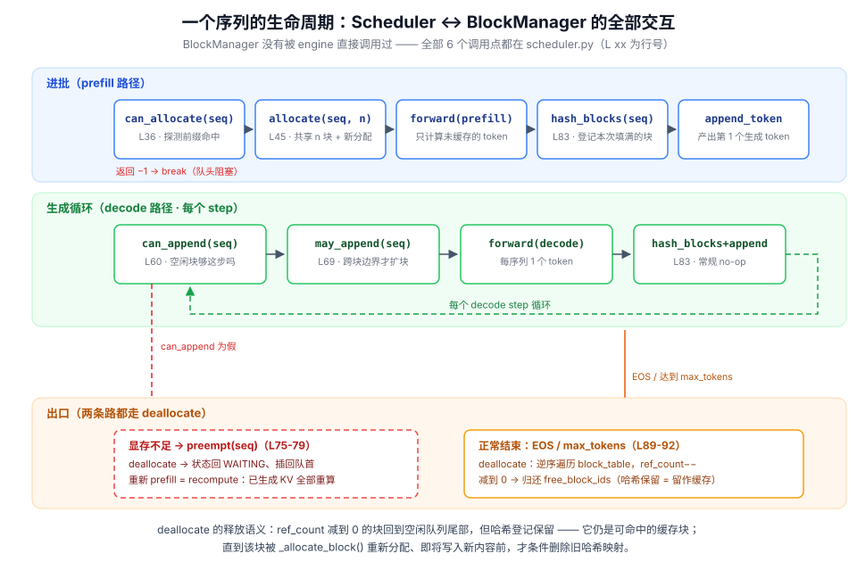
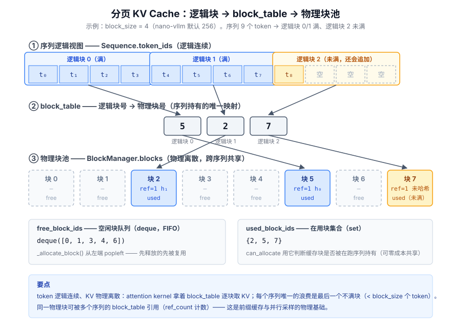
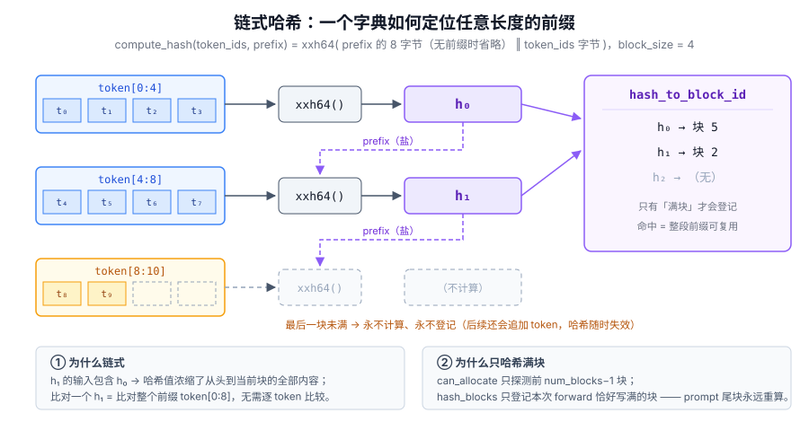
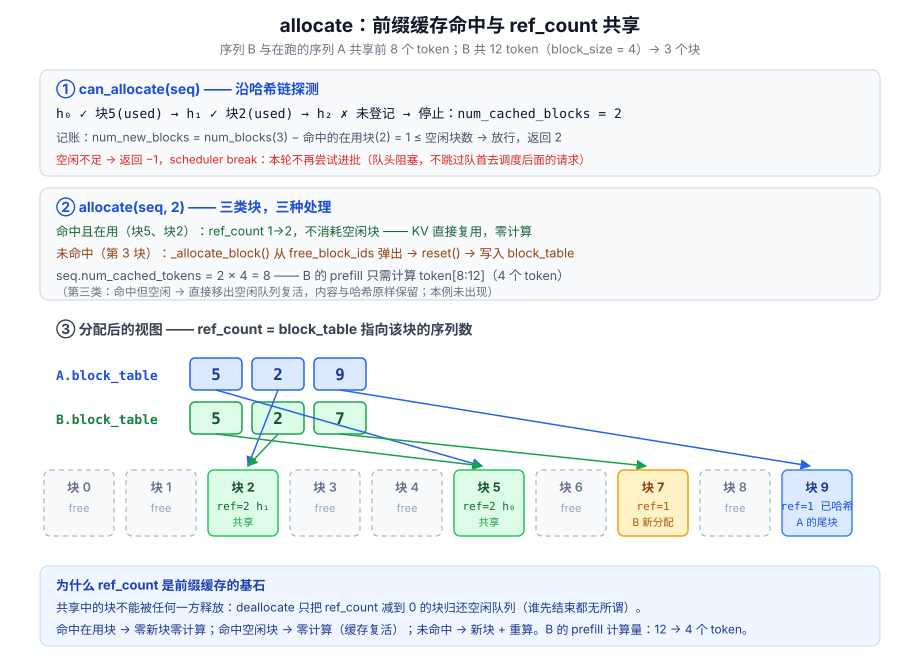
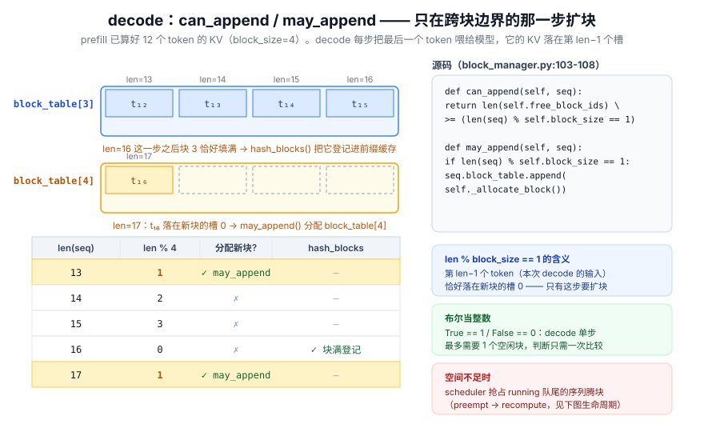

# block_manager.py 逐行解读：分页 KV Cache 与链式哈希前缀缓存

> **源码**：[block_manager.py](block_manager.py)（120 行，逐行引用在正文中）
> **在专题中的位置**：[Day 3](../day3.md) 从概念与实验视角讲了 PagedAttention 与前缀缓存，[Scheduler 解读](scheduler.md) 里的每个调度决策都要回来问这里——**BlockManager 是 nano-vllm 的"显存管理器"**，vLLM 论文两大机制（PagedAttention + Automatic Prefix Caching）的最小真实实现
> **一句话定位**：块池 + 缓存索引 + 引用计数，120 行决定"块给不给、给哪几个、要不要回收"

---

## 🎯 目标

通过本文，你将：

1. 逐行读懂 `BlockManager` 的 **6 个公开方法**：进批三步（`can_allocate` / `allocate`）、decode 两步（`can_append` / `may_append`）、收尾两步（`hash_blocks` / `deallocate`）
2. 看懂**链式哈希前缀缓存**的全部细节：为什么把前一块哈希当盐、为什么只哈希满块、`hash_to_block_id` 的登记 / 复活 / 驱逐时机
3. 掌握四个"魔鬼细节"：`can_allocate` 的记账口径（为什么只有命中**在用**块才减额度）、`len % block_size == 1` 背后的槽位推导、`_allocate_block` 删旧哈希前要"验明正身"、释放块**保留哈希**的缓存语义
4. 理解 `ref_count` 如何让"空闲块池"和"前缀缓存池"合二为一，以及 recompute 抢占为什么能被缓存兜底成"部分重算"
5. 能对着图独立讲清：一条序列从进批到释放，块池里的 8 个数字（free / used / ref / hash）怎么变

> 💡 **前置知识**：[Sequence 解读](sequence.md) 的三个数字字段（`num_cached_tokens` / `num_scheduled_tokens` / `block_table`）——本文它们全部登场；[Day 3](../day3.md) 的概念视角可与本文互为印证

---

## 全景：这个文件在引擎里被谁调用

`block_manager.py` 定义了两个类：`Block`（物理块的元数据）和 `BlockManager`（块池 + 前缀缓存索引）。它**不被 LLMEngine 直接调用**——全部 6 个调用点都在 `scheduler.py` 里：

```python
# scheduler.py 中的调用点（节选）
num_cached_blocks = self.block_manager.can_allocate(seq)   # L36 进批前探测
self.block_manager.allocate(seq, num_cached_blocks)        # L45 进批时分配
while not self.block_manager.can_append(seq):              # L60 decode 前检查
    self.preempt(self.running.pop())                       #    不够 → 抢占
self.block_manager.may_append(seq)                         # L69 decode 扩块
self.block_manager.hash_blocks(seq)                        # L83 每次 forward 后
self.block_manager.deallocate(seq)                         # L78 抢占 / L91 结束
```

一句话分工：**Scheduler 决定"谁上、谁下"，BlockManager 决定"块给不给、给哪几个、要不要回收"**。调度器的每个决策本质上都在问 BlockManager 一个问题。



整条生命线的读法：

- **prefill 路径**（蓝）：进批时 `can_allocate` 探测前缀缓存 → `allocate` 共享命中块并补齐新块 → forward 只算未缓存 token → `hash_blocks` 把本次写满的块登记进缓存
- **decode 路径**（绿）：每个 step 问一次 `can_append`（这一步要新块吗）→ 跨块边界才 `may_append` 扩块 → forward 后 `hash_blocks`（通常无事可做）
- **出口**（橙/红）：正常结束或显存不足抢占，都走 `deallocate`；区别是抢占后序列回队首，重新 prefill = **recompute**（已生成 token 的 KV 全部重算）

---

## 数据结构：两个类、六个字段装下整个显存管理

### Block：物理块的元数据

```python
class Block:                                    # L8
    def __init__(self, block_id):
        self.block_id = block_id                # 物理块编号（KV 池中的下标）
        self.ref_count = 0                      # 引用计数：几个序列的 block_table 指向我
        self.hash = -1                          # 内容哈希（-1 = 无/已清空）
        self.token_ids = []                     # 块内 token（用于哈希碰撞校验）

    def update(self, hash, token_ids):          # 块写满时登记
        self.hash = hash
        self.token_ids = token_ids

    def reset(self):                            # 块被重新分配时清零
        self.ref_count = 1
        self.hash = -1
        self.token_ids = []
```

| 字段 | 类型 | 语义 | 谁改它 |
|------|------|------|--------|
| `block_id` | int | 物理块号，即 KV 大张量 `[2, layers, num_blocks, block_size, ...]` 的第 3 维下标 | 创建后不变 |
| `ref_count` | 0 | 无人在用（在空闲队列里） | `allocate`/`deallocate` 增减 |
| `ref_count` | 1 | 恰好一个序列在用（常态） | 同上 |
| `ref_count` | ≥2 | 多序列共享（前缀命中 / 并行采样） | 同上 |
| `hash` | int | 满块的链式哈希；`-1` 表示无 | `update`（写满登记）/ `reset`（重分配） |
| `token_ids` | list | 满块时的内容快照 | 同上 |

### BlockManager：块池 + 缓存索引

```python
class BlockManager:                             # L26
    def __init__(self, num_blocks: int, block_size: int):
        self.block_size = block_size
        self.blocks: list[Block] = [Block(i) for i in range(num_blocks)]
        self.hash_to_block_id: dict[int, int] = dict()   # 前缀缓存索引：哈希 → 块号
        self.free_block_ids: deque[int] = deque(range(num_blocks))  # 空闲队列（FIFO）
        self.used_block_ids: set[int] = set()            # 在用集合
```

四个数据结构各司其职：

| 结构 | 角色 | 关键操作 |
|------|------|----------|
| `blocks` | 物理块池（编号 → 元数据） | 按 block_id O(1) 定位 |
| `hash_to_block_id` | **前缀缓存**：内容哈希 → 持有该内容的块 | 命中即免算 KV |
| `free_block_ids` | 空闲块队列 | `popleft()` 分配（先释放的先被复用） |
| `used_block_ids` | 在用块集合 | `can_allocate` 判断缓存块能否零成本共享 |

结合 `Sequence` 侧的字段（`seq.block_table`、`seq.num_cached_tokens`、`seq.num_scheduled_tokens`），整张分页地图如下：



三条读图要点：

1. **逻辑连续、物理离散**：序列只看到一维 token 流；`block_table` 把逻辑块号翻译成物理块号，attention kernel（flash-attn 的 paged 接口）拿它逐块取 KV
2. **唯一的浪费是尾块**：每个序列最后一个不满块平均浪费 `block_size / 2` 个槽位（nano-vllm 取 block_size=256，对齐 flash-attn 约束）
3. **`hash = -1` 的块 7**：未满块永不计算哈希、永不进缓存索引——这是前缀缓存正确性的前提（见下节）

---

## compute_hash：链式哈希（L35-41）

```python
@classmethod
def compute_hash(cls, token_ids: list[int], prefix: int = -1):
    h = xxhash.xxh64()
    if prefix != -1:
        h.update(prefix.to_bytes(8, "little"))   # 前一块的哈希，8 字节小端
    h.update(np.array(token_ids).tobytes())      # 本块 token 的字节
    return h.intdigest()
```

算法本身 4 行，但它是整个前缀缓存的灵魂：



**为什么要链式（把前一块哈希当盐）**：`h₁` 的输入包含 `h₀`，而 `h₀` 又包含块 0 的全部 token——递归展开后，`h₁` 浓缩了"从头到块 1"的完整内容信息。于是**比对一个 64 位整数 = 比对整段前缀**，新序列不用逐 token 比较，沿链走几步就知道能复用几块。

**为什么只哈希满块**：最后一块还会继续追加 token（decode 每步 +1），任何提前计算的哈希都会立刻失效。所以代码里有两个配合的保守设计：

- `can_allocate` 的循环是 `range(seq.num_blocks - 1)`——**最后一个块即使恰好是满的也不探测**，prompt 尾块永远重算
- `hash_blocks` 只登记"本次 forward 恰好写满"的块（见下文 hash_blocks 一节）

**为什么用 xxhash 而不是内置 `hash()`**：Python 内置 hash 对 str 有随机化种子（进程间不稳定）、对 tuple 大整数碰撞率不可控；xxh64 是确定性的非加密哈希，快且碰撞率足够低。**但非加密 ≠ 无碰撞**，所以 `can_allocate` L66 还有一道内容校验：

```python
if block_id == -1 or self.blocks[block_id].token_ids != token_ids:
    break                                       # 哈希碰撞 / 陈旧登记 → 当作未命中
```

`Block.token_ids` 留着的快照就是为了这一行——哈希命中后**逐 token 复核**，碰撞时最多损失一次缓存机会，不会算错。

---

## 进批：can_allocate → allocate（L58-92）

### can_allocate：探测 + 记账，不改动任何状态

```python
def can_allocate(self, seq: Sequence) -> int:
    h = -1
    num_cached_blocks = 0
    num_new_blocks = seq.num_blocks
    for i in range(seq.num_blocks - 1):         # 只探测前 n-1 块（尾块不算）
        token_ids = seq.block(i)
        h = self.compute_hash(token_ids, h)     # 沿链推进哈希
        block_id = self.hash_to_block_id.get(h, -1)
        if block_id == -1 or self.blocks[block_id].token_ids != token_ids:
            break                               # 链断了：后面不可能再命中
        num_cached_blocks += 1
        if block_id in self.used_block_ids:
            num_new_blocks -= 1                 # 在用块可共享，不占新额度
    if len(self.free_block_ids) < num_new_blocks:
        return -1                               # 空闲不够 → 拒绝进批
    return num_cached_blocks
```

三处值得停顿：

1. **链式探测的短路**：`h` 从 -1 出发逐块推进，一旦哈希未命中就 `break`——链断了，后面的块即使内容相同也不可能构成前缀
2. **记账口径**（L69-70）：`num_new_blocks` 初始为"全部块数"，**只有命中"在用"块才减一**。命中"空闲"缓存块不减——因为它还躺在 `free_block_ids` 里，`allocate` 时要把它从队列里取出来，占的还是空闲额度
3. **返回 -1 的调度语义**：scheduler 拿到 -1 直接 `break` 整个 prefill 循环——**队头阻塞**，宁可让 GPU 空转也不跳过队首去进后面的请求（保持 FCFS 公平，避免长 prompt 永远排不上）

### allocate：三类块，三种处理

```python
def allocate(self, seq: Sequence, num_cached_blocks: int):
    assert not seq.block_table                  # 只在首次进批调用（抢占后重来）
    h = -1
    for i in range(num_cached_blocks):          # 命中的块：共享或复活
        token_ids = seq.block(i)
        h = self.compute_hash(token_ids, h)
        block_id = self.hash_to_block_id[h]
        block = self.blocks[block_id]
        if block_id in self.used_block_ids:     # ① 在用 → 引用 +1，零开销
            block.ref_count += 1
        else:                                   # ② 空闲缓存块 → 复活
            block.ref_count = 1
            self.free_block_ids.remove(block_id)  # 取出但 NOT reset：内容哈希原样保留
            self.used_block_ids.add(block_id)
        seq.block_table.append(block_id)
    for i in range(num_cached_blocks, seq.num_blocks):
        seq.block_table.append(self._allocate_block())  # ③ 未命中 → 新块
    seq.num_cached_tokens = num_cached_blocks * self.block_size
```



三类块的对比（面试高频）：

| 块的处境 | 处理 | 计算开销 | 空闲块开销 |
|----------|------|----------|-----------|
| ① 命中且在用 | `ref_count += 1` | 零（KV 直接复用） | 零 |
| ② 命中但空闲 | 移出空闲队列，**不 reset** | 零（缓存"复活"） | 占 1 |
| ③ 未命中 | `_allocate_block()`：弹出 → 删旧哈希 → reset | 重算整块 KV | 占 1 |

最后一句 `seq.num_cached_tokens = num_cached_blocks * self.block_size` 是与 scheduler 的接口：scheduler 用它算出 `num_tokens - num_cached_tokens`，**prefill 只调度未缓存的 token**。

> ⚠️ **注意分支 ②**：`free_block_ids.remove()` 是 O(n) 的 deque 线性扫描，且**故意不走 `_allocate_block()`**——后者会 reset 块内容。复活路径必须保留 `hash` 和 `token_ids`，否则这块缓存就"失忆"了。

---

## decode：can_append / may_append（L103-108）

```python
def can_append(self, seq: Sequence) -> bool:
    return len(self.free_block_ids) >= (len(seq) % self.block_size == 1)

def may_append(self, seq: Sequence):
    if len(seq) % self.block_size == 1:
        seq.block_table.append(self._allocate_block())
```

五行代码，一个关键推导：**decode 时 `len(seq)` 个 token 已存在，但最后一个 token 的 KV 还没算**——它正是本次 forward 的输入，将落在第 `len(seq) - 1` 个槽。于是：

```
需要新块  ⟺  (len(seq) - 1) % block_size == 0  ⟺  len(seq) % block_size == 1
```

即"本次要算 KV 的 token 恰好是新块的第一个 token"。`can_append` 里的 `(len(seq) % self.block_size == 1)` 是布尔表达式，**直接当整数用**（True==1 / False==0）——因为 decode 单步最多需要 1 个新块，需求判断压缩成一次比较。



按图核对一遍（block_size=4，prefill 后 12 个 token 的 KV 已算好）：

| len(seq) | len % 4 | 动作 | 之后 |
|----------|---------|------|------|
| 13 | **1** | `may_append` 分配 block_table[3]，t₁₂ 落槽 0 | 块 3 有 1 个 token |
| 14 / 15 | 2 / 3 | 无动作，token 依次填槽 1、2 | |
| 16 | 0 | 无动作，t₁₅ 填满块 3 → **`hash_blocks` 登记它** | 块 3 成为缓存 |
| 17 | **1** | 分配 block_table[4]，t₁₆ 落槽 0 | 新循环 |

块在一个 decode step 里被填满 → 同一次 postprocess 里 `hash_blocks` 立刻登记——decode 生成的内容也能进前缀缓存（多轮对话的共享就是这么来的）。

---

## hash_blocks：forward 之后登记满块（L110-120）

```python
def hash_blocks(self, seq: Sequence):
    start = seq.num_cached_tokens // self.block_size
    end = (seq.num_cached_tokens + seq.num_scheduled_tokens) // self.block_size
    if start == end: return                     # 本次没写满任何块
    h = self.blocks[seq.block_table[start - 1]].hash if start > 0 else -1
    for i in range(start, end):                 # 只循环"恰好被写满"的块
        block = self.blocks[seq.block_table[i]]
        token_ids = seq.block(i)
        h = self.compute_hash(token_ids, h)     # 续链
        block.update(h, token_ids)
        self.hash_to_block_id[h] = block.block_id
```

两个数字的语义（[Sequence 解读](sequence.md) 的三字段，[Day 2](../day2.md) 讲过骨架）：

- `num_cached_tokens`：**KV 已算好的 token 数**——在 postprocess 里，`hash_blocks` 先跑、然后才 `num_cached_tokens += num_scheduled_tokens`（scheduler.py L83-84），所以这里看到的 `[num_cached_tokens, num_cached_tokens + num_scheduled_tokens)` 正是**本次 forward 覆盖的 token 区间**
- `end` 用整除下取整：区间尾部落在块中间时，`start == end`，这个未满块自动跳过——**"只哈希满块"由整除天然保证**

L114 是 chunked prefill 的续链逻辑：如果一个 prompt 被切成多次 forward（`max_num_batched_tokens` 限制），第二段计算要从**上一段最后登记的那个块的哈希**接着链，否则前缀对不上。`start > 0` 时取 `block_table[start-1]` 的哈希做盐，正是把链从上次断点接起来。

登记动作 `self.hash_to_block_id[h] = block.block_id` 是覆盖式写：若两个同内容块先后登记（同批两个序列各算了一份），后者覆盖前者——这正是 `_allocate_block` 里删除旧哈希前要"验明正身"的原因（见下节）。

---

## _allocate_block / _deallocate_block：底层两原语（L43-56）

```python
def _allocate_block(self) -> int:
    block_id = self.free_block_ids.popleft()    # FIFO：最久空闲的先用
    block = self.blocks[block_id]
    assert block.ref_count == 0
    if block.hash != -1 and self.hash_to_block_id.get(block.hash) == block_id:
        del self.hash_to_block_id[block.hash]   # 只有映射还指向自己才删
    block.reset()
    self.used_block_ids.add(block_id)
    return block_id

def _deallocate_block(self, block_id: int):
    assert self.blocks[block_id].ref_count == 0
    self.used_block_ids.remove(block_id)
    self.free_block_ids.append(block_id)        # 归还到队尾；哈希与内容保留！
```

**释放 ≠ 驱逐**：`_deallocate_block` 只把块挪回空闲队列，`hash` / `token_ids` / `hash_to_block_id` 里的登记**全部保留**——这个块仍然是可命中的缓存。真正的驱逐发生在它被 `popleft` 选中复用、即将写入新内容之前（L47-48 的条件删除）。

**为什么删除前要 `get(block.hash) == block_id`**：哈希映射的"所有权"可能已经转移。场景：同批两个序列各算出一份相同内容的块，`hash_blocks` 后登记时后者覆盖前者——此时字典里 `h` 指向的是别人的块。如果这个块后来被复用，无脑 `del hash_to_block_id[h]` 会把别人有效的缓存索引误删；先验明"这条映射确实指向我"再删，最多留下一条无人指向的孤儿映射（无害，只是占内存）。

**FIFO 复用顺序**：`popleft` 取最久空闲的块 → 近似"最久未被命中先驱逐"。对前缀缓存来说这是个合理的朴素策略（vLLM 用 TTL / LRU 做更精细的驱逐）。

---

## deallocate：结束与抢占共用（L94-101）

```python
def deallocate(self, seq: Sequence):
    for block_id in reversed(seq.block_table):  # 逆序遍历
        block = self.blocks[block_id]
        block.ref_count -= 1
        if block.ref_count == 0:                # 最后一个引用者离开才真正归还
            self._deallocate_block(block_id)
    seq.num_cached_tokens = 0
    seq.block_table.clear()
```

配合 scheduler 的两条出口：

- **正常结束**（postprocess 里检测 EOS / `max_tokens`）：deallocate 后序列退场
- **抢占 preempt**（decode 时 `can_append` 为假）：scheduler 从 running 队尾抓牺牲者 → `deallocate` → 状态回 WAITING、插回 waiting 队首 → 下轮**从 prompt 头重新 prefill**。由于 `assert not seq.block_table`（allocate L76）要求空表进批，抢占序列重走的正是上文 allocate 的完整路径——这就是 **recompute 抢占策略**：不把 KV 换出到 CPU（vLLM 的 swap 策略），直接重算，实现简单且对短序列更划算

`reversed()` 遍历不影响正确性（ref_count 与顺序无关），只是"从尾块开始释放"的直觉写法。

---

## 面试要点

1. **`ref_count` 什么时候 > 1？** ① 新请求命中在跑序列的前缀（上文 allocate 的分支 ①）；② beam search / 并行采样——nano-vllm 只做了 ①，vLLM 还靠它配合 copy-on-write
2. **为什么 prompt 尾块永远不进缓存？** `can_allocate` 的 `range(num_blocks - 1)`。即便尾块恰好是满的（prompt 长度整除 block_size）也不探测——保守取舍：尾块 KV 即将因追加而失效的概率最高，简化边界判断
3. **空闲块为什么会带着哈希？** 释放不清登记（见 _deallocate_block 一节）——空闲块池同时是缓存池，"可用容量"和"缓存容量"是同一批块的两个身份
4. **`free_block_ids.remove()` 为什么可以 O(n)？** 教学实现取舍：deque 的按值删除要线性扫描，生产级实现会用双向链表（vLLM 的 free block 链表）做到 O(1)
5. **哈希碰撞怎么办？** 双保险：xxh64 碰撞率极低 + `token_ids` 逐 token 复核（见 compute_hash 一节），碰撞只损失性能不出错
6. **`Block.update` 的参数名 `hash` 遮蔽了内置函数**——文件内没再用内置 `hash()`，能跑但不值得学
7. **block_size=256 的约束来自哪？** flash-attn paged 接口的页大小约束向上穿透到显存管理层（`Config` 里 `assert kvcache_block_size % 256 == 0`）——算子接口约束影响资源管理参数的典型例子

## 小结

- **一图流**：`free_block_ids`（FIFO 空闲池）+ `hash_to_block_id`（内容索引）两个集合撑起一切——前者管"还能给谁"，后者管"谁已经算过"；`ref_count` 是两者之间的一杆秤，称出一个块能不能被回收
- **一条主链**：进批 `can_allocate`（探测）→ `allocate`（共享 / 复活 / 新分配）→ forward → `hash_blocks`（登记满块）；decode 只在 `len % block_size == 1` 时 `may_append` 扩一块
- **一个不变量**：**只有满块才有哈希**——`can_allocate` 不看尾块、`hash_blocks` 靠整除自动过滤尾块，两处保守设计共同保证缓存索引里的内容永远不会变
- **一条暗线**：释放不清哈希 → 空闲池即缓存池；抢占走 recompute → 重新 prefill 时又能被自己刚才登记的缓存接住，变成"部分重算"

| 方法 | 行号 | 一句话 |
|------|------|--------|
| `compute_hash` | L35 | 链式 xxh64：比对一个整数 = 比对整段前缀 |
| `can_allocate` | L58 | 沿哈希链探测能复用几块，顺带做容量记账 |
| `allocate` | L75 | 三类块三种处理：共享 / 复活 / 新分配 |
| `can_append` / `may_append` | L103/106 | `len % block_size == 1` ⟺ 本步 token 落新块槽 0 |
| `hash_blocks` | L110 | forward 之后，登记恰好写满的块（整除天然过滤尾块） |
| `deallocate` | L94 | 引用计数减到 0 才归还；哈希保留 = 释放即缓存 |

> 💡 **下一步**：带着 block_table 和链式哈希的心智模型去读 [attention 解读](attention.md)——看 kernel 怎么拿 `block_table` 逐页取 KV、`slot_mapping` 怎么由 `num_cached_tokens` 推出来；再对照 [vLLM 专题](../../vllm/README.md) 的 APC 与 PagedAttention 文档，看生产级实现多了 TTL / LRU 驱逐与 copy-on-write。
