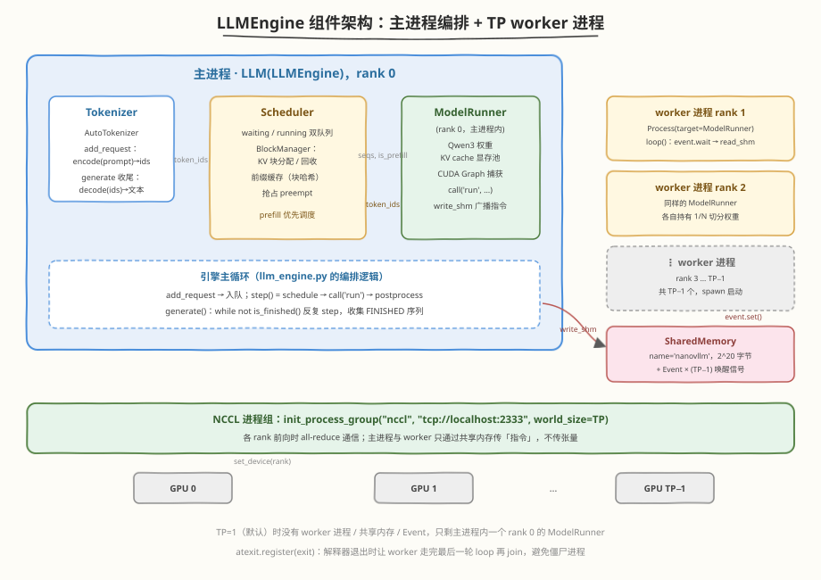
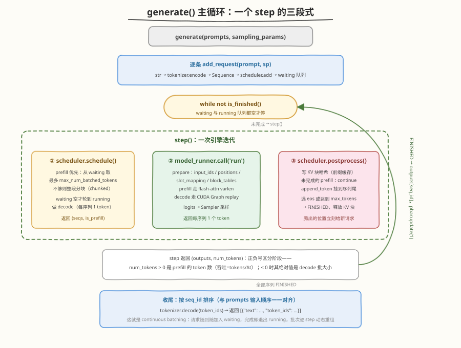
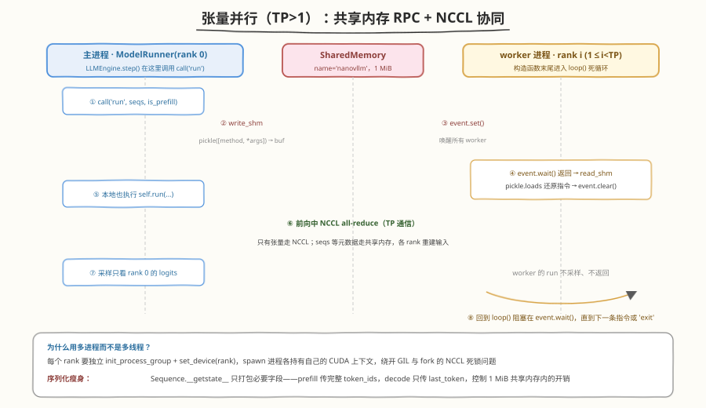

# llm_engine.py 源码解读：nano-vllm 的引擎主循环

> 源码版本：nano-vllm v0.2.0（commit `bb823b3`），文件 `nanovllm/engine/llm_engine.py`，全文仅 **90 行**。
> 这是整个框架的"指挥中枢"——把分词器、调度器、执行器拼成一条流水线，并用一个 `while` 循环实现 continuous batching。

## 🎯 目标

通过本文，你将：

1. 理解 `LLMEngine` 的组件构成与初始化顺序
2. 掌握 `step()` 三段式（schedule → run → postprocess）的执行逻辑
3. 理解 `generate()` 主循环如何实现 continuous batching 与 chunked prefill
4. 看懂张量并行（TP）下的多进程 + 共享内存 RPC 设计
5. 学到若干 Python 工程技巧（kwargs 过滤、atexit、正负号编码）

> 💡 **前置知识**：建议先读 [Day 2：引擎主线](../day2.md) 与 [vLLM 专题](../../vllm/README.md) 中的 PagedAttention / 连续批处理概念；本文只聚焦 `llm_engine.py` 本身。
> ⚠️ **源码出处**：[GeeeekExplorer/nano-vllm](https://github.com/GeeeekExplorer/nano-vllm)，一个对标 vLLM 的极简教学实现。

---

## 一、整体架构：90 行代码里有什么

`llm_engine.py` 定义了唯一的类 `LLMEngine`。对外暴露的门面 `LLM` 只是它的空壳子类：

```python
# nanovllm/llm.py
class LLM(LLMEngine):
    pass
```

`LLMEngine` 自己**不做任何计算**，只做三件事：**编排（orchestrate）、转发（dispatch）、收尾（finalize）**。真正干活的是它组装出来的三个组件：

| 组件 | 职责 | 关键点 |
|------|------|--------|
| `Tokenizer` | 文本 ↔ token ids | `add_request` 时 encode，`generate` 收尾时 decode；`eos_token_id` 也由它提供 |
| `Scheduler` | 决定"这一步算哪些序列" | 维护 `waiting`/`running` 双队列，管理 KV 块分配与抢占 |
| `ModelRunner` | 真正执行前向 + 采样 | 持有模型权重、KV cache 池、CUDA Graph；TP>1 时 rank 0 在主进程，其余在子进程 |



> 💡 **一句话总结**：`LLMEngine` 是"经纪人"——Tokenizer 管翻译，Scheduler 管排期，ModelRunner 管干活，三者通过 `step()` 串成闭环。

---

## 二、逐段精读

### 2.1 `__init__`：从一堆 kwargs 到可运行的引擎

```python
def __init__(self, model, **kwargs):
    config_fields = {field.name for field in fields(Config)}
    config_kwargs = {k: v for k, v in kwargs.items() if k in config_fields}
    config = Config(model, **config_kwargs)
    Sequence.block_size = config.kvcache_block_size
```

**kwargs 过滤技巧**：`Config` 是一个 `@dataclass(slots=True)`，用 `dataclasses.fields()` 反射出全部合法字段名，把用户传入的 kwargs **白名单过滤**后再构造。好处是调用方可以放心地把 `SamplingParams` 之类的参数混着传，多余项不会炸掉 `Config.__init__`。

**类属性注入**：`Sequence.block_size = config.kvcache_block_size` 把块大小写进 `Sequence` 的**类属性**（默认 256）。因为 `Sequence` 会被 pickle 后经共享内存发给 worker 进程，块大小作为类属性不参与序列化，各进程加载 nanovllm 模块后天然一致。

#### 张量并行：spawn 出 TP−1 个 worker

```python
    self.ps = []
    self.events = []
    ctx = mp.get_context("spawn")
    for i in range(1, config.tensor_parallel_size):
        event = ctx.Event()
        process = ctx.Process(target=ModelRunner, args=(config, i, event))
        process.start()
        self.ps.append(process)
        self.events.append(event)
    self.model_runner = ModelRunner(config, 0, self.events)
```

注意循环从 **1** 开始：`rank 0` 的 `ModelRunner` 不在子进程里，而是**主进程内**直接构造（最后一行）。`range(1, tp)` 只为 rank 1..TP−1 各 spawn 一个进程，并把 `config`、`rank`、专属 `Event` 作为构造参数传入——`Process(target=ModelRunner, ...)` 的意思是**把类当函数调**：子进程执行 `ModelRunner(config, i, event)`，其构造函数末尾会进入 `loop()` 死循环等待指令。

#### 组件组装顺序暗含依赖

```python
    self.tokenizer = AutoTokenizer.from_pretrained(config.model, use_fast=True)
    config.eos = self.tokenizer.eos_token_id
    self.scheduler = Scheduler(config)
    atexit.register(self.exit)
```

顺序不能乱：

1. 先建 `tokenizer`，才能把 `eos_token_id` 回填进 `config`（`Config` 默认 `eos: int = -1`，它自己不知道模型词表）；
2. `Scheduler` 构造时会读 `config.eos` 判断序列是否结束，所以必须在回填之后；
3. `atexit.register(self.exit)` 兜底：哪怕用户忘了调 `exit()`，解释器退出时也会让 worker 进程优雅退出、`join` 收尸，避免孤儿进程占着 GPU 显存。

> ⚠️ **注意**：`ModelRunner.__init__` 会做 warmup、按 `gpu_memory_utilization` 探测显存并算出 `num_kvcache_blocks`，随后写回 `config`——所以 `Scheduler` 拿到的 `config.num_kvcache_blocks` 是探测后的真实值。这也是 `ModelRunner` 必须先于 `Scheduler` 构造的隐藏原因。

### 2.2 `exit`：优雅关停

```python
def exit(self):
    self.model_runner.call("exit")
    del self.model_runner
    for p in self.ps:
        p.join()
```

`call("exit")` 是一次广播 RPC：rank 0 把 `"exit"` 方法名写进共享内存并 set 所有 event；每个 worker 的 `loop()` 读到后执行 `ModelRunner.exit()`（关共享内存、销毁 NCCL 进程组），再 `break` 退出循环，进程自然结束。主进程随后 `join()` 等它们退出。

### 2.3 `add_request`：请求的入队口

```python
def add_request(self, prompt: str | list[int], sampling_params: SamplingParams):
    if isinstance(prompt, str):
        prompt = self.tokenizer.encode(prompt)
    seq = Sequence(prompt, sampling_params)
    self.scheduler.add(seq)
```

短短四行，干三件事：文本请求现编码；构造 `Sequence`（状态机起点 `WAITING`，记录 `num_prompt_tokens`、温度、`max_tokens` 等）；塞进调度器的 `waiting` 队列。**注意这里不触发任何计算**——nano-vllm 是同步批式接口，所有请求攒到 `generate()` 里一起跑。

### 2.4 `step()`：引擎的心跳（核心）

```python
def step(self):
    seqs, is_prefill = self.scheduler.schedule()
    num_tokens = sum(seq.num_scheduled_tokens for seq in seqs) if is_prefill else -len(seqs)
    token_ids = self.model_runner.call("run", seqs, is_prefill)
    self.scheduler.postprocess(seqs, token_ids, is_prefill)
    outputs = [(seq.seq_id, seq.completion_token_ids) for seq in seqs if seq.is_finished]
    return outputs, num_tokens
```

一次 `step` 就是引擎的一次心跳，固定三段式：

1. **`schedule()`**：问调度器要本批序列。prefill 优先——只要 `waiting` 队列非空就组 prefill 批（受 `max_num_batched_tokens` 约束，首序列允许 chunked prefill 切块）；`waiting` 空了才对 `running` 队列做 decode（每序列 1 个 token）。返回 `(seqs, is_prefill)`。
2. **`call("run", seqs, is_prefill)`**：转发给 ModelRunner（TP>1 时同时经共享内存广播给 worker）。内部构造 `input_ids`/`positions`/`slot_mapping`/`block_tables`，prefill 走 flash-attn varlen、decode 走 CUDA Graph replay，最后采样，**给每个序列吐出恰好 1 个新 token**。
3. **`postprocess()`**：写 KV 块哈希（供前缀缓存命中）、`append_token` 挂到序列尾；chunked prefill 没跑完的序列 `continue`（不算完成）；命中 eos 或达到 `max_tokens` 的序列置 `FINISHED` 并立即释放 KV 块。



#### 正负号编码：一个返回值当两个用

```python
num_tokens = sum(...) if is_prefill else -len(seqs)
```

`step()` 的第二个返回值 `num_tokens` 被故意编码了符号：

- **prefill 步**：`> 0`，值是本批实际调度的 token 总数（被 chunked prefill 切过的也算）；
- **decode 步**：`< 0`，绝对值是批大小（每序列 1 token，所以 `-len(seqs)` 就是产出的 token 数）。

调用方 `generate()` 只看符号就能分流统计两种吞吐，省掉再传一个 `is_prefill` 标志。这是个很"抠门"但有效的接口设计——毕竟整个文件才 90 行。

> 💡 **为什么 prefill/decode 要分开？** 两者计算形态完全不同：prefill 是"长序列、算力受限"（大量 token 并行算 attention），decode 是"每序列 1 token、访存受限"（读整个 KV cache 却只算一步）。分开组批才能分别用 varlen attention / CUDA Graph 各自的最优路径。

### 2.5 `is_finished`

```python
def is_finished(self):
    return self.scheduler.is_finished()
```

纯转发：`waiting` 和 `running` 两个队列**都空**才算全部完成。被抢占（preempt）回 `waiting` 的序列会让循环继续，不会丢请求。

### 2.6 `generate`：把心跳串成推理服务

```python
def generate(self, prompts, sampling_params, use_tqdm=True) -> list[str]:
    pbar = tqdm(total=len(prompts), desc="Generating", dynamic_ncols=True, disable=not use_tqdm)
    if not isinstance(sampling_params, list):
        sampling_params = [sampling_params] * len(prompts)
    for prompt, sp in zip(prompts, sampling_params):
        self.add_request(prompt, sp)
    outputs = {}
    prefill_throughput = decode_throughput = 0.
    while not self.is_finished():
        t = perf_counter()
        output, num_tokens = self.step()
        if num_tokens > 0:
            prefill_throughput = num_tokens / (perf_counter() - t)
        else:
            decode_throughput = -num_tokens / (perf_counter() - t)
        pbar.set_postfix({...})
        for seq_id, token_ids in output:
            outputs[seq_id] = token_ids
            pbar.update(1)
    pbar.close()
    outputs = [outputs[seq_id] for seq_id in sorted(outputs.keys())]
    outputs = [{"text": self.tokenizer.decode(token_ids), "token_ids": token_ids} for token_ids in outputs]
    return outputs
```

几个值得咀嚼的细节：

- **采样参数广播**：单个 `SamplingParams` 自动复制成列表，逐请求绑定到各自的 `Sequence` 上。
- **吞吐双指标**：`perf_counter()` 计每步耗时，按 `num_tokens` 符号分流——progress bar 上能看到 Prefill（tok/s）和 Decode（tok/s）两行实时数字，prefill 与 decode 的量级差异一目了然。
- **完成即摘牌**：每步结束后把 `FINISHED` 序列的 `completion_token_ids` 存进 `outputs[seq_id]` 并 `pbar.update(1)`。它腾出的 KV 块已在 `postprocess` 里释放，**下一个 step 就能接纳 waiting 里的新序列**——这正是 continuous batching 的实现本体。
- **按 `seq_id` 排序**：`Sequence.seq_id` 来自 `itertools.count()` 的自增序号，即请求加入顺序。排序后输出与 `prompts` 输入**严格对齐**，调用方能 `zip(prompts, outputs)` 使用。

> 💡 **一句话总结**：continuous batching 在 nano-vllm 里没有一个叫 "continuous batching" 的模块——它就是 `while not is_finished(): step()` 这一行，配上 Scheduler 里"prefill 优先、完成即释放、逐 step 重组批次"的策略，效果自然涌现。

---

## 三、张量并行：为什么引擎里有一段多进程代码

`llm_engine.py` 里最"出戏"的部分是 `__init__` 中的 `mp.get_context("spawn")`。因为 nano-vllm 的 TP 方案是：**每个 rank 一个独立进程，rank 0 留在主进程，其余 spawn**。



通信被拆成两条互不干扰的通道：

| 通道 | 载体 | 传什么 | 方向 |
|------|------|--------|------|
| 控制面 | `SharedMemory('nanovllm')`（1 MiB）+ `Event` | pickle 后的 `[方法名, *args]`，如 `('run', seqs, is_prefill)` | rank 0 → workers，单向广播 |
| 数据面 | NCCL（`tcp://localhost:2333`） | 前向中的 all-reduce 梯度切片 / 激活 | 全体 rank 双向 |

`ModelRunner.call()` 是控制面入口：rank 0 先 `write_shm`（pickle 序列化 → 写共享内存 → 对每个 worker `event.set()`），再**自己也执行一遍**该方法；worker 的 `loop()` 阻塞在 `event.wait()`，被唤醒后 `read_shm` 反序列化、`event.clear()`、执行同名方法。采样只发生在 rank 0。

两个精妙的配套设计：

1. **`Sequence.__getstate__` 瘦身**：序列化 `Sequence` 时只打包必要字段——prefill 阶段传完整 `token_ids`，decode 阶段只传 `last_token` 一个 int。这样即便几十上百个序列塞进 1 MiB 共享内存也不爆。
2. **为什么是进程不是线程**：每个 rank 需要 `torch.cuda.set_device(rank)` 绑定自己的 GPU、独立的 `init_process_group` 上下文；`spawn` 进程各持 CUDA 上下文，绕开 GIL，也避开 `fork` 与 NCCL 的死锁坑。代价是 worker 收不到返回值——所以 worker 里 `run` 的采样结果直接丢弃（`token_ids = ... if self.rank == 0 else None`）。

---

## 四、设计亮点小结

| 技巧 | 位置 | 一句话点评 |
|------|------|-----------|
| kwargs 白名单过滤 | `__init__` | `dataclasses.fields` 反射，接口宽容、内部严格 |
| 类属性注入 | `Sequence.block_size` | 避免随 pickle 传输的静态配置 |
| `atexit` 兜底退出 | `__init__` 末行 | 用户忘了 `exit()` 也不留孤儿进程 |
| `num_tokens` 正负号 | `step()` | 一个 int 编码"阶段 + 数量"，接口极简 |
| prefill 优先调度 | `step()` → `schedule()` | 新请求零等待插队，长尾友好（Orca/Sarathi 思路） |
| `seq_id` 排序对齐 | `generate()` 收尾 | 输出顺序 = 输入顺序，API 契约清晰 |

---

## 五、面试要点

**Q：nano-vllm 的 continuous batching 是怎么实现的？**

&emsp;&emsp;没有专门模块。`generate()` 里 `while not is_finished(): step()`；`schedule()` 每步重新组批：`waiting` 非空就优先组 prefill 批（支持 chunked prefill），否则对 `running` 做 decode；`postprocess()` 中 `FINISHED` 序列立刻释放 KV 块。于是批次每个 step 都在动态重组——新请求随时进、完成请求随时出。

**Q：为什么 `step()` 里 prefill 和 decode 不会混在一个批里？**

&emsp;&emsp;`schedule()` 的结构是两个串行的 while：先尽力从 `waiting` 组 prefill，只有 `scheduled_seqs` 为空（没有 prefill 可做）时才走 decode 分支，最后以 `is_prefill` 布尔值整体返回。两种形态的计算分别匹配 varlen attention 与 CUDA Graph 的最优路径。

**Q：TP>1 时，主进程和 worker 之间传模型张量吗？**

&emsp;&emsp;不传。控制面只经 1 MiB 共享内存传 pickle 后的指令（方法名 + 序列元数据），各 worker 自己重建输入张量；真正的张量通信全部由前向中的 NCCL all-reduce 完成。`Sequence.__getstate__` 还对序列化做了瘦身（decode 只传 `last_token`）。

**Q：`atexit.register(self.exit)` 有什么用？**

&emsp;&emsp;保证解释器退出时（包括异常退出路径）也会广播 `"exit"` 给 worker、销毁 NCCL 进程组并 `join` 子进程，避免子进程持有 GPU 显存和共享内存句柄变成孤儿。同时 `ModelRunner.exit` 里 rank 0 负责 `shm.unlink()`，跨进程资源有明确的释放责任人。

**Q：`generate()` 的输出为什么最后要 `sorted(outputs.keys())`？**

&emsp;&emsp;序列完成的先后是随机的（长短句、eos 时机不同），`outputs` 字典的插入顺序因此乱序；`seq_id` 由 `itertools.count()` 按请求加入顺序分配，排序后恢复与 `prompts` 一一对应，保证 API 语义可预期。

---

## 推荐资源

- ⭐ [GeeeekExplorer/nano-vllm](https://github.com/GeeeekExplorer/nano-vllm)：源码本体，90 行引擎 + 600 行执行器，一天可读完
- 📌 [Day 4：Scheduler——Continuous Batching 与抢占](../day4.md)：`llm_engine.py` 的下游，双队列与抢占的细节都在那里
- 📌 [vLLM 专题](../../vllm/README.md)：PagedAttention、调度器状态机、prefix caching 的完整版实现
- 📌 Orca 论文（*Orca: A Distributed Serving System for Transformer-Based Generative Models*）：iteration-level scheduling 的出处
- 📎 [Day 6：Tensor Parallelism](../day6.md)：TP 切分与共享内存 RPC 的实验验证
