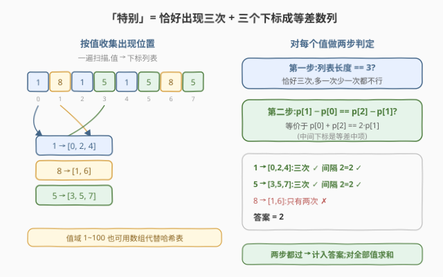
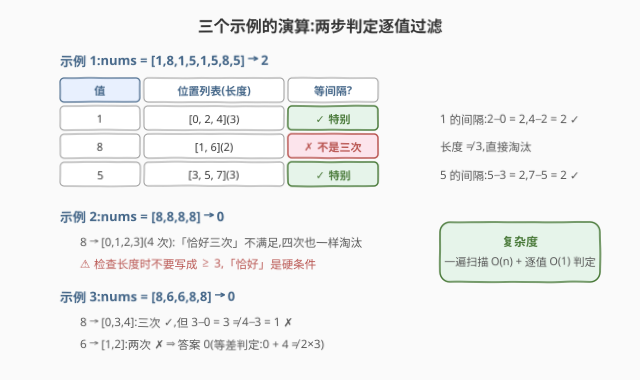

# LeetCode 统计等间距出现整数数目 I 题解

## 1. 题目概述

- **标题 / 题号**:统计等间距出现整数数目 I(#4048,Easy)
- **链接**:https://leetcode.cn/problems/count-values-with-equally-spaced-occurrences-i/
- **来源**:LeetCode 第 191 场双周赛 Q1
- **难度**:简单
- **标签**:数组、哈希表、计数

**题意**:给定整数数组 `nums`。整数 $x$ 是**特别**的,当且仅当:

1. $x$ 在 `nums` 中**恰好出现三次**;
2. 三次出现的下标 $i_1 < i_2 < i_3$ **等间隔**,即 $i_2 - i_1 = i_3 - i_2$。

返回不同特别整数的数量。

**约束**:

- $3 \le \mathrm{nums.length} \le 100$
- $1 \le \mathrm{nums[i]} \le 100$

## 2. 示例

**示例 1**

```text
输入:nums = [1,8,1,5,1,5,8,5]
输出:2
解释:1 出现在 [0,2,4],间隔 2=2 ✓;5 出现在 [3,5,7],间隔 2=2 ✓;
      8 只出现两次 ✗。
```

**示例 2**

```text
输入:nums = [8,8,8,8]
输出:0
解释:8 出现四次,不满足「恰好三次」。
```

**示例 3**

```text
输入:nums = [8,6,6,8,8]
输出:0
解释:8 出现在 [0,3,4],3−0 = 3 ≠ 4−3 = 1 ✗;6 只出现两次 ✗。
```

## 3. 解题思路

### 3.1 暴力思路

对每个候选值 $x$ 重新扫一遍数组,数出现次数并收集位置,单值 $O(n)$、全部 $O(n \cdot U)$($U$ 为值域 100);或更朴素地三重循环枚举 $(i_1, i_2, i_3)$ 判同值等距,$O(n^3)$。$n \le 100$ 下都能通过,但一次扫描把位置按值分组后,每个值的判定只需 $O(1)$,代码也最短。

### 3.2 核心观察:位置列表 + 两步 $O(1)$ 判定

一遍扫描建立「值 → 出现下标列表」的哈希表(扫描顺序保证列表**天然递增**)。每个值的判定只剩两步:

1. **长度恰为 3**(「恰好三次」,多一次少一次都不行);
2. **等差中项**:$p[1] - p[0] = p[2] - p[1]$,等价于 $p[0] + p[2] = 2 \cdot p[1]$。



> 💡 **一句话总结**:等间隔的三个下标就是等差数列——分组收集位置,「长度 = 3」加「中间项是等差中项」两步 $O(1)$ 判定,对全部值求和。

### 3.3 算法流程

1. 扫描数组,把每个下标 $i$ 追加到 `pos[nums[i]]` 列表末尾;
2. 遍历哈希表中每个值的位置列表 $p$;
3. 若 $\mathrm{len}(p) = 3$ 且 $p[1] - p[0] = p[2] - p[1]$,计数加一;
4. 返回计数。

### 3.4 示例演算

以示例 1(`nums = [1,8,1,5,1,5,8,5]`)为例,分组结果与判定:

| 值 | 位置列表 | 长度 = 3? | 等间隔? | 特别? |
|----|---------|-----------|---------|-------|
| 1 | $[0, 2, 4]$ | ✓ | $2-0 = 2 = 4-2$ ✓ | ✓ |
| 8 | $[1, 6]$ | ✗(两次) | — | ✗ |
| 5 | $[3, 5, 7]$ | ✓ | $5-3 = 2 = 7-5$ ✓ | ✓ |

答案 $2$ ✓。示例 2 中 8 的列表长度为 4——**「恰好」是硬条件**,四次同样淘汰;示例 3 中 8 的间隔 $3 \ne 1$,两步各拦下一类反例。



## 4. 算法细节

1. **列表天然有序**:按扫描顺序追加,无需排序;等差判定直接用相邻差。

2. **等差判定的两种写法**:$p[1] - p[0] = p[2] - p[1]$ 或 $p[0] + p[2] = 2 \cdot p[1]$,后者是「中间下标为等差中项」的直观形式,本题两者等价(下标非负、无溢出风险)。

3. **值域小可用数组代替哈希**:$1 \le \mathrm{nums[i]} \le 100$,C++ 可开 `vector<vector<int>> pos(101)` 按值直接索引,省去哈希开销;值域大时换 `unordered_map`(同场 Q2 的 II 版即此情形)。

4. **去重免费**:按值分组后每个值只判定一次,「不同整数」的计数天然成立。

> ⚠️ **易错**:长度检查写成 `>= 3` 会把出现四次的值误判(示例 2 正是为此设计);等间隔是**下标**等间隔,与值本身无关。

## 5. 正确性证明

**引理 1(等间隔的等价刻画)**:下标 $i_1 < i_2 < i_3$ 等间隔 $\iff$ $i_1 + i_3 = 2 \cdot i_2$。

**证明**:等间隔 $\iff i_2 - i_1 = i_3 - i_2$ $\iff 2 \cdot i_2 = i_1 + i_3$(移项即得)。∎

**定理**:算法返回的值等于特别整数的个数。

**证明**:(1) `pos[v]` 按扫描序追加下标,恰为 $v$ 在数组中全部出现位置且严格递增;(2) $v$ 特别 $\iff$ 出现次数为 3 且三下标等间隔 $\iff$ $\mathrm{len}(p) = 3$ 且 $p[0] + p[2] = 2 \cdot p[1]$(引理 1),即算法的判定条件;(3) 不同值的判定互不影响,且每个值恰被判定一次,求和即为不同特别整数的个数。∎

## 6. 复杂度分析

- **时间复杂度**:$O(n + U)$。一遍扫描建表 $O(n)$,逐值判定 $O(1)$、共 $U \le 100$ 个值(哈希实现则按不同值个数计,不超过 $\min(n, U)$)。
- **空间复杂度**:$O(n)$。所有位置列表的总长度恰为 $n$;计数与值域数组为 $O(U)$。

## 7. 参考代码

### C++

```cpp
class Solution {
  public:
    int countSpecialIntegers(vector<int>& nums) {
        vector<vector<int>> pos(101);      // 值域 1..100,数组代替哈希
        for (int i = 0; i < (int)nums.size(); i++)
            pos[nums[i]].push_back(i);
        int ans = 0;
        for (int v = 1; v <= 100; v++) {
            auto& p = pos[v];
            if (p.size() == 3 && p[1] - p[0] == p[2] - p[1])
                ans++;
        }
        return ans;
    }
};
```

### Python

```python
from collections import defaultdict

class Solution:
    def countSpecialIntegers(self, nums: list[int]) -> int:
        pos = defaultdict(list)
        for i, x in enumerate(nums):
            pos[x].append(i)          # 扫描序追加,天然递增
        return sum(1 for p in pos.values()
                   if len(p) == 3 and p[1] - p[0] == p[2] - p[1])
```

## 8. 边界情况与易错点

1. **「恰好三次」不是「至少三次」**:出现四次同样淘汰(示例 2),长度检查必须是 $= 3$ 而非 $\ge 3$。

2. **间隔不等的长尾反例**:`[0, 3, 4]` 型(间隔 $3, 1$)是长度合法但等间隔失败的典型,两个相邻差都要比,不能只看一个。

3. **列表无需排序**:哈希表按扫描序收集,下标严格递增;重复排序是无谓开销。

4. **答案按「不同整数」计**:多个值可同时特别(示例 1 中 1 与 5),分组遍历天然去重。

5. **最小情形 $n = 3$**:如 `[5,5,5]`,三下标 $[0,1,2]$ 等间隔,答案 1;`[5,5,6]` 则 5 只出现两次,答案 0。

6. **值域边界**:`nums[i] = 100` 与 `nums[i] = 1` 都在数组索引范围内,C++ 开 101 大小即可,不要开成 100 漏掉值 100。

## 相关题目与扩展

- [219. 存在重复元素 II](https://leetcode.cn/problems/contains-duplicate-ii/):哈希记录上次出现位置、判距离阈值的同门练习。
- [1. 两数之和](https://leetcode.cn/problems/two-sum/):「一遍扫描 + 哈希分组/查询」的最基础形态。
- LeetCode 第 191 场双周赛 Q2. 统计等间距出现整数数目 II:本题的加强版,「值 → 位置列表」的分组结构是共同的起点,放大数据后需要更高效的等差判定。

**延伸思考**:

- 若「恰好三次」推广为「恰好 $k$ 次」且要求 $k$ 个下标成等差数列,判定改为「相邻差全部相等」,仍是列表上 $O(k)$ 一次扫描。
- 若还要求统计**哪些**下标三元组等间隔(而非只判存在),可对每个值的位置列表做等差三元组计数,套路同「好子数组」类哈希计数题。
