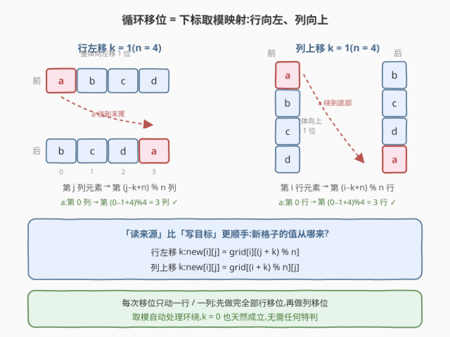
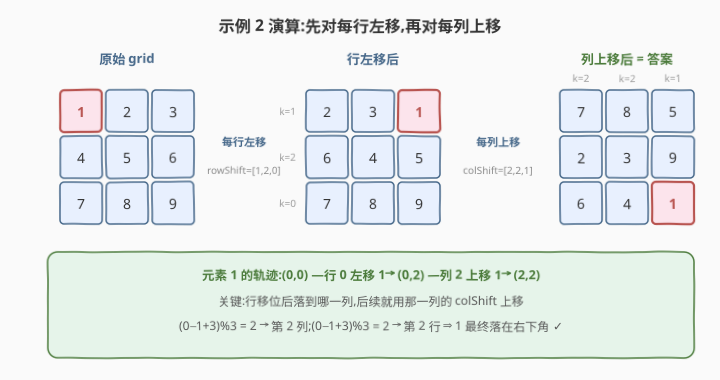

# LeetCode 行列循环移位 题解

## 1. 题目概述

- **标题 / 题号**:行列循环移位(#4052,Easy)
- **链接**:https://leetcode.cn/problems/cyclically-shift-rows-and-columns/
- **来源**:LeetCode 第 519 场周赛 Q1
- **难度**:简单
- **标签**:数组、矩阵、模拟

**题意**:给定 $n \times n$ 网格 `grid` 与两个长度为 $n$ 的数组 `rowShift`、`colShift`。`rowShift[i]` 表示把第 $i$ 行**向左**循环移位的位数,`colShift[j]` 表示把第 $j$ 列**向上**循环移位的位数。要求**先**按 `rowShift` 对每一行做左移,**再**按 `colShift` 对每一列做上移,返回最终网格。

题面直接给出了两条坐标规则:

- 行左移 $k$ 位:第 $j$ 列的元素移动到第 $(j - k + n) \bmod n$ 列;
- 列上移 $k$ 位:第 $i$ 行的元素移动到第 $(i - k + n) \bmod n$ 行。

**约束**:

- $1 \le n = \mathrm{grid.length} = \mathrm{grid[i].length} \le 10$
- $1 \le \mathrm{grid[i][j]} \le 100$
- $\mathrm{rowShift.length} = \mathrm{colShift.length} = n$
- $0 \le \mathrm{rowShift[i]}, \mathrm{colShift[j]} < n$

## 2. 示例

**示例 1**

```text
输入:n = 2, grid = [[1,2],[3,4]], rowShift = [1,0], colShift = [0,1]
输出:[[2,4],[3,1]]
解释:行移位后:[[2,1],[3,4]](第 0 行左移 1 位,第 1 行不动);
      再对第 1 列上移 1 位:该列 [1,4] 变为 [4,1],得到 [[2,4],[3,1]]。
```

**示例 2**

```text
输入:n = 3, grid = [[1,2,3],[4,5,6],[7,8,9]], rowShift = [1,2,0], colShift = [2,2,1]
输出:[[7,8,5],[2,3,9],[6,4,1]]
解释:行移位后:[[2,3,1],[6,4,5],[7,8,9]];
      再对第 0、1、2 列分别上移 2、2、1 位,得到 [[7,8,5],[2,3,9],[6,4,1]]。
```

## 3. 解题思路

### 3.1 暴力思路

最朴素的模拟:把「左移 $k$ 位」拆成 $k$ 次「整行左移一格、首元素绕到末尾」,列同理。单个行移位 $O(nk)$,全部操作合计 $O(n^3)$,在 $n \le 10$ 下只有约 $10^3$ 次搬运,完全能过。

也可以按题面的「写目标」定义直接搬运:`new[i][(j - k + n) % n] = grid[i][j]`。但这两种写法要么逐步滚动、要么负数取模,都容易在**方向**和**取模**上出错。事实上每个目标格子的来源可以 $O(1)$ 直接算出,一遍填完即可。

### 3.2 核心观察:「读来源」的下标取模映射

把题面的「写目标」翻译成「读来源」:**行左移 $k$ 位后,新行第 $j$ 列的值来自旧行第 $(j + k) \bmod n$ 列**;列上移 $k$ 位后,新列第 $i$ 行的值来自旧列第 $(i + k) \bmod n$ 行。

$$\text{行左移 } k:\quad \mathrm{new}[i][j] = \mathrm{grid}[i][(j + k) \bmod n]$$

$$\text{列上移 } k:\quad \mathrm{new}[i][j] = \mathrm{grid}[(i + k) \bmod n][j]$$

这个方向的好处:**$(j+k) \bmod n$ 恒非负**,不需要 `+n` 防负数,`k = 0` 时自动退化为恒等映射,全程无需任何 `if` 特判。



> 💡 **一句话总结**:循环移位就是下标取模映射,「新格子从哪读」比「旧元素写到哪」更好写——先左移行、再上移列,两遍扫描各填 $n^2$ 个格子。

### 3.3 算法流程

1. **行遍**:建中间矩阵 `mid`,对每个 $(i, j)$ 令 `mid[i][j] = grid[i][(j + rowShift[i]) % n]`,完成全部行左移;
2. **列遍**:建答案矩阵 `ans`,对每个 $(i, j)$ 令 `ans[i][j] = mid[(i + colShift[j]) % n][j]`,完成全部列上移;
3. 返回 `ans`。

### 3.4 示例演算

以示例 2($n = 3$)走一遍完整流程。

**第一遍:行左移 `rowShift = [1,2,0]`**

| 行 | 移位前 | 左移位数 | 移位后 |
|----|--------|---------|--------|
| 0 | $[1,2,3]$ | $1$ | $[2,3,1]$ |
| 1 | $[4,5,6]$ | $2$ | $[6,4,5]$ |
| 2 | $[7,8,9]$ | $0$ | $[7,8,9]$ |

**第二遍:列上移 `colShift = [2,2,1]`**(作用在中间矩阵上)

| 列 | 移位前 | 上移位数 | 移位后 |
|----|--------|---------|--------|
| 0 | $[2,6,7]$ | $2$ | $[7,2,6]$ |
| 1 | $[3,4,8]$ | $2$ | $[8,3,4]$ |
| 2 | $[1,5,9]$ | $1$ | $[5,9,1]$ |

拼回矩阵得 $[[7,8,5],[2,3,9],[6,4,1]]$,与期望输出一致。✓



## 4. 算法细节

1. **「读来源」公式的由来**:题面规定第 $j$ 列元素落到第 $(j-k+n) \bmod n$ 列,即 $\mathrm{old}[j] \to \mathrm{new}[(j-k+n) \bmod n]$。对新位置 $j$ 反解来源:$j_0 = (j + k) \bmod n$(模 $n$ 下代表元唯一),得 $\mathrm{new}[j] = \mathrm{old}[(j+k) \bmod n]$。

2. **两遍顺序不可换**:题面规定先做行移位、再做列移位。行移位会把元素**搬到新的列**,该元素随后按**新列**的 `colShift` 上移——示例 2 的元素 1 原在第 0 列,行移位后落到第 2 列,生效的是 $\mathrm{colShift}[2] = 1$ 而非 $\mathrm{colShift}[0] = 2$。两遍扫描天然保持这一顺序。

3. **可选的一遍写法**:合并两遍可得单元素映射

$$j' = (j - \mathrm{rowShift}[i] + n) \bmod n,\quad i' = (i - \mathrm{colShift}[j'] + n) \bmod n,\quad \mathrm{final}[i'][j'] = \mathrm{grid}[i][j]$$

   一遍扫描 $O(n^2)$ 同样可写,但列移位的下标依赖行移位的结果,容易绕晕;比赛时推荐清晰的两遍扫描。

4. **实现**:两个矩阵 `mid`、`ans` 都按读来源公式双层循环直填,每格 $O(1)$,无临时数组、无分支。

> ⚠️ **易错**:不要把方向搞反——「向左」对应列号**减小**,「向上」对应行号**减小**;读来源公式里对应的是 **+k**。写反会得到「向右 / 向下」的结果。

## 5. 正确性证明

**引理 1**(行移位的读来源公式):对长度为 $n$ 的行 $r$ 与 $0 \le k < n$,设 $r'$ 为 $r$ 向左循环移 $k$ 位的结果(题面定义:第 $j$ 列元素移动到第 $(j-k+n) \bmod n$ 列),则对一切 $0 \le j < n$ 有

$$r'[j] = r[(j + k) \bmod n]$$

**证明**:取 $j_0 = (j + k) \bmod n$。由题面定义,$r[j_0]$ 落到 $r'[(j_0 - k + n) \bmod n]$。由模运算的可结合性,

$$(j_0 - k + n) \bmod n = \big((j + k) \bmod n - k + n\big) \bmod n = (j + n) \bmod n = j$$

最后一步用到 $0 \le j < n$ 时代表元唯一。故 $r'[j] = r[j_0] = r[(j+k) \bmod n]$。∎

**引理 2**(列移位的读来源公式):对长度为 $n$ 的列 $c$ 与 $0 \le k < n$,同样有 $\mathrm{new}[i] = \mathrm{old}[(i+k) \bmod n]$。

**证明**:与引理 1 完全相同,只是把「列号」换成「行号」。∎

**定理**:上述两遍扫描算法返回的矩阵等于题目要求的最终网格。

**证明**:第一遍对每行 $i$ 独立应用引理 1。行移位只改变元素的列号、不改变行号,故各行互不干扰,`mid` 恰为「按 `rowShift` 完成全部行移位」后的网格。第二遍对 `mid` 的每列 $j$ 独立应用引理 2。列移位只改变元素的行号、不改变列号,故各列互不干扰,`ans` 恰为「在 `mid` 基础上按 `colShift` 完成全部列移位」后的网格。这与题面规定的执行顺序(先行后列)逐阶段一致,因此 `ans` 即所求。∎

## 6. 复杂度分析

- **时间复杂度**:$O(n^2)$。两遍扫描,每遍填充 $n^2$ 个格子,每个格子一次取模与一次赋值,共 $O(1) \times 2n^2$。
- **空间复杂度**:$O(n^2)$。额外使用中间矩阵 `mid` 与答案矩阵 `ans`。若逐行 / 逐列用长度 $n$ 的临时数组轮换,可降到 $O(n)$ 额外空间,但 $n \le 10$ 下没有必要。

## 7. 参考代码

### C++

```cpp
class Solution {
  public:
    vector<vector<int>> cyclicShift(int n, vector<vector<int>>& grid,
                                    vector<int>& rowShift, vector<int>& colShift) {
        // 第一遍:每行向左循环移位 rowShift[i]
        vector<vector<int>> mid(n, vector<int>(n));
        for (int i = 0; i < n; i++)
            for (int j = 0; j < n; j++)
                mid[i][j] = grid[i][(j + rowShift[i]) % n];

        // 第二遍:每列向上循环移位 colShift[j]
        vector<vector<int>> ans(n, vector<int>(n));
        for (int i = 0; i < n; i++)
            for (int j = 0; j < n; j++)
                ans[i][j] = mid[(i + colShift[j]) % n][j];
        return ans;
    }
};
```

### Python

```python
class Solution:
    def cyclicShift(self, n: int, grid: list[list[int]],
                    rowShift: list[int], colShift: list[int]) -> list[list[int]]:
        # 第一遍:每行向左循环移位 rowShift[i]
        mid = [[grid[i][(j + rowShift[i]) % n] for j in range(n)] for i in range(n)]
        # 第二遍:每列向上循环移位 colShift[j]
        return [[mid[(i + colShift[j]) % n][j] for j in range(n)] for i in range(n)]
```

## 8. 边界情况与易错点

1. **顺序不可颠倒、不可「各自独立」同时算**:必须先做完全部行移位再做列移位。行移位后元素所在列已变,随后生效的是**新列**的 `colShift`(示例 2 的元素 1:原第 0 列,行移位后落到第 2 列,用 $\mathrm{colShift}[2]=1$ 而非 $\mathrm{colShift}[0]=2$)。

2. **方向写反**:「向左」是列号减小、「向上」是行号减小;读来源公式中对应 $+k$。写反会得到向右 / 向下的移位,示例对不上才能发现。

3. **负数取模**:若按题面「写目标」用 $(j-k+n) \bmod n$,漏写 $+n$ 时 Python 的负索引会取到行 / 列末尾(逻辑错),C++ 则是下标越界的未定义行为。读来源公式 $(j+k) \bmod n$ 恒非负,从根源上规避。

4. **$k = 0$ 与 $k = n-1$**:$k=0$ 时公式自动退化为恒等,无需特判;$k$ 最大取到 $n-1$,$j+k$ 可达 $2n-3$,不要忘记取模。

5. **$n = 1$ 的最小情形**:唯一格子任何移位都不动,$(j+k) \bmod 1 = 0$ 恒成立,公式自动正确。

6. **两个数组别用反**:`rowShift` 按行索引 $i$ 取,`colShift` 按列索引 $j$ 取,调试时优先检查这两处下标。

## 相关题目与扩展

- [189. 轮转数组](https://leetcode.cn/problems/rotate-array/):一维循环移位,「读来源 / 写目标」公式的最小场景,另含原地三次翻转技巧。
- [48. 旋转图像](https://leetcode.cn/problems/rotate-image/):矩阵坐标映射 $(i,j) \to (j,\,n-1-i)$,同样推荐「读来源」写法。
- [867. 转置矩阵](https://leetcode.cn/problems/transpose-matrix/):矩阵坐标映射的基础操作,适合对照练习。

**延伸思考**:

- 一遍扫描的合成映射:$j' = (j - \mathrm{rowShift}[i] + n) \bmod n$,$i' = (i - \mathrm{colShift}[j'] + n) \bmod n$,直接 $\mathrm{final}[i'][j'] = \mathrm{grid}[i][j]$。复杂度同为 $O(n^2)$,但可读性差,比赛时两遍扫描是更稳的选择。
- 若行 / 列移位交替进行 $q$ 轮(每轮给出新的 `rowShift` / `colShift`),注意行移位与列移位**不可交换**,多轮操作无法合并成一次映射;逐轮套用同样的两遍扫描,总复杂度 $O(q \cdot n^2)$。
