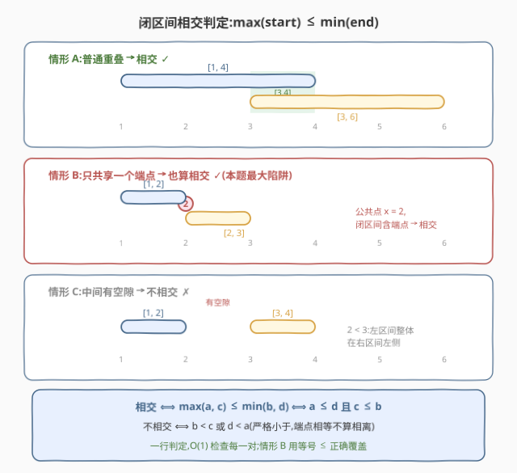
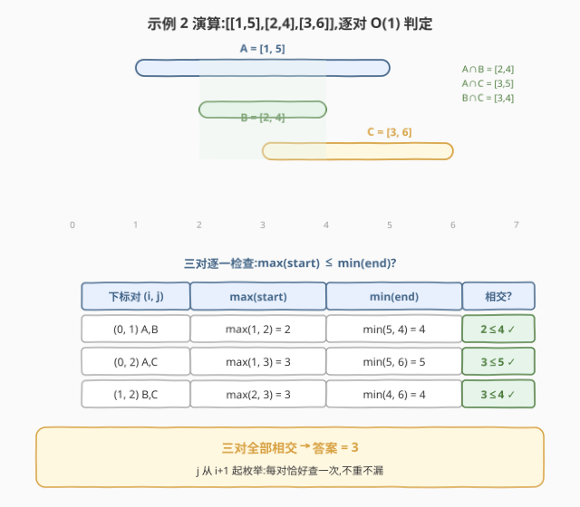
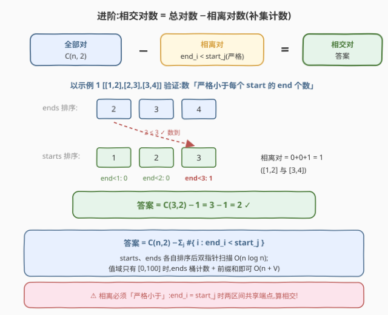

# LeetCode 统计相交区间对 I 题解

## 1. 题目概述

- **标题 / 题号**:统计相交区间对 I(#4056,Easy)
- **链接**:https://leetcode.cn/problems/number-of-intersecting-interval-pairs-i/
- **来源**:LeetCode 第 520 场周赛 Q1
- **难度**:简单
- **标签**:数组、区间、枚举

**题意**:给定 $n$ 个闭区间 $[\mathrm{start}_i, \mathrm{end}_i]$,统计满足 $0 \le i < j < n$ 且两区间**相交**的下标对 $(i, j)$ 的数量。两个区间**至少有一个公共点**即算相交——**只共享一个端点也算**。

**约束**:

- $2 \le n = \mathrm{intervals.length} \le 100$
- $\mathrm{intervals}[i] = [\mathrm{start}_i, \mathrm{end}_i]$
- $0 \le \mathrm{start}_i \le \mathrm{end}_i \le 100$

## 2. 示例

**示例 1**

```text
输入:intervals = [[1,2],[2,3],[3,4]]
输出:2
解释:区间 [1,2] 与 [2,3] 在点 2 处相交;[2,3] 与 [3,4] 在点 3 处相交。
      [1,2] 与 [3,4] 中间有空隙,不相交。
```

**示例 2**

```text
输入:intervals = [[1,5],[2,4],[3,6]]
输出:3
解释:三对区间两两相交:[1,5]∩[2,4]=[2,4],[1,5]∩[3,6]=[3,5],[2,4]∩[3,6]=[3,4]。
```

**示例 3**

```text
输入:intervals = [[1,2],[3,4],[5,6]]
输出:0
解释:三对区间全部相离,答案为 0。
```

## 3. 解题思路

### 3.1 直觉思路:二重循环逐对判定

「数满足条件的对」最直接的写法就是枚举所有下标对 $(i, j)$($j$ 从 $i+1$ 起,天然不重不漏),对每一对做一次 $O(1)$ 的相交判定。总共 $O(n^2)$ 对,$n \le 100$ 时最多 $\binom{100}{2} = 4950$ 对,毫秒级通过——**这就是本题的正解**,不需要任何优化。

### 3.2 核心观察:闭区间相交的 $O(1)$ 判定

两个闭区间 $[a, b]$ 与 $[c, d]$(均已保证 $a \le b$、$c \le d$)相交,当且仅当

$$\max(a, c) \le \min(b, d)$$

等价的双向形式是 $a \le d$ 且 $c \le b$(左区间的起点不超过右区间的终点、反之亦然)。而**不相交**当且仅当

$$b < c \quad\text{或}\quad d < a\quad(\text{严格小于})$$

**关键陷阱在等号上**:本题是**闭**区间,共享端点(如 $[1,2]$ 与 $[2,3]$ 在点 $2$)也算相交。所以判定必须用 $\le$,而「不相交」必须写成严格 $<$——把 $\le$ 写反方向、或用严格不等号判相交,都会在示例 1 上直接出错。



> 💡 **一句话总结**:$O(n^2)$ 枚举所有对,每对用 $\max(\text{start}) \le \min(\text{end})$ 判相交;等号是闭区间的灵魂,端点相切也算。

### 3.3 算法流程

1. 初始化计数器 `ans = 0`;
2. 外层 $i$ 从 $0$ 到 $n-2$,内层 $j$ 从 $i+1$ 到 $n-1$;
3. 对每对 $(i, j)$:取 $[a, b] = \mathrm{intervals}[i]$、$[c, d] = \mathrm{intervals}[j]$,若 $\max(a, c) \le \min(b, d)$ 则 `ans += 1`;
4. 返回 `ans`。

### 3.4 示例演算

以示例 2($[[1,5],[2,4],[3,6]]$)走一遍三对的判定:

| 下标对 | $\max(\text{start})$ | $\min(\text{end})$ | 判定 |
|--------|---------------------|--------------------|------|
| $(0,1)$ | $\max(1,2)=2$ | $\min(5,4)=4$ | $2 \le 4$,相交 ✓ |
| $(0,2)$ | $\max(1,3)=3$ | $\min(5,6)=5$ | $3 \le 5$,相交 ✓ |
| $(1,2)$ | $\max(2,3)=3$ | $\min(4,6)=4$ | $3 \le 4$,相交 ✓ |

三对全部相交,答案为 $3$,与期望输出一致。



## 4. 算法细节

1. **判定条件的三种等价写法**(任选其一,推荐第一种最不易错):
   - $\max(a, c) \le \min(b, d)$(交集 $[\max(\text{start}), \min(\text{end})]$ 非空);
   - $a \le d$ 且 $c \le b$(双向「起点不超过对方终点」);
   - 非($b < c$ 或 $d < a$)(补集形式)。

2. **不相交的单向判定要查两侧**:区间对谁左谁右事先未知,「$b < c$」只覆盖了 $i$ 在左的情形,漏掉 $d < a$ 的另一半;用补集写法时两个方向都要写。

3. **进阶:补集计数 $O(n \log n)$(为 Q2 铺路)**。相交对数不好直接批量算,但**相离对**结构简单:$\{i, j\}$ 相离 $\iff$ 一方的 $\mathrm{end}$ **严格小于**另一方的 $\mathrm{start}$,且方向唯一(若两个方向同时成立会推出 $\mathrm{end}_i < \mathrm{start}_j \le \mathrm{end}_j < \mathrm{start}_i \le \mathrm{end}_i$,矛盾)。于是

   $$\text{答案} = \binom{n}{2} - \sum_{j=1}^{n} \#\{\, i : \mathrm{end}_i < \mathrm{start}_j \,\}$$

   把所有 start、end 各自排序后双指针(或对值域 $[0,100]$ 做 end 的桶计数 + 前缀和,$O(n + V)$),即可线性对数求和。这正是同场 Q2 在 $n$、值域都大时的正解雏形。



## 5. 正确性证明

**引理 1**(闭区间相交判定):设 $a \le b$、$c \le d$,则闭区间 $[a, b]$ 与 $[c, d]$ 有公共点,当且仅当 $a \le d$ 且 $c \le b$。

**证明**:

(必要性)设 $x$ 为公共点,则 $a \le x \le b$ 且 $c \le x \le d$。由 $a \le x \le d$ 得 $a \le d$;由 $c \le x \le b$ 得 $c \le b$。

(充分性)设 $a \le d$ 且 $c \le b$。取 $x = \max(a, c)$。若 $x = a$,则 $a \ge c$,于是 $x = a \le b$(区间自身合法)且 $x = a \le d$(已知),故 $x \in [a,b] \cap [c,d]$;若 $x = c$,则 $c \ge a$,于是 $x = c \le d$ 且 $x = c \le b$(已知),同样 $x$ 是公共点。∎

**引理 2**(与 $\max/\min$ 形式等价):$a \le d$ 且 $c \le b \iff \max(a,c) \le \min(b,d)$。

**证明**:由引理 1,公共点存在 $\iff$ 交集非空。而两闭区间的交集恰为 $[\max(a,c), \min(b,d)]$(左端取两起点较大者、右端取两终点较小者),它非空 $\iff \max(a,c) \le \min(b,d)$。∎

**定理**:二重循环算法返回的即为相交下标对的数量。

**证明**:外层 $i$ 与内层 $j \ge i+1$ 的取值恰使每个满足 $i < j$ 的无序下标对被枚举**恰好一次**,不重不漏。对每个这样的对,由引理 1/引理 2,判定条件 $\max(\mathrm{start}_i, \mathrm{start}_j) \le \min(\mathrm{end}_i, \mathrm{end}_j)$ 为真当且仅当两区间相交;计数器恰在此时自增。故返回值等于相交对数。∎

**推论**(进阶计数的正确性):$\binom{n}{2} - \sum_j \#\{i : \mathrm{end}_i < \mathrm{start}_j\}$ 等于相交对数。

**证明**:每个无序对要么相交要么相离(二分且完备)。相离时,「$\mathrm{end}_i < \mathrm{start}_j$」与「$\mathrm{end}_j < \mathrm{start}_i$」恰有一个成立(见 §4 第 3 点),故和式把每个相离无序对**恰计一次**;$i = j$ 时 $\mathrm{end}_i < \mathrm{start}_i$ 与 $\mathrm{start}_i \le \mathrm{end}_i$ 矛盾,自配对恒不计。于是和式 = 相离对数,补集即相交对数。∎

## 6. 复杂度分析

- **时间复杂度**:$O(n^2)$。二重循环枚举 $\binom{n}{2}$ 对,每对一次 $\max/\min$ 比较为 $O(1)$;$n \le 100$ 时约 $5 \times 10^3$ 次判定。
- **空间复杂度**:$O(1)$。只用常数个变量,不修改输入、无额外数据结构。

## 7. 参考代码

### C++

```cpp
class Solution {
  public:
    int countIntersectingIntervals(vector<vector<int>>& intervals) {
        int n = intervals.size(), ans = 0;
        for (int i = 0; i < n; i++)
            for (int j = i + 1; j < n; j++) {
                int lo = max(intervals[i][0], intervals[j][0]);  // max(start)
                int hi = min(intervals[i][1], intervals[j][1]);  // min(end)
                if (lo <= hi) ans++;                             // 等号:端点相切也算
            }
        return ans;
    }
};
```

### Python

```python
class Solution:
    def countIntersectingIntervals(self, intervals: list[list[int]]) -> int:
        n = len(intervals)
        return sum(
            1
            for i in range(n)
            for j in range(i + 1, n)
            if max(intervals[i][0], intervals[j][0]) <= min(intervals[i][1], intervals[j][1])
        )
```

### Python(进阶:补集计数,$O(n \log n)$,为 Q2 铺路)

```python
class Solution:
    def countIntersectingIntervals(self, intervals: list[list[int]]) -> int:
        n = len(intervals)
        starts = sorted(s for s, _ in intervals)
        ends = sorted(e for _, e in intervals)
        # k = 已遇到的多大的 start 前进了几个 end 指针 = #{end < start}
        disjoint = k = 0
        for s in starts:
            while k < n and ends[k] < s:  # 严格小于:端点相等算相交
                k += 1
            disjoint += k
        return n * (n - 1) // 2 - disjoint
```

## 8. 边界情况与易错点

1. **等号方向(本题最大陷阱)**:闭区间共享端点算相交。判定用 $\max(\text{start}) \le \min(\text{end})$;若写补集,相离必须严格 $<$。示例 1 的 $[1,2]$ 与 $[2,3]$ 专测这一点。

2. **包含也算相交**:$[1,5]$ 完全包含 $[2,4]$,是相交而非「只有部分重叠才叫相交」;$\max/\min$ 判定天然覆盖。

3. **补集判定只查一侧**:「不相交 $\iff b < c$」是错的,还要并上 $d < a$;谁左谁右未知。

4. **单点区间**:$[\mathrm{start}, \mathrm{start}]$ 是合法区间,与其他区间端点重合时同样计入。

5. **重复区间**:两个一模一样的区间(如 $[2,3]$ 与 $[2,3]$)相交,正常计数,不要去重。

6. **去重靠枚举顺序**:$j$ 从 $i+1$ 起即可,不需要哈希去重;每对恰好判一次。

7. **进阶计数的溢出**:$n \le 100$ 无溢出风险;但为 Q2(大 $n$)做准备时,$\binom{n}{2}$ 与答案要提前用 `long long`,C++ `int` 相乘会先溢出再赋值。

## 相关题目与扩展

- [LeetCode 第 520 场周赛 Q2. 相交区间对的数量 II](https://leetcode.cn/problems/number-of-intersecting-interval-pairs-ii/):本题的加强版,$n$ 与值域大幅放大,$O(n^2)$ 不再可行,正解即本文 §4 的补集计数 + 排序双指针 / 值域前缀和。
- [LeetCode 56. 合并区间](https://leetcode.cn/problems/merge-intervals/):闭区间排序与相交判定的经典应用,判定式同样是 $\max(\text{start}) \le \min(\text{end})$。
- [LeetCode 986. 区间列表的交集](https://leetcode.cn/problems/interval-list-intersections/):两组有序区间的逐对求交,双指针推进的规模更大版本。
- [LeetCode 452. 用最少数量的箭引爆气球](https://leetcode.cn/problems/minimum-number-of-arrows-to-burst-balloons/):「端点相切也算相交」的贪心场景,等号处理与本题如出一辙。

**延伸思考**:

- 把「相交」改成「交集长度 $\ge k$」:判定式变为 $\min(b,d) - \max(a,c) \ge k$,枚举写法不变;批量计数时给 end/start 的比较加偏移 $k$ 即可。
- 把「区间对」改成「三元组 $(i,j,k)$ 两两相交」:由 Helly 性质,数轴上一组区间两两相交 $\iff$ 整组有公共点 $\iff \max \text{start} \le \min \text{end}$,可以据此做更高维的组合计数。
